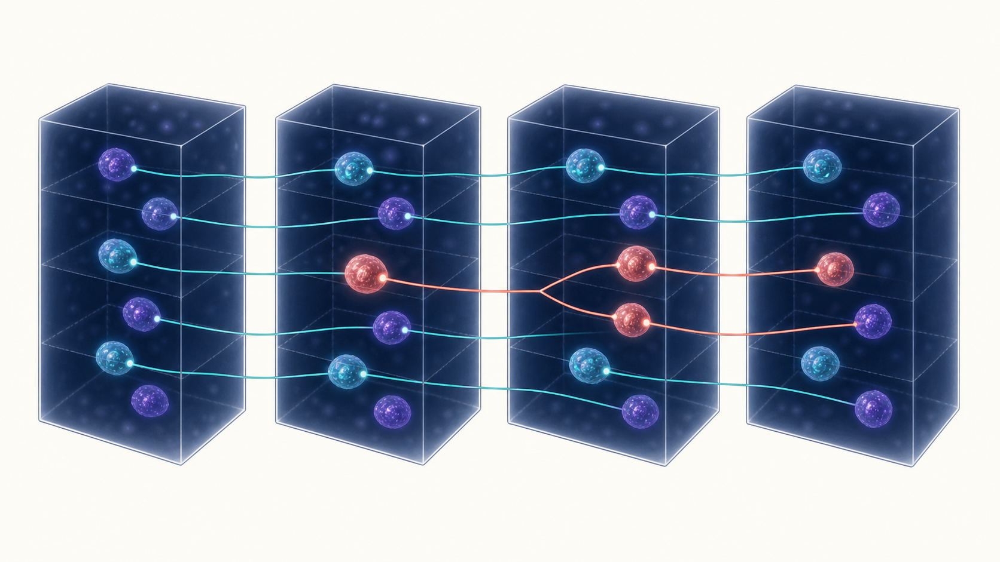
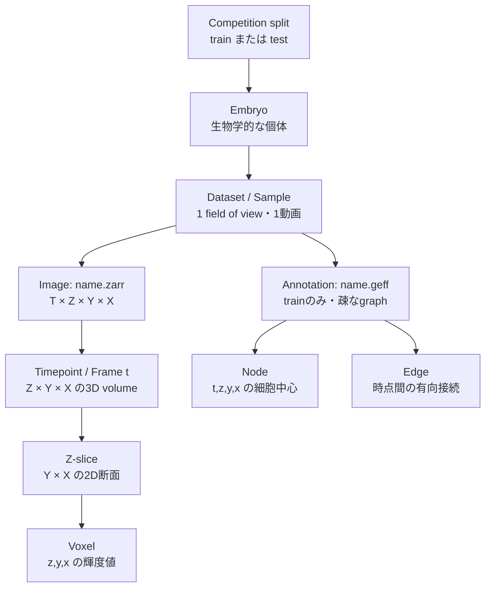
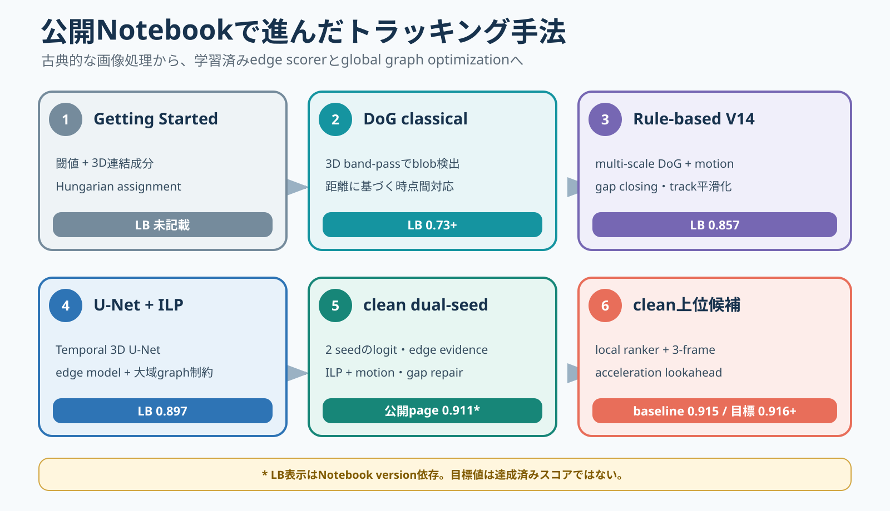
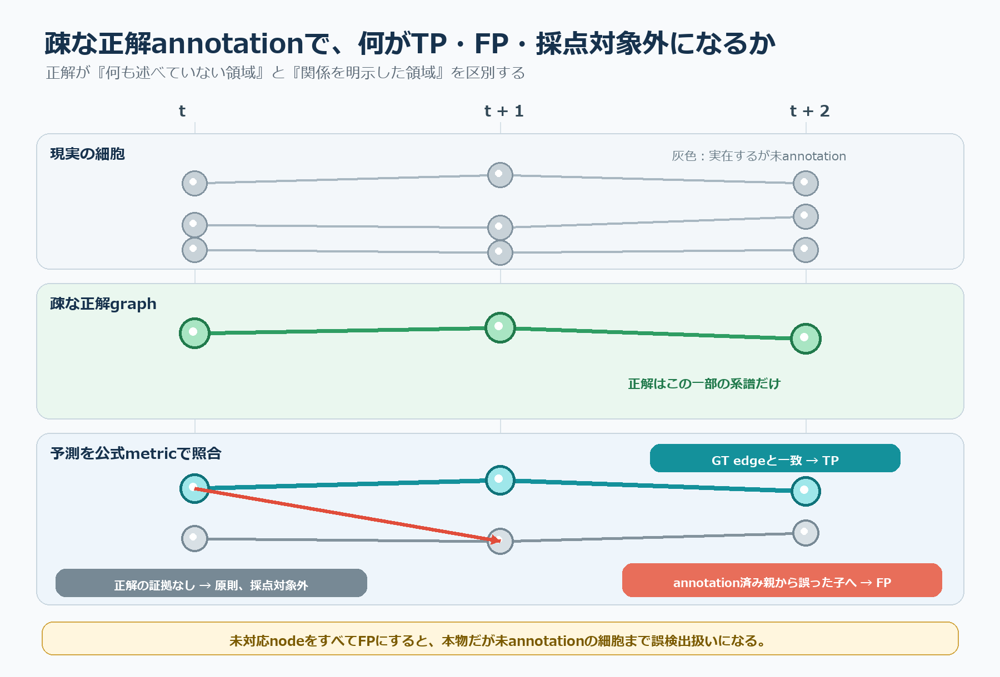
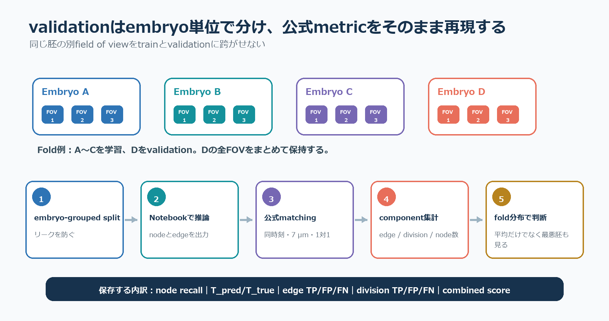

# Biohub Cell Tracking：コンペ・公開Notebook・validation解説

更新日: 2026-08-14

> [!NOTE]
> この文書は、コンペ公式資料、主催者の公開実装、2026-08-14時点で保存した公開Notebookを照合した技術解説です。Leaderboard（LB）値、Notebook内のローカル評価、未提出候補の目標値は同じ意味ではないため、区別して記載します。過去に成立したmetric exploitは、細胞追跡性能の比較から除外します。

## まず全体像

このコンペの仕事は、3D顕微鏡画像の時系列から、次の3段階を一続きに推定することです。

1. 各時点の3D画像から細胞中心を検出する。
2. 隣り合う時点の細胞を対応付け、同一細胞の軌跡を作る。
3. 1個の親細胞から2個の娘細胞へ枝分かれする箇所を細胞分裂として表す。



予測結果は、細胞検出を表す **node** と、時点間の対応を表す有向 **edge** からなるtracking graphです。分裂は特別なラベルではなく、1個のnodeから2本のedgeが出る構造として表現されます。

$$
G=(V,E),\qquad
v_i=(t_i,z_i,y_i,x_i),\qquad
e_{ij}=(v_i\rightarrow v_j)
$$

---

## 1. コンペ概要

| 項目 | 内容 |
| --- | --- |
| コンペ | Biohub - Cell Tracking During Development |
| 主催 | Biohub SF |
| 対象 | ゼブラフィッシュ発生過程の3D蛍光顕微鏡動画 |
| 入力 | OME-Zarr / Zarr v3形式の4次元画像 `(T,Z,Y,X)` |
| 学習用正解 | GEFF形式の疎なtracking graph |
| 出力 | 各datasetのnode行とedge行を格納した `submission.csv` |
| 評価 | adjusted edge Jaccardとdivision Jaccard |
| 実行形式 | Notebook-only Code Competition。採点時にhidden testで再実行 |

最終スコアは

$$
\mathrm{Score}
=
\mathrm{AdjustedEdgeJaccard}
+0.1\,\mathrm{DivisionJaccard}
$$

です。重みから分かるように、主成分は時点間edgeの正しさです。ただし分裂をすべて無視するとdivision項を失い、系譜としても不完全になります。

### 提出グラフ

node行は1個の細胞中心、edge行は同一dataset内の2個のnodeの接続を表します。

| 行 | 使用する列 | `-1`にする列 |
| --- | --- | --- |
| node | `dataset,node_id,t,z,y,x` | `source_id,target_id` |
| edge | `dataset,source_id,target_id` | `node_id,t,z,y,x` |

通常の系譜では、次の構造条件を満たすようにします。

$$
t_j=t_i+1,\qquad
\deg^{-}(i)\le 1,\qquad
\deg^{+}(i)\le 2
$$

- edgeは次の時点へ進む。
- 1個の細胞が複数の親を持つmergeは作らない。
- 通常の継続は出次数1、分裂は出次数2とする。

---

## 2. データ構造の体系

### 2.1 最も重要な階層

このデータでは、「領域」と「動画」が別々のフォルダ階層になっているわけではありません。実務上は、**1個のdataset/sampleが、1個の胚の1撮像領域（field of view）の時系列動画**に対応します。



要するに、データを数える単位は次のように違います。

| 用語 | このコンペでの意味 | 例・注意 |
| --- | --- | --- |
| embryo（胚） | 生物学的に独立した個体。validationの最上位group | `44b6`, `6bba` |
| field of view（FOV、撮像領域） | 胚の中で撮像された空間領域 | sample名の胚IDより後ろの部分 |
| dataset / sample | 画像とgraphを対応付ける処理単位 | `{name}.zarr`と`{name}.geff` |
| video / time-lapse | 1 sampleに含まれる時系列全体 | 4D配列 `(T,Z,Y,X)` |
| timepoint / frame | ある時刻の3D画像 | 2D画像ではなく `(Z,Y,X)` |
| Z-slice | 3D frame内の1枚の2D断面 | `(Y,X)` |
| voxel | 3D画像の最小画素 | 位置 `(z,y,x)` |
| node | ある時点の細胞中心 | `(t,z,y,x)` |
| edge | node間の時間方向の対応 | 継続または分裂 |
| track | edgeで連結された1細胞の軌跡 | 独立した入力ファイルではない |

### 2.2 sample名と胚ID

sample IDは概ね

$$
\texttt{dataset\_name}
=
\texttt{embryo\_id}
\texttt{\_}
\texttt{field\_of\_view}
$$

という形です。たとえば `44b6_0113de3b` なら、

- `44b6`: embryo ID
- `0113de3b`: 同じ胚内のsample/FOVを識別する部分

と扱います。実装上のgroup keyは、最初の `_` より前です。

```python
embryo_id = dataset_name.split("_", 1)[0]
```

field-of-view部分には追加の区切りを含む長い表現もあり得るため、`_`ですべて分割して固定個数の項目へ解釈しない方が安全です。

### 2.3 画像の内側

1 sampleの画像を

$$
I^{(e,r)}
\in
\mathbb{N}^{T\times Z\times Y\times X}
$$

と書きます。ここで \(e\) は胚、\(r\) は撮像領域/sampleです。現在確認できているtrain画像はすべて

$$
(T,Z,Y,X)=(100,64,256,256)
$$

です。

ある時刻 \(t\) のframeは

$$
I_t\in\mathbb{N}^{Z\times Y\times X}
$$

という3D volumeです。その中の1枚のz断面だけを取り出すと

$$
I_{t,z}\in\mathbb{N}^{Y\times X}
$$

となります。通常の動画でいう「1 frame＝1枚の2D画像」とは異なる点が重要です。

空間voxelの物理サイズは異方的です。

$$
(s_z,s_y,s_x)
=(1.625, 0.40625, 0.40625)
\quad \mu\mathrm{m/voxel}
$$

したがって、voxel座標差をそのまま距離にせず、

$$
d(i,j)=
\sqrt{
(1.625\Delta z)^2+
(0.40625\Delta y)^2+
(0.40625\Delta x)^2
}
$$

で物理距離へ変換します。

### 2.4 画像とannotationの対応

```text
train/
├── 44b6_0113de3b.zarr   # 100時点の3D画像
├── 44b6_0113de3b.geff   # 同じsampleの疎な正解graph
├── 44b6_0b24845f.zarr
├── 44b6_0b24845f.geff
└── ...

test/
├── hidden_sample_1.zarr # 正解GEFFは提供されない
└── ...
```

学習データでは、1個の `.zarr` と同名の `.geff` が1対1で対応します。

- `.zarr`: 全voxelの画像輝度
- `.geff`: annotationされた細胞中心nodeと、その間のedge

GEFFは全細胞のsegmentation maskではありません。正解nodeは細胞中心の近似座標で、しかも実際に存在する細胞の一部だけがannotationされています。

### 2.5 確認済みのデータ規模

| split | 画像sample | 胚 | 正解graph |
| --- | ---: | ---: | --- |
| train | 199 | 2 | 199 |
| 公開test例 | 4 | train由来の例 | なし |
| hidden test | 採点時に差し替え | trainと胚単位で分離 | 非公開 |

trainの内訳は、`44b6`が71 sample、`6bba`が128 sampleです。train全体の疎な正解には133,318 node、128,883 edgeがありますが、全細胞node数の概算 `estimated_number_of_nodes` の合計は4,725,117です。この大きな差が「疎な正解」の意味を示しています。

---

## 3. 公開Notebookの手法



### 3.1 比較表

| 手法 | 細胞検出 | 時点間対応 | 分裂 | 公開値・位置づけ |
| --- | --- | --- | --- | --- |
| Getting Started | downsample、平滑化、90 percentile閾値、連結成分重心 | 隣接frameのHungarian assignment | なし | 教材。LB値の明示なし |
| DoG classical | Difference of Gaussians（DoG）の3D極大 | 最近傍またはHungarian assignment | ほぼなし | LB 0.73+ |
| Rule-based V14 | multi-scale DoG、subvoxel refinement | 2段階assignment、motion、gap closing | 既定設定では無効 | LB 0.857 |
| U-Net + ILP | Temporal 3D U-Netのcenter map | node transformerのedge確率をILPで選択 | ILPのdivision変数と後処理 | LB 0.897 |
| clean dual-seed | 独立seedの2モデルのlogitを融合 | 2モデルのedge evidence、ILP、motion repair | 保守的な幾何条件 | 公開ページ表示 0.911 |
| 現在のclean上位候補 | dual-seed検出を固定 | local ranker、4-view evidence、3-frame lookahead | 従来処理を固定 | 実績baseline 0.915、候補目標 0.916+ |

> [!CAUTION]
> Notebook名にあるLB、KaggleページのBest Score、Notebook内のLocalCVは別物です。特に「目標0.916」は達成済みスコアではありません。また、metricの挙動だけを利用した高スコアNotebookは、cleanな細胞追跡性能の比較表には含めていません。

### 3.2 Getting Started

最も単純な入口です。各3D frameを4分の1にdownsampleし、3×3×3の一様filterで平滑化します。90 percentileより明るいvoxelを二値化し、3D連結成分の重心を細胞候補にします。

$$
B_t(r)=
\mathbb{1}
\left[
\mathrm{UniformFilter}(I_t)(r)>P_{90}
\right]
$$

前時点と現時点の全候補間の物理距離行列を作り、Hungarian algorithmで1対1 assignmentします。15 µmを超える対応は捨てます。

長所は、CPUだけで短時間に動き、データ形式と提出形式を理解しやすいことです。一方で、明るい領域が接触すると1成分に結合しやすく、暗い細胞を落としやすく、分裂を表せません。これは競争用の完成手法ではなく、入出力を学ぶためのbaselineです。

### 3.3 DoG classical

Difference of Gaussians（DoG）は、細胞らしい大きさのbright blobを強調します。

$$
D_t
=
G_{\sigma_s}*I_t
-
G_{\sigma_l}*I_t,
\qquad
\sigma_s<\sigma_l
$$

小さいGaussianは細胞中心の局所輝度を残し、大きいGaussianは緩やかな背景を表します。差を取ることで、背景むらを抑えながらblob中心を抽出します。DoG responseの3D局所極大をnode候補とし、隣接frameを距離で接続します。

Getting Startedより細胞サイズを明示的に扱えるため検出が改善しますが、外観や長時間の運動履歴を学習していません。密集部、輝度変化、交差軌跡、分裂では弱く、公開値はLB 0.73+でした。

### 3.4 Rule-based V14

Rule-based V14は単一DoGをかなり強化したclassical pipelineです。

1. \((1.5,4.0)\) µmと\((2.2,5.5)\) µmのmulti-scale DoGを取る。
2. 局所極大を抽出し、画像輝度重心で中心をrefineする。
3. 6 µmのtight gate、8 µmのloose gateで2段階assignmentする。
4. 前の移動量を使ったmotion predictionで曖昧な対応を解く。
5. 1 frameのgapを距離条件内で閉じる。
6. 短すぎるtrackを除き、座標を時間方向に平滑化する。

位置予測を

$$
\widehat q_i
=
q_i+\beta(q_i-q_{\mathrm{prev}(i)})
$$

とし、\(\widehat q_i\)に近い次時点候補を優先します。学習済みモデルなしでLB 0.857まで到達した点は重要です。一方、保存済みV14の既定設定では `allow_divisions=False` であり、分裂性能の高い解法ではありません。

### 3.5 U-Net + ILP

学習モデルの中心となる系統です。短い時間windowをTemporal 3D U-Netへ入力し、voxelごとの特徴fieldとcell-center probabilityを得ます。

$$
F_t=h_\theta(I_{t:t+W-1})_t,
\qquad
p_t(r)=\sigma(q_\theta(F_t(r)))
$$

local maximum suppressionでnode候補を作り、候補位置のfeatureをnode transformerへ渡して隣接frameのedge確率 \(p_{ij}\) を予測します。

その後、Integer Linear Programming（ILP、整数線形計画）で、局所的に高いedgeを単独で選ぶのではなく、graph全体の制約を満たす組合せを選びます。概念的には

$$
\min_{x,a,b,v}
-
\sum_{(i,j)\in E_0}p_{ij}x_{ij}
+\lambda_a\sum_i a_i
+\lambda_b\sum_i b_i
+\lambda_v\sum_i v_i
$$

です。

- \(x_{ij}\): edgeを採用するか
- \(a_i\): trackの出現
- \(b_i\): trackの消失
- \(v_i\): 分裂

ILP後に、gap repair、短track除去、division geometry、座標平滑化などを行います。公開LB 0.897系は、classical detectionからlearned detection/associationへ移った大きな段階です。

### 3.6 clean dual-seed

独立したseedで学習した2個のTemporalUNet3Dを使い、同じ物理volume上でdetection logitを融合します。

$$
d_t^{\mathrm{shared}}(x)
=(1-\alpha)d_t^{(A)}(x)
+\alpha\widetilde d_t^{(B)}(x)
$$

融合fieldから共通の候補点集合を1回だけ抽出するため、モデルAとBが別々のnode IDを作って後から無理に対応させる方式ではありません。両モデルのfeature/edge evidenceを利用し、ILP、motion reassignment、gap repair、分裂の幾何条件へ渡します。

独立モデルが同じcell centerを支持する場合はnoiseを平均化でき、一方だけが強く反応した偽陽性を抑えられます。代償はGPU計算量とartifact管理の増加です。2026-08-14に確認したKaggleページではBest Score 0.911でした。

Notebook系統内の限定diagnosticでは、単一volumeのnode recallが0.9951から0.9984へ、wide96のadjusted edge Jaccardが0.9053から0.9081へ、division Jaccardが0.0630から0.0833へ、combinedが0.9116から0.9164へ改善しています。ただし、これはembryo-disjoint CVでもKaggle hidden scorerでもないため、改善方向を見る補助値です。

### 3.7 現在の公開上位候補

保存済みのclean/no-hack系上位候補は、実績baseline 0.915を固定し、3-frame forward acceleration lookaheadを1点だけ追加する構成です。

前時点からの速度を使った予測位置を

$$
\widehat q_i
=
q_i+0.5(q_i-q_{\mathrm{prev}(i)})
$$

とし、候補edgeのcostを

$$
C_{ij}
=
\lVert q_j-\widehat q_i\rVert_2
+0.05\lVert q_j-q_i\rVert_2
-p_{ij}
$$

で計算します。さらに \(i\rightarrow j\) の次に、同じ速度で自然に続く \(j\rightarrow k\) が存在する場合だけ、最大0.20のbounded bonusを与えます。

この変更は検出、ILP、gap repair、分裂条件を固定し、対応付けだけへ長い時間文脈を加える試みです。Notebookの記載は

- 固定baseline: LB 0.915
- promotion target: 0.916+
- candidate自体のadjusted edge Jaccard、division Jaccard、node recall: 未計測

です。したがって、0.916を達成済みの精度として扱ってはいけません。

---

## 4. 機能別にどこまでできているか

| 機能 | 現状 | 読み方 |
| --- | --- | --- |
| 3D画像からの細胞検出 | dual-seedの限定diagnosticでnode recall 0.9984 | 1 volumeだけの値であり、全胚・全sampleの検出精度ではない |
| 時点間対応・長時間追跡 | wide96 adjusted edge Jaccard 0.9081 | edge評価には強いが、長trackが完全に1本つながる確率とは異なる |
| 細胞分裂 | wide96 division Jaccard 0.0833 | edgeより大幅に弱い。分裂例の少なさと疎annotationの影響が大きい |
| pipeline全体 | clean系でLB 0.911～0.915、次候補は0.916+目標 | LB、限定LocalCV、未提出目標を混同しない |

「node recallがほぼ1」でも「trackingがほぼ完全」という意味にはなりません。100 frameのtrackでは、1本の誤edgeや欠落だけで軌跡が分断されます。またdivision Jaccard 0.0833は、分裂判定が現在の明確な弱点であることを示します。

---

## 5. 疎な正解annotationに合わせたvalidation



### 5.1 なぜ通常のprecisionでは評価できないか

正解GEFFには、動画内の全細胞ではなく一部の細胞系譜だけが入っています。予測nodeが正解nodeの近くにないからといって、その細胞が存在しないとは限りません。

たとえば、実際には100個の細胞があり、10個だけannotationされているとします。正しいモデルが100個すべて検出すると、90個は「正解にない予測」になります。通常のobject detection metricで90個をすべてfalse positiveにすると、完全に近い予測が悪いモデルとして評価されます。

したがって、validationでは次を分けます。

- annotationされた場所で正しい対応を作れたか
- annotationされた場所で誤ったedgeを作ったか
- 画像全体のnode数を過剰に出しすぎていないか

### 5.2 node matching

同じ時点内で、予測nodeと正解nodeの物理距離を計算します。最大7 µm以内のpairだけを候補とし、optimal bipartite assignmentで1対1対応を作ります。

$$
M_t
=
\operatorname*{argmin}_{M}
\sum_{(p,g)\in M}
d(p,g),
\qquad
d(p,g)\le7\ \mu\mathrm{m}
$$

これにより、複数の予測nodeが同じ正解nodeを重複して回収することを防ぎます。

### 5.3 edge TP・FP・FN

予測edgeの両端が正解nodeへ対応し、その正解node間にも正解edgeがあればTPです。回収できなかった正解edgeはFNです。

疎な正解に対応するため、正解nodeへ対応しない予測edgeは原則として無視されます。ただし、annotationされたsourceまたはtargetに対して矛盾する接続を作った場合はFPになります。

$$
J_{edge}
=
\frac{TP_{edge}}
{TP_{edge}+FP_{edge}+FN_{edge}}
$$

### 5.4 node数の過剰予測penalty

未annotation nodeを直接FPにしない代わりに、各sampleに与えられた全細胞node数の粗い推定値 \(T_{true}\) と、予測node総数 \(T_{pred}\) を比較します。

$$
J_{edge}^{adj}
=
\max\left(
0,\,
J_{edge}
\left[
1-0.1
\frac{T_{pred}-T_{true}}{T_{true}}
\right]
\right)
$$

つまり、annotationにない正常な細胞を予測しても即FPにはなりませんが、画像全体に大量の偽nodeを撒くと総数penaltyを受けます。逆に \(T_{pred}<T_{true}\) のとき係数が1を超え得るため、combined scoreも1を超える場合があります。

### 5.5 division metric

予測graphで2本以上の出力edgeを持つnodeをpredicted forkとして扱います。

$$
F_{pred}
=
\{v\in V:\deg^+(v)\ge2\}
$$

分裂時刻の見え方には曖昧さがあるため、正解の分裂nodeだけを1時点で完全一致させるのではなく、grandparent、parent、children、grandchildrenからなる局所windowを使います。親側anchor、異なる2本の娘枝、edge方向、mergeしていないことを確認し、GT divisionとpredicted forkを1対1matchingします。

$$
J_{div}
=
\frac{TP_{div}}
{TP_{div}+FP_{div}+FN_{div}}
$$

### 5.6 sample集約

adjusted edge Jaccardは、sample \(i\) の

$$
w_i=TP_i+FP_i+FN_i
$$

を重みとして平均します。divisionは全sampleのTP、FP、FNを先に合計してmicro-averageします。小さなsampleを多数作って平均を操作するmetricではありません。

---

## 6. validation splitの作り方



### 6.1 primary validation

同じ胚の別FOVは、細胞密度、輝度、撮像条件、発生段階などが似ている可能性があります。同じ胚のsampleをtrainとvalidationへランダムに分けると、hidden testの「未知の胚」を再現できません。

trainには2胚しかないため、primary validationは2方向のleave-one-embryo-outとします。

| fold | train | validation |
| --- | --- | --- |
| A | 胚 `44b6`の全71 sample | 胚 `6bba`の全128 sample |
| B | 胚 `6bba`の全128 sample | 胚 `44b6`の全71 sample |

同じ `embryo_id` のsampleをtrainとvalidationへまたがせません。2foldの平均だけでなく、両方向を個別に残します。胚が2個しかないため分散は大きいですが、公式splitの単位と整合します。

### 6.2 secondary validation

公開Notebook `Clean Approach + Lightweight Local CV` は、各胚4 sample、合計8 sampleを固定して評価します。これは8-fold CVではなく、固定8 sampleの1回のholdoutです。

このfixed-8は、

- 公開Notebookの変更を同じ条件でA/B比較する
- 短時間でnode recallやedge errorを診断する

ためには便利です。一方、使用checkpointが同じ胚の別sampleを学習に使っていない証拠はNotebook内にないため、primary validationの代わりにはなりません。

### 6.3 推奨する実行順

1. validation胚の全sampleに対して、実際の推論と同じpipelineでgraphを予測する。
2. 主催者公開実装と同じ7 µmのnode matchingを行う。
3. sampleごとのedge TP/FP/FNとnode数penaltyを計算する。
4. 全sampleのdivision TP/FP/FNをmicro集約する。
5. adjusted edge、division、combinedを計算する。
6. fold Aとfold Bを別々に保存し、平均とばらつきを確認する。
7. fixed-8は別欄に記録し、primary scoreと混ぜない。

最低限、次のdiagnosticを残します。

| 種類 | 保存する値 |
| --- | --- |
| node | predicted数、estimated数、matched GT数、node recall、過剰予測率 |
| edge | TP、FP、FN、raw Jaccard、adjusted Jaccard |
| division | TP、FP、FN、division Jaccard |
| graph | track長、gap数、孤立node、出次数2のnode数 |
| group | embryo別、sample別、cell density別の値 |

### 6.4 よくある誤り

- 未annotation領域を背景maskとして学習・評価する。
- 正解にない全予測nodeをFPにする。
- voxel距離でmatchingし、z方向の異なる物理scaleを無視する。
- 同じ胚のFOVをrandom splitする。
- fixed-8を「8-fold CV」と呼ぶ。
- `split_0`というcheckpoint名だけから5-fold学習済みと判断する。
- 公開Notebookの簡略metricをKaggle hidden scorerそのものとみなす。
- combined scoreだけを保存し、edgeとdivisionのどちらが変わったか残さない。

---

## 7. まとめ

- データ階層は **embryo → dataset/sample（1 FOV・1動画）→ timepoint/frame（3D volume）→ Z-slice → voxel** です。
- 画像側の1 sampleは `(T,Z,Y,X)` の4D Zarr、正解側は同名の疎なGEFF graphです。
- 公開手法は、単純閾値と最近傍対応から、multi-scale DoG、学習済みU-Net、node transformer、ILP、dual-seed ensembleへ発展しています。
- 現時点ではedge trackingが最も成熟し、division判定が相対的に弱い部分です。
- 疎な正解では、未annotation予測を一律FPにせず、annotation周辺のedge整合性と全node数penaltyを組み合わせて評価します。
- primary validationはsample単位ではなくembryo単位の2方向leave-one-embryo-outとし、fixed-8は公開Notebook比較用のsecondary diagnosticに限定します。

## 参考資料

- [Kaggle: Biohub - Cell Tracking During Development](https://www.kaggle.com/competitions/biohub-cell-tracking-during-development)
- [Kaggle: Data Description](https://www.kaggle.com/competitions/biohub-cell-tracking-during-development/data)
- [Kaggle: Evaluation](https://www.kaggle.com/competitions/biohub-cell-tracking-during-development/overview/evaluation)
- [主催者baseline repository](https://github.com/royerlab/kaggle-cell-tracking-competition)
- [主催者のmetric仕様](https://github.com/royerlab/kaggle-cell-tracking-competition/blob/main/metrics.md)
- [Getting Started with Nearest Neighbor](https://www.kaggle.com/code/inversion/cell-tracking-getting-started-w-nearest-neighbor)
- [DoG BAND-PASS, LB 0.73+](https://www.kaggle.com/code/romanrozen/strong-start-dog-band-pass-lb-0-73)
- [Rule-Based V14, LB 0.857](https://www.kaggle.com/code/seshurajup/lb-0-857-best-rule-base-v14)
- [U-Net + ILP reproduction](https://www.kaggle.com/code/yaroslavkholmirzayev/biohub-cell-tracking-v4-unet-ilp-reproduction)
- [LB 0.897 baseline](https://www.kaggle.com/code/yusuketogashi/lb897-baseline)
- [Two Seeds Logit Blend](https://www.kaggle.com/code/pilkwang/biohub-cell-tracking-two-seeds-logit-blend)
- [Clean Approach + Lightweight Local CV](https://www.kaggle.com/code/yusuketogashi/clean-approach-lightweight-local-cv-no-hack)
- [No-Hack: Another Approach 3rd](https://www.kaggle.com/code/yusuketogashi/no-hack-biohub-cell-another-approch-3rd)
- [このリポジトリのデータ仕様](04_data.md)
- [このリポジトリの評価指標メモ](02_metric.md)
- [このリポジトリのvalidation方針](03_validation.md)
