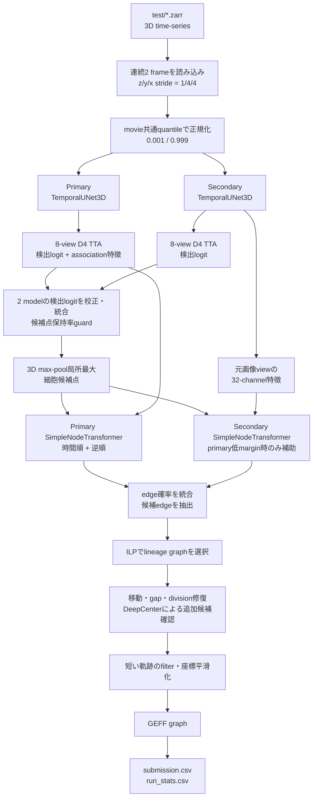
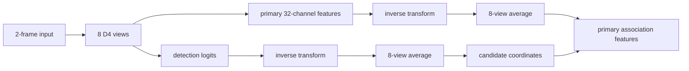
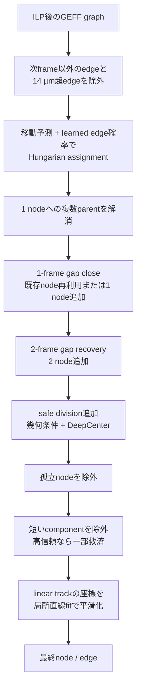

# Biohub Cell Tracking: 0.946 LB Notebook 解説

作成日: 2026-09-13

## 結論

採用した [Biohub Cell Tracking: 0.946 LB](https://www.kaggle.com/code/reyhanksatria/biohub-cell-tracking-0-946-lb) は、連続する2枚の3D画像から細胞候補点を検出し、候補点間の時間方向の接続を予測し、整数線形計画法（integer linear programming、ILP）と複数段の軌跡修復を経て `submission.csv` を作る推論Notebookである。Notebook内で学習は行わない。

構成の中心は次の4点である。

1. seedの異なる2つの `TemporalUNet3D + SimpleNodeTransformer` checkpointを使う。
2. xy平面の8通りのD4変換を、検出logitだけでなくprimary modelのassociation用UNet特徴にも適用する。
3. primary modelの時間順・逆順予測を確率空間で統合し、primaryが迷う接続だけsecondary modelで補助する。
4. ILPの後にも、移動の整合性、欠落frame、細胞分裂、短い軌跡を対象とする規則とDeepCenterの出力を使ってgraphを修正する。

Notebook名の0.946は、この全体を通したPublic LBの作者報告であり、detector単体、`TemporalUNet3D`単体、0.946で追加されたtest-time augmentation（TTA）単体のスコアではない。また、exp011ではこのスコアを再実行して独立確認していない。

## 対象と証拠範囲

- 対応する上位仮説: `HYP-20260910-12`
- 対象実験: [`exp011_public_detector_selection`](../../experiments/exp011_public_detector_selection/)
- Notebookの識別: kernel id `133199516`、取得したcontent SHA `ae8e01a262211045161984e469e8be23e3386bab9140fe12df503dc6a1e010e6`
- 主な証拠: 2026-09-12にKaggleから取得したNotebook source、Notebookが展開する推論source、3つのcheckpointとartifact manifest
- 機械可読な選定内容: [`public_detector_selection.json`](../../experiments/exp011_public_detector_selection/assets/public_detector_selection.json)
- この文書からは判断できないこと: 0.946の独立再現性、detector単体精度、各後処理の単独寄与、hidden test全件の実行時間、将来再学習するtrackerの精度

Notebook本体のcode licenseは、取得したmetadataとsourceから確認できなかった。この文書は処理内容を要約し、Notebook独自コードを転載しない。

## 全体の処理



この図で重要なのは、細胞の位置を出す検出と、前後frameの同じ細胞を結ぶassociationが別の段階であることだ。後半のgraph修復は、その両方の誤りを一部補うが、元の画像モデルを再学習しているわけではない。

## 1. 実行環境とartifactの固定

NotebookはKaggleのinputからsupport artifactを探し、次のものを `/kaggle/working/tracking_repo` に展開する。

- 推論repositoryとオフライン依存package
- primary `TemporalUNet3D + SimpleNodeTransformer` checkpoint
- seedの異なるsecondary checkpoint
- 修復候補の確認に使う `DeepCenterUNet3D` checkpoint

展開後、推論sourceのPythonファイル一覧と各SHA、source全体のmanifest SHA、3 checkpointのSHAを照合してから処理を続ける。推論scriptはその後に文字列置換でpatchされるため、想定したsourceから少しでもずれるとpatch位置の検査で停止する。これは変更に弱い一方、異なるsourceへ誤ってpatchを当てたまま推論することを防いでいる。

公開Notebookは既定で作者のmirror datasetを参照する。exp011で採用した再利用契約では、同じcheckpoint SHAを持ち、licenseを確認できたPilkwangの元datasetを正とした。

| 用途 | model | checkpoint SHAの先頭12文字 |
| --- | --- | --- |
| primary検出・特徴・association | `TemporalUNet3D + SimpleNodeTransformer` | `12f6881ee362` |
| secondary検出・association | `TemporalUNet3D + SimpleNodeTransformer` | `9bac2fa0dadc` |
| gap・division追加候補の確認 | `DeepCenterUNet3D` | `8040999a92f6` |

完全なSHA、dataset version、artifact manifest SHAは選定manifestを正とする。

## 2. 入力と正規化

1つのmovieについて、window size 2、stride 1で連続frameを処理する。z方向は間引かず、yとxは4 voxelごとに読み込む。入力shapeは概念的には `batch × 2 × 1 × z × y/4 × x/4` である。

強度は各windowで計算し直さず、Zarr metadataの `image_statistics.quantiles` に記録されたmovie共通の0.001 quantileと0.999 quantileを使う。入力値を $x$ 、2つのquantileを $q_{0.001}$ 、 $q_{0.999}$ とすると、画像モデルへ渡す値は次のとおりである。

```math
x_{\mathrm{norm}}
=
\max\left(
0,
\frac{x-q_{0.001}}{q_{0.999}-q_{0.001}+10^{-6}}
\right)
```

windowごとのmin-max正規化ではないので、隣接window間で強度scaleが変わりにくい。

## 3. TemporalUNet3Dと細胞候補点

primaryとsecondaryは同じ構造で、`TemporalUNet3D` のchannel幅は `[32, 64, 128]`、出力はframeごとに32 channelsである。各stageは3D convolutionを使い、深いstageでは同じ空間位置にある2 frame間へmulti-head attentionを適用する。出力には次の2つの使い道がある。

- 1×1×1 convolutionのdetection headで、各voxelが細胞中心であることを表す1-channel logitを作る。
- 候補点座標で32-channel feature mapを整数indexingし、association特徴として使う。

detection logitへsigmoidを適用した確率が0.965を超え、かつ約5 µmの3D max-pooling範囲内で局所最大となるvoxelを細胞候補点にする。物理距離5 µmは、各軸のvoxel sizeに合わせて奇数のpooling kernelへ変換される。

## 4. 8-view D4 TTA

TTAは、入力を変換してそれぞれ推論し、出力を元の向きへ戻して平均する処理である。このNotebookはz軸を変換せず、xy平面の正方形が持つ8通りのD4対称変換を使う。

| view | 処理 |
| ---: | --- |
| 1 | 元画像 |
| 2–4 | x反転、y反転、xy両方の反転 |
| 5–6 | 90度、270度回転 |
| 7–8 | 転置、反転を伴う転置 |

変換を $T_i$ 、detection logitを $L$ とすると、平均logitは次のように書ける。

```math
\bar{L}(x)
=
\frac{1}{8}
\sum_{i=1}^{8}
T_i^{-1}\!\left(L\!\left(T_i(x)\right)\right)
```

0.946で追加された中心的な差分は、primary modelの32-channel feature map $F$ にも同じ処理を行う点である。

```math
\bar{F}(x)
=
\frac{1}{8}
\sum_{i=1}^{8}
T_i^{-1}\!\left(F\!\left(T_i(x)\right)\right)
```



secondary modelもdetection logitには8-view平均を使うが、associationへ渡す32-channel特徴は元画像のviewだけから取得する。したがって「0.946では2 modelの全特徴をTTA平均する」という理解は正しくない。

## 5. 2 modelの検出結果の統合

secondary detection logitは、平均と標準偏差をprimaryへ合わせてから統合される。標準偏差の比は0.5から2.0へclipする。最終的なdetection logitはprimary 0.20、secondary 0.80の重みである。

ただし、統合後の候補数がprimary単独の候補数の90%未満になるframeでは、候補点を失いすぎたと判断してprimary単独のdetection logitへ戻す。この判定はframeごとに行い、診断用JSON Linesへ候補数と選択結果を記録する。

このguardは候補点の数だけを見ており、候補点の正しさや座標一致を確認するものではない。

## 6. SimpleNodeTransformerによるassociation

各候補点には、次の情報を連結して `SimpleNodeTransformer` へ渡す。

- 候補点座標で取り出した32-channel UNet特徴
- window内の相対時刻とz/y/xをsin/cosで符号化した32-dimensional位置embedding

したがってnodeごとの入力は64 dimensionsである。Transformer本体はhidden dimension 128、4 heads、4 cross-attention blocksを使い、frame $t$ の候補群とframe $t+1$ の候補群を相互に参照する。最後に、source特徴、target特徴、相対z/y/xをpair MLPへ渡し、全source-target pairのedge logitを出す。

### primaryの時間順・逆順統合

primary modelは $t \rightarrow t+1$ と $t+1 \rightarrow t$ の両方向でedgeを予測する。逆方向logitの平均とscaleを時間順logitへ合わせた後、確率へ変換する。実装は単純な50対50の調和平均ではなく、逆方向の寄与 $w=0.15$ を使う重み付き調和平均である。

```math
\tilde{p}_{ij}
=
\left(
\frac{1-w}{p^{\mathrm{forward}}_{ij}}
+
\frac{w}{p^{\mathrm{reverse}}_{ij}}
\right)^{-1},
\qquad
w=0.15
```

その後、候補間で再正規化し、log確率をprimaryの元logit scaleへ合わせる。どちらか一方向だけが高いedgeを抑えつつ、時間順予測を主に残すための処理である。

### secondaryのlow-margin consensus

secondary modelのedge logitも、平均とscaleをprimaryへ合わせる。ただし常に0.15を混ぜるのではない。各targetに対してprimaryの上位2 parent候補の確率差をmarginとし、次の条件でだけsecondaryを使う。

- primary marginが0.35未満である。
- primaryとsecondaryが同じparentを1位にしている。

marginが0.35へ近づくほどsecondaryの重みは0へ下がり、primaryが最も迷っているときに最大0.15となる。2 modelが不一致ならsecondaryの重みは0である。

統合後はsource軸へsoftmaxを適用し、確率0.48を超えるedgeをILP前の候補に残す。

## 7. ILPによるgraph選択

候補点をnode、接続候補をedgeとするgraphを作り、`tracksdata` のILP solverへ渡す。採用設定は次のとおりである。

| 項目 | 値 |
| --- | ---: |
| edge probability weight | -1.0 |
| appearance weight | 0.0 |
| disappearance weight | 2.0 |
| division weight | 1.2 |

ILPは各edgeを独立に閾値処理するだけではなく、trackの出現、消失、分裂を含むgraph全体の整合性を考慮して接続を選ぶ。出力はmovieごとのGEFF graphとして一度保存される。

GPUが2台見える場合はmovie一覧を交互に2 shardへ分けて別processで推論し、全movieが重複なく揃ったことを確認してからGEFFを統合する。1 GPUでは単一processで実行する。

## 8. ILP後の軌跡修復

NotebookはILP出力をそのまま提出しない。次の順序でnodeとedgeを修正する。



### 移動に基づく再接続

各frame間で、直前の移動ベクトルから次位置を予測し、予測位置との差、元の移動距離、学習済みedge確率をcostにしたHungarian assignmentを行う。6 µmのtight passと10 µmのrelaxed passを順に使う。候補が得られた場合、コード上は元のedge集合をこのassignment結果で置き換える。

### 1-frame gap close

frame $t$ のtrack終端とframe $t+2$ のtrack始端を対応付け、間のframe $t+1$ にある孤立候補点を再利用する。近い孤立候補点がなければ中点にnodeを追加し、元画像の局所強度重心で位置を補正する。

基準は1 stepあたり5.0 µmで、周囲の細胞間隔に応じて小さく補正される。合計移動が8.5 µm以上で新しいnodeを追加する場合は、DeepCenter heatmapの最大値が0.25以上であることを要求する。

設定上の `GAP_CLOSE_MAX_GAP` は2だが、この関数は実装内で有効値を1へ制限する。2 frame分が欠ける場合は、次の別処理が担当する。

### 2-frame gap recovery

frame $t$ とframe $t+3$ を接続し、間に2 nodeを追加する。全移動10.2 µm以下、1 step平均4.4 µm以下に加え、前後の既存edgeから得られる移動方向との整合性を要求する。追加数にはframe単位と全体のcapがある。

### safe divisionの追加

すでに1 childを持つparentに対して、次frameの未接続候補を2番目のchildとして追加する。主な条件は次のとおりである。

- parentから追加childまで9.0 µm以下
- 既存childと追加childの距離が14.0 µm以下
- 既存childまでの距離が10.0 µm以下
- 追加childが既存childから見た相互最近傍候補である
- その次のframeで2系統が2.25 µm以上離れる方向へ進む
- 2 childのparent距離の非対称度が0.6以下
- 追加child位置のDeepCenter scoreが0.25以上

frameごとの追加数と全体の追加数にもcapを設ける。DeepCenterは全細胞を検出し直すためには使わず、gap closeまたはdivisionで追加しようとする一部の候補を確認するgateとしてだけ使う。

### 短い軌跡と座標平滑化

node数6未満のconnected componentは原則として除外するが、divisionを含むcomponentは残す。除外量が多いときは、node数4以上、平均edge確率0.88以上、平均edge距離3.0 µm以下のcomponentを、上限内で戻す。

最後に、各nodeから一意に接続できる前後方向へ最大2 nodeずつたどり、3点以上を得られた場合は3次元座標へ直線をfitする。元座標20%、fit座標80%で平滑化し、graph topologyはこの段階では変えない。

## 9. 出力と実行時検査

最終的な `submission.csv` は、node行とedge行を同じtableへ格納する。

| row type | 主な値 |
| --- | --- |
| `node` | `dataset`、`node_id`、`t`、`z`、`y`、`x` |
| `edge` | `dataset`、`source_id`、`target_id` |

Notebookは次を検査してから完了する。

- testの全movieが1回ずつ出力されている。
- `id` が0から連続している。
- nodeとedgeの両方が存在する。
- 座標と時刻が負でない。
- edgeは必ず次frameへ接続する。
- 各nodeの入次数は1以下、出次数は2以下である。
- 候補点保持率guardの診断が全movieを覆う。

`run_stats.csv` にはmovieごとのnode数、edge数、各修復の候補数・採用数・除外数、推論時間などを記録する。加えて、checkpoint SHA、support source SHA、submission SHA、topology、候補点保持率をJSONへ保存する。

## 10. 0.946で変わった範囲

Notebook本文が示す変更履歴では、0.941から0.946の差はprimaryのassociation特徴へ8-view D4平均を追加したことに限定される。

| 処理 | 0.941 | 0.946 |
| --- | --- | --- |
| detection logitの8-view TTA | あり | あり |
| primary association特徴 | 元画像viewのみ | 8-viewを元の向きへ戻して平均 |
| D4 view数 | 8 | 8 |
| bidirectional association weight | 0.15 | 0.15 |
| safe division parent距離 | 9.0 µm | 9.0 µm |
| DeepCenter division threshold | 0.25 | 0.25 |
| gap close基準 | 5.0 µm/step | 5.0 µm/step |

したがって、0.946を「TTA view数を増やした構成」や「後処理を全面変更した構成」と捉えるのは誤りである。既存の8 viewから得ていたUNet特徴を、primary associationまで利用するようにした変更である。

## 11. exp011での採用範囲

このNotebook自体は推論だけを行う。一方、exp011が将来の下流学習へ渡した契約は次のとおりであり、Notebook内で実行済みの学習内容ではない。

- primary checkpointの `SimpleNodeTransformer` を初期値にする。
- primary `TemporalUNet3D` とdetection headを固定する。
- secondary branch全体とDeepCenterを固定する。
- 候補点生成、特徴抽出、secondaryの補助、ILP、graph修復を最初の比較では固定する。
- 変更対象をprimary trackerの重みに限定する。

これにより、detectorや後処理の変更とtracker再学習の効果を最初の比較で混在させない。

## 注意点

- 0.946はNotebook題名、本文、実行receiptに基づく作者報告で、exp011によるPublic LBの再現値ではない。
- receiptはleaderboard feedbackを設定へ使用したと記録しているため、独立validationで選ばれた固定構成とは扱わない。
- primary checkpointのbest epoch、seed、split、独立validationの有無はartifact manifestから確認できない。
- secondary association特徴には8-view平均が適用されない。
- 動的source patchは固定したsupport sourceに強く依存する。sourceを更新する場合はpatch成功だけでなく処理意味の再監査が必要である。
- Notebook独自patchをリポジトリへコピーする前にcode licenseを確認する必要がある。
- full inference、hidden test実行時間、候補点数、特徴cache容量は未計測である。

## 関連ファイル

- 選定理由とartifact来歴: [`biohub-public-detector-selection_20260912.md`](biohub-public-detector-selection_20260912.md)
- 実験結果とユーザー判断: [`result.md`](../../experiments/exp011_public_detector_selection/result.md)
- 選定manifest: [`public_detector_selection.json`](../../experiments/exp011_public_detector_selection/assets/public_detector_selection.json)
- Notebook: [Biohub Cell Tracking: 0.946 LB](https://www.kaggle.com/code/reyhanksatria/biohub-cell-tracking-0-946-lb)

## 次に確認すること

original Pilkwang datasetをKaggle inputへ付けた小規模runで、3 checkpoint SHA、import、候補点数、primary TTA特徴shape、secondary元view特徴shape、1 movieの実行時間、出力schemaを確認する。これは説明文書の作成では実行していない。
