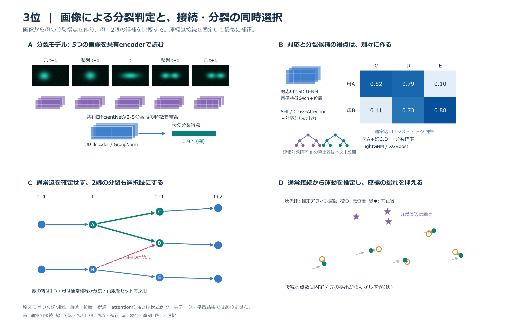
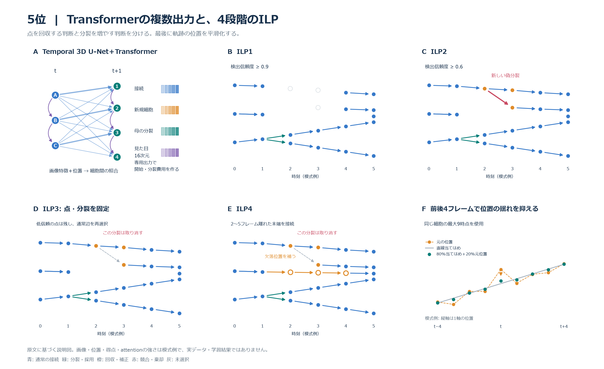
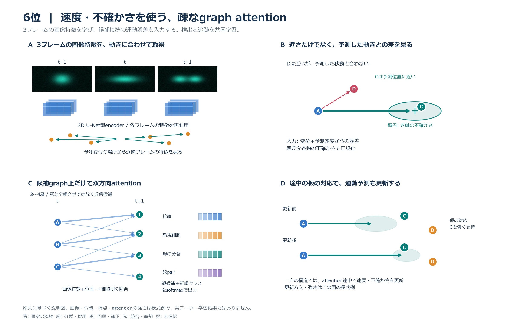
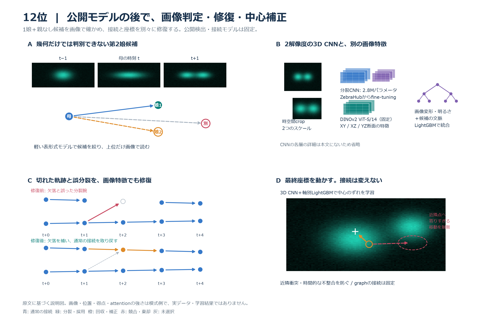
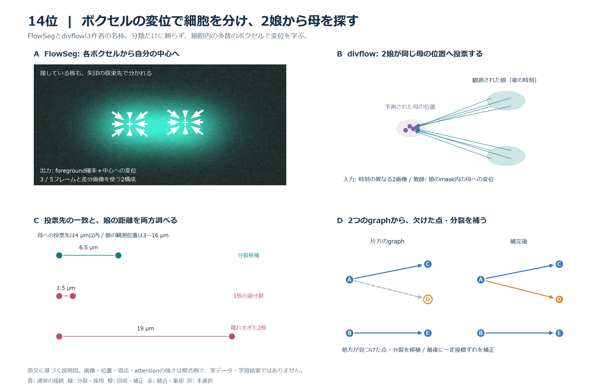
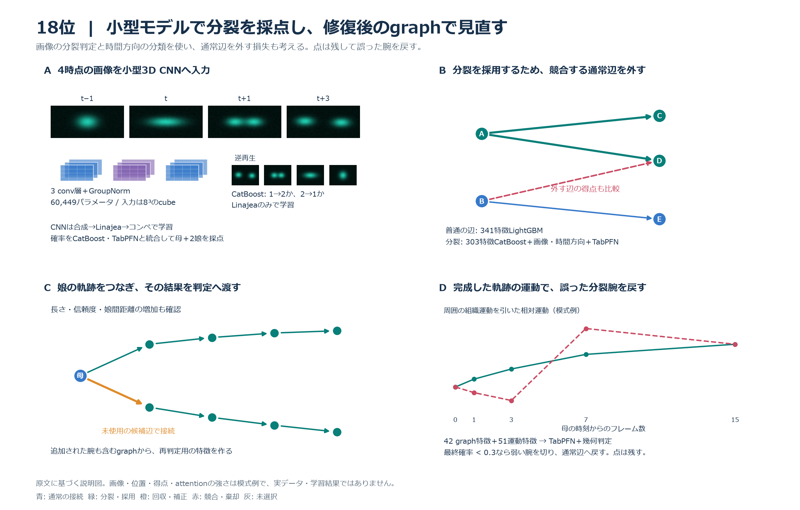

# Biohub 終了後の上位解法と自分の解法の比較

確認日: 2026-09-30、19:47 JST。終了後のKaggle Discussionと最新APIの順位・提出スコアを照合した。順位はこの時点の表示であり、主催者による最終監査後の確定順位とは区別する。

追記: 同日21時台の再確認で、新たに公開された6位の解説を取得した。3位・5位の本文と最新コメントも再取得し、評価対象確率の公開範囲を確認した。

## 結論

今回確認できた上位解法は、**3位・5位・6位・12位・14位・18位**。1位 Sergio Alvarez（Private 0.977）、2位 Soheil Ayati（0.970）、4位 z7777（0.962）は順位を確認できたが、今回調べた最近60件のDiscussionとWeb検索では解法本文を確認できなかった。未公開と断定せず、今回の取得範囲では未確認とする。

こちらとの大きな差は次の4点だった。

1. **分裂を座標関係だけで判定せず、前後画像や別の追跡モデルから判断材料を作る。** 3・12・18位は画像による分裂判定、5・6位は分裂専用出力、14位は娘から母への変位予測を使う。
2. **通常接続と分裂を競合させ、既存接続を変更できる。** 3位は母と2娘をまとめた事象を通常接続と同時選択する。18位は分裂採用時に競合する通常接続を外す。こちらのexp053は親なしの第2娘を追加する範囲に限られる。
3. **後処理で完成したgraphを評価し直す。** 18位は娘軌跡の補完後に分裂を再判定する。12位は段階的な修復と座標補正を加える。こちらでも後処理による変更消失を診断したが、最終構成で後処理全体を学習して置き換えるところまでは進んでいない。
4. **Publicの小差で手法を選ぶ限界が、こちらのPrivate結果にも現れた。** exp053はexp043に対してPublic +0.003、Private −0.002。Publicで不採用になったexp050の3構成はPrivate 0.922で、最終リーダーボードの0.919を上回った。これだけでGNNなどの単独寄与を確定できないが、実験の順序はPublicとPrivateで逆転している。

今の学習方針である「公開画像モデルとtrackerを固定し、後段の選択・修復を改善する」に最も近い参考は**18位と12位**。5位の外部事前学習や3位・14位の新しい画像モデルは学ぶ価値があるが、実装するなら学習対象・GPU予算の方針変更が必要である。この調査では実験の採否やバックログを変更していない。

## 対象と証拠範囲

- 対応する上位仮説: なし
- 今回は終了後の手法比較で、既存の上位仮説の採否を判断しない。
- 収集: Kaggle CLI 2.2.4の最近3ページ、60件のDiscussion一覧。上位5投稿と関連4投稿の本文・全コメントをAPIでも再取得し、リンク、表、図の参照を保存した。
- 追記時の収集: 最新1ページを再確認し、6位の本文を追加取得。保存したDiscussionは計10件。[追記時の取得データ](../../studies/biohub_top_solutions_20260930/calibration_transformer_followup.json)。
- 順位: `get_leaderboard`の最新表示を先頭600件まで取得し、こちらのTeam ID `16717777`まで確認した。[最終順位の生データ](../../studies/biohub_top_solutions_20260930/final_leaderboard.json)。
- スコア: こちらの全14提出について`competitions submissions`から取得した。[提出スコアの生データ](../../studies/biohub_top_solutions_20260930/own_submissions.csv)、[比較に使用した数値](../../studies/biohub_top_solutions_20260930/comparison_evidence.json)。
- 注意: `competitions leaderboard --download`で取得したCSVはファイル名が示すとおり**Public leaderboard**だった。APIの最終表示と混同しない。こちらのPublic順位833位をPrivate順位に使わない。
- 解法の実装は作者の説明に基づく。上位5件のBiohub最終source・checkpointを取得して再実行した比較ではない。5投稿にはBiohub最終実装の直接リンクがなかった。14位の図内の式や添付PDFまでは解析していない。
- 他参加者のテスト動画数・分割に関する推定は互いに一致しない。3位と89位の投稿にある件数を公式仕様として採用しない。
- 交差検証（CV）、学習に使わない分割への予測（OOF）、反転・回転などの複数入力で推論する方法（TTA）、整数線形計画法（ILP）を以下で使う。正解の注釈をGTと呼び、細胞を点、時間をまたぐ対応を辺として表すgraphを比較する。TPは評価対象で正しい予測、FPは評価対象で誤った予測を指す。

## 取得した上位解法

Privateは最新の最終リーダーボードと照合した。Publicは作者の最終提出の自己申告と、チームの過去最高Public値が混在しないよう、この表には置かない。

| 順位 | チーム | Private | 一次解説 | 手元の保存先 |
| --- | --- | --- | --- | --- |
| 3 | yu4u | 0.967 | [3rd Place Solution](https://www.kaggle.com/competitions/biohub-cell-tracking-during-development/discussion/744484) | [原文・表・図・コメント](../discussions/biohub-cell-tracking-during-development-744484-3rd-place-solution.md) |
| 5 | Tang | 0.954 | [3D U-Net + Transformer Linker + Multi-stage ILP Tracking](https://www.kaggle.com/competitions/biohub-cell-tracking-during-development/discussion/744549) | [原文・表・図](../discussions/biohub-cell-tracking-during-development-744549-5th-place-3d-u-net-transformer-linker-multi-stage-ilp-tracking.md) |
| 6 | Cyrus | 0.953 | [Six-Model Detect-and-Link Ensemble + Global ILP](https://www.kaggle.com/competitions/biohub-cell-tracking-during-development/discussion/744582) | [原文・表・図](../discussions/biohub-cell-tracking-during-development-744582-6th-place-six-model-detect-and-link-ensemble-global-ilp.md) |
| 12 | Corwin | 0.946 | [12th Place Solution](https://www.kaggle.com/competitions/biohub-cell-tracking-during-development/discussion/744501) | [原文・表・図・コメント](../discussions/biohub-cell-tracking-during-development-744501-12th-place-solution.md) |
| 14 | Vibes & Edges Trade-Off | 0.944 | [14th place solution](https://www.kaggle.com/competitions/biohub-cell-tracking-during-development/discussion/744486) | [原文・図・コメント](../discussions/biohub-cell-tracking-during-development-744486-14th-place-solution-from-vibes-edges-trade-off.md) |
| 18 | ymg_aq | 0.941 | [Lineage Graph Refinement Focused on Cell Divisions](https://www.kaggle.com/competitions/biohub-cell-tracking-during-development/discussion/744531) | [原文・表・図・コメント](../discussions/biohub-cell-tracking-during-development-744531-18th-place-solution-lineage-graph-refinement-focused-on-cell-divisions.md) |

## こちらの解法と最終結果

**こちらは当初、検出モデル・画像特徴を固定してtrackerを学習していた。** [exp016](../../experiments/exp016_frozen_image_encoder/result.md)ではprimary `SimpleNodeTransformer`を再学習し、全199動画の固定graph推論とKaggle上の公式評価まで実施した。その後もself-attentionや複数フレーム入力など、trackerの学習方法・構造を比較している。「こちらは公開trackerを固定していた」という一括した説明はこの経緯を落としていたため訂正する。

以下の提出スコア比較は、終盤の[exp043](../../experiments/exp043_x138_self_trained_head/requirements.md)を基準に、採用済みの[exp052](../../experiments/exp052_x138_relink_candidate_scores/result.md)、[exp053](../../experiments/exp053_x138_postlink_division_score/result.md)を比較対象に加えたもの。この構成で公開trackerを固定したことと、それ以前のtracker学習の経緯を分けて扱う。公開x138をそのまま再現した[exp042](../../experiments/exp042_public_x138_replay/result.md)とも分ける。

処理は、公開の2つのTemporalUNet3Dと対応tracker、DeepCenterによる検出候補の確認、自前の座標補正、ILP、近傍運動による再接続、検出点の再追加、欠落補完・分裂修復・平滑化である。自前の座標補正は、固定画像特徴224次元→全結合層32次元→SiLU活性化→全結合層3次元の7,299パラメータの小型ネットワーク。3軸の移動量を出し、そのノルムを2 µm未満に制限する。20動画で学習し、既知中心との一対一対応にHuber損失を使った。検出器と公開trackerはこの構成では再学習していない。

exp052はILPに選ばれなかった候補辺のtracker得点も再接続へ渡す。exp053は母の直前、母と2娘、娘の直後という4時点から19個の座標・接続特徴を作り、ロジスティック回帰で親なし第2娘を採点する。exp053は画像特徴を分裂採点器に入力せず、既に別の親がある娘の奪い返しや、前後接続の同時変更も行わない。[特徴実装](../../experiments/exp053_x138_postlink_division_score/division_features.py)、[選択実装](../../experiments/exp053_x138_postlink_division_score/scored_division.py)。

| 実験・構成 | submission ref | Public | Private | 比較上の意味 |
| --- | --- | --- | --- | --- |
| exp013 公開構成の再現 | 56199738 | 0.944 | 0.914 | 初期の公開モデル基準 |
| exp042 x138作者head | 56569806 | 0.953 | 0.917 | 公開x138の再現 |
| exp043 自前座標head | 56508119 | 0.950 | 0.918 | 後段改善の基準 |
| exp050 GNN | 56638386 | 0.938 | 0.922 | Publicで不採用、Privateでは手元最高と同点 |
| exp050 Optuna費用 | 56658424 | 0.942 | 0.922 | 同上 |
| exp050 拡張候補＋旧費用 | 56662549 | 0.943 | 0.922 | 同上 |
| exp052 候補得点の再接続への受け渡し | 56675101 | 0.950 | 0.919 | 最終リーダーボードの表示スコアと一致 |
| exp053 4時点の第2娘採点 | 56663354 | 0.953 | 0.916 | Public +0.003、Private −0.002、対照はexp043 |

**最終表示は430位／4,020チーム、0.919。全提出の最高Privateは0.922。** 最新APIはexp053など、既存metricsで未記録だったPrivate値も返した。このレポートの表は取得時点の新しい観測であり、実験statusやユーザーの採否判断を変更するものではない。Private未記録の実験正本への反映は別作業として残る。

exp052とexp053を同時適用した構成はこの表にない。両者の改善を加算して最終解法の性能を説明しない。exp050の3構成が同じPrivate値なので、0.922をGNN単独の成功の証拠とも扱わない。

## 図とモデル構成表の読み方

以下の6枚は、原文をもとにこのレポート用に作った説明図である。画像、細胞の位置、候補の得点、attentionの強さ、補正の方向は模式例であり、参加者の実データ・学習済みモデル出力・性能測定ではない。3D画像は2D断面として描き、重ねた矩形は画像特徴を表す。矩形の枚数を実際の層数やchannel数とは扱わない。本文に確認できる寸法・層数だけを構成表へ記載する。

青は通常接続、緑は分裂・採用、橙は回収・補正、赤は競合・棄却、灰は未選択を示す。各図は、処理の箱を順番に並べるだけでなく、モデルが見る画像、比較する細胞、予測する量、接続や座標が変わる具体例を示す。

encoderは画像から特徴を抽出する部分、decoderは特徴から画像上の出力へ戻す部分、headは接続や分裂など特定の予測を出す部分である。Self-Attentionは同じフレーム内の細胞関係を取り込み、Cross-Attentionは異なるフレーム間の細胞を照合する。channelは画像特徴の成分数を指す。GroupNormは特徴をchannelのグループごとに正規化する処理、GELUは非線形の活性化関数である。畳み込み層を用いる画像モデルをCNN、graphの点・辺の特徴を更新するモデルをGNN、画像を小さなpatchに分けて処理するTransformerをViT、時系列の情報を更新する再帰型モデルの一種をGRUと呼ぶ。

U-Netは、encoderで画像を縮小しながら広い範囲の特徴を学び、decoderで元の位置の細かさへ戻す構造である。同じ解像度のencoder特徴をdecoderへ直接渡すskip connectionにより、細胞の位置の情報を保つ。3D CNNはz・y・x方向の近傍を一緒に処理する。以下の3位の2.5D U-Netは、隣接z断面を2D encoderのchannelへ入れ、その特徴を3D decoderで統合する構造を指す。

[6枚の一覧](../images/biohub_top_solutions_20260930/00_contact_sheet.png)、[図の出典と模式例の範囲](../images/biohub_top_solutions_20260930/manifest.json)。個別のSVG版は各節から参照できる。

## 3位: 疎い注釈、画像からの運動・分裂、通常接続との同時選択

[yu4uの解説](https://www.kaggle.com/competitions/biohub-cell-tracking-during-development/discussion/744484)は、検出器・運動・対応・分裂を別々に学習し、graph最適化で組み合わせる構成。

**図の見方:** Aは元の前後画像と位置合わせした画像を別入力にして、母の分裂得点を出す。Bは細胞間の対応得点と、母＋2娘の分裂確率を分けて作る。CではAの分裂を選ぶために競合するB→Dを外し、B→Eを残す例を描く。Dは通常接続から求めた運動で点を動かし、分裂周辺を固定する例。[SVG版](../images/biohub_top_solutions_20260930/03_joint_division.svg)。

### モデルアーキテクチャ

| 部分 | 入力 | 確認できる構造 | 出力と教師 |
| --- | --- | --- | --- |
| 検出器2種 | z方向の隣接3断面をchannelとして積んだ画像 | EfficientNetV2-LまたはEfficientNet-B7の2D encoder。各段でz方向を統合し、3D decoderで出力する2.5D U-Net | 中心heatmap。注釈中心周辺のGaussianを教師にし、背景と正例の平均二乗誤差（MSE）を別々に平均。未注釈らしい領域は損失から除く |
| 3D検出器 | 3D画像 | MONAI SegResNet。初期32ch、encoder 4段、各段1 residual block、GroupNorm | 同じ中心heatmap。前2種と重み0.3・0.4・0.3で融合 |
| 運動モデル | 連続する2つの3D画像をz/y/x＝1/4/4で縮小 | 小型3D encoder-decoder、32/64/128ch。局所相関から初期変位を出し、残差を予測して更新 | 密な3D変位場。実画像の位置合わせ・順逆の整合・滑らかさと、合成した既知変位で学習 |
| 対応モデル | 独自2.5D U-Netの検出点上の64ch特徴、運動補正した位置 | EfficientNetV2-S encoder。Self/Cross-Attention、フレームの役割を表す埋め込み、見た目のcosine類似度を使う採点head | 対応得点と対応なしの得点。注釈接続による双方向交差エントロピー。分裂では各娘の学習時にもう一方の娘を負例から除く |
| 母の分裂モデル | 元t−1・整列t−1・t・整列t+1・元t+1の5画像 | 共通EfficientNetV2-S encoderで各入力を処理し、対応する段の特徴を結合。GroupNorm付き3D decoder | 各検出点の母の分裂得点。次フレームに2娘を持つ母を正例とする二値交差エントロピー |
| 分裂前後のモデル | 分裂前または分裂後の点を中心とする3時点の元画像 | 母モデルとは独立。本文では個々の層構成を詳述していない | 分裂前の細胞、分裂後の娘を予測 |
| 候補の校正 | 距離・双方向対応・分裂前後の得点など | 通常辺はロジスティック回帰。分裂はLightGBMとXGBoost | 通常辺・母＋2娘の条件付き正解確率。評価対象確率の算出器の詳細は未公開 |

画像からの検出・運動・対応・分裂は別々に学習し、最後にgraph最適化で組み合わせる。対応モデルのattentionの層数・head数を本文だけから推定して補わない。

- 検出はEfficientNetV2-L、EfficientNet-B7の2.5D U-NetとMONAI SegResNetの平均。2.5Dは2D encoderでz方向の隣接断面を処理し、3D decoderで深さを統合する。5分割モデルと2方向のTTAを使う。
- 疎い注釈への対処が明示されている。Difference of Gaussians（DoG、異なる幅のGaussian平滑化の差）で未注釈の細胞らしい候補を探し、その周囲を背景の損失から除外する。未注釈候補を新しい正解にせず、「背景と断定できない場所」を除く。
- 3D変位場を自己教師ありの画像整合と合成変形で学習。対応モデルは運動補正後の位置、画像特徴、対応なしの選択肢を使う。
- 分裂モデルは動きで位置合わせした前後画像と元画像を入力し、分裂する母を予測する。分裂前の細胞と分裂後の娘を予測する別モデルも加える。
- 通常辺と母＋2娘の候補を校正し、点の保持・通常継続・分裂を共同選択する。疎い評価では候補が評価対象になる確率と、評価される場合に正しい確率を分ける。HiGHSの線形計画と混合整数計画で解く。
- 欠落を埋めたあと、通常接続から組織のアフィン運動を求めて座標を補正する。分裂点や欠落の両端は固定する。

**3位のLightGBMの用途は、母1点と娘2点からなる分裂候補の確率校正である。** 画像モデルの分裂得点、双方向の対応得点、距離、候補順位、他候補との差、検出信頼度、分裂前後のモデル得点などを入力し、「評価対象になった場合に、この母と2娘が正しい分裂である確率」を予測する。未注釈候補を一律に誤りとしないため、評価対象になる確率は別に扱う。通常接続の校正はロジスティック回帰であり、LightGBMは検出器や全接続の対応モデルを置き換える用途ではない。

分裂の条件付き確率はLightGBMとXGBoostを学習し、予測確率を等重みで平均する。初期graphの構築にはLightGBMの確率を残し、最適化中の選択肢の評価には平均確率を使う。主な分裂候補と追加の候補には別々の校正モデルを使う。教師では母と両娘の厳密な対応を求め、公式分裂指標の局所的な時刻許容とは同じではない。

画像モデルの分裂得点は、検出された母が次のフレームで2娘へ分裂するかを予測した得点である。主モデルには、元のt−1画像、tへ位置合わせしたt−1画像、t画像、tへ位置合わせしたt+1画像、元のt+1画像の5つの3D画像を入力する。共通encoderと3D decoderで各検出点の母の得点を出す。教師の正例は次フレームに2娘を持つ注釈済みの母、負例は通常継続する細胞や分裂直後の娘などで、GTに対応しない検出点を負例損失へ入れない。分裂前と分裂後の細胞を予測する別モデルもある。画像モデルだけでは、どの2点が娘かまで最終決定しない。

評価対象になる確率は、画像内の細胞が存在する確率ではなく、その候補が疎い注釈のもとでTP・FPとして評価される確率である。例えば注釈済みの接続を誤った候補は誤りと判定できるが、未注釈の細胞同士の接続は正誤を判定できない場合がある。条件付きの正解確率は、評価対象になるという条件の下で候補が正しい確率である。説明用に前者10%、後者80%なら、同条件の100候補について期待されるTP寄与は8、FP寄与は2となる。残る90をFPにしない。保持する点の数に対する補正は別に扱う。

**評価対象になる確率の具体的算出器は未確認である。** 最新本文・コメントには、この確率を出すモデルの種類、教師を作る処理、そのための特徴量、係数は載っていない。通常接続にロジスティック回帰を使うという記述だけから、評価対象確率も同じモデルで出すと断定しない。全体の注釈率2.8%をそのまま使うとも説明されていない。以前の対話で「候補の特徴から学習して算出する」と断定した説明は公開範囲を超えており、実装例としての説明へ訂正する。

一般的な実装例では、学習候補を公式評価器に照らし、TPまたはFPとして評価される候補を1、評価不能な候補を0として、評価対象になるかを予測する分類器を学習できる。評価対象になる候補だけで正誤の分類器を学習すれば、2つの確率を分けられる。ただし、この実装を3位が使ったと確認できたわけではない。分裂候補への評価対象ラベルには分裂用の判定が必要であり、通常辺のルールをそのまま適用すると断定しない。

ロジスティック回帰の役割は、距離や複数モデルの得点を組み合わせて通常接続の正解確率を推定すること。単一の得点を変換するだけの校正ではない。一般的には、比較的少ないパラメータで確率を出せて、複雑なモデルより過学習を抑えやすい選択肢になる。ただし作者は、通常辺にこれを選んだ理由や別モデルとの比較実験を示していない。ロジスティック回帰を使うだけで校正の良さが保証されるわけでもない。[確率校正の一般的な説明](https://scikit-learn.org/stable/modules/calibration.html)。

**数値例:** 距離、順方向の対応得点、逆方向の対応得点を入力し、重み付き和をsigmoid関数で0〜1へ変換する。切片−3、距離の係数−0.5、両方向の得点の係数を各3と仮定すると、次のようになる。係数も数値も説明用で、3位の実測値ではない。

| 距離 | 順方向得点 | 逆方向得点 | 出力確率 | 違い |
| --- | --- | --- | --- | --- |
| 1 µm | 0.95 | 0.93 | 0.895 | 近く、両方向で支持される |
| 4 µm | 0.95 | 0.93 | 0.655 | 得点は同じでも距離が大きい |
| 1 µm | 0.95 | 0.35 | 0.599 | 近いが逆方向の支持が弱い |
| 4 µm | 0.95 | 0.35 | 0.250 | 距離も方向間の不一致も大きい |

実際は、評価可能な学習候補の正誤ラベルから係数を学ぶ。未注釈候補を誤りと扱わず、学習に使わない動画の予測で確率の妥当性を確認する。順方向0.95という1つの得点をそのまま最終確率にせず、他の判断材料も反映できることがこの例の要点である。

同時最適化では、各検出点の保持、各通常辺の採用、各母と2娘の分裂候補の採用を意思決定として扱う。分裂候補を選ぶと両娘の辺がまとめて入り、母の通常辺や娘の他の親からの辺とは排他的になる。目的は公式指標に近い代理目的を高めることであり、校正確率から期待されるTP・FPと点数を求める。そのままでは比率を含むため、現在の解の周りで線形化し、各選択肢の報酬・費用へ変換する。動画ごとに解き、全動画の期待数を集約して係数を更新し、最大3巡まで改善した解を残す。HiGHSでまず線形計画（LP）の緩和、つまり二値の選択を一時的に0〜1の連続値として解き、分数の選択が残れば分裂変数を二値にした混合整数線形計画（MILP）で解く。公開本文には完全な目的関数の式やsolver実装は載っておらず、ここでは原文の処理内容を説明している。

作者の段階比較では、検出＋幾何接続0.890211から、運動0.901919、対応0.901953、分裂と共同選択0.964493、最終0.977801。**大きな改善の段階は分裂モデル・校正・共同選択・候補範囲・点の選択を同時に変更している**ので、+0.062540を共同選択単独の寄与と呼べない。Privateは0.967、Division Jaccardは作者報告で0.47。

こちらとの差は、新しい画像モデルと分裂画像判定、疎い教師への対処、事象単位の同時選択。こちらの4時点採点は完成途中の予測接続を特徴に使うが、3位はその接続自体も選択の対象に残す。3位の動画単位5分割にも同じ胚の重複cropによる依存があり、作者は完全に独立した検証とは述べていない。

## 5位: 外部事前学習、細胞の出現・分裂を予測するtracker

[Tangの解説](https://www.kaggle.com/competitions/biohub-cell-tracking-during-development/discussion/744549)は、公開TemporalUNet3Dを基にしながら、検出器とtrackerを自前学習している。

**図の見方:** Aの線は細胞間の照合を表し、出現・分裂・見た目も予測する。B→Cで閾値を下げると橙の点が回収される一方、赤い偽分裂も生じる。Dではその分裂を取り消して点を残す。Eの橙の白抜き点はILP4で補った欠落位置。Fは同じ細胞の9時点へ直線を当てはめ、位置の揺れを抑える数値例。[SVG版](../images/biohub_top_solutions_20260930/05_multistage_ilp.svg)。

### モデルアーキテクチャ

| 部分 | 入力 | 確認できる構造 | 出力・学習 |
| --- | --- | --- | --- |
| 検出 | 時間方向の3D画像。X/Yはaverage poolingで4分の1へ縮小 | 公開baselineのTemporal 3D U-Net | 核中心と画像特徴。4つの公開ZebraHubデータで事前学習し、コンペデータでfine-tuningする構成 |
| 対応 | 時刻tとt+1の細胞特徴 | フレーム内Self-Attention、フレーム間Cross-Attention | 全候補pairの接続得点 |
| 見た目 | U-Netの細胞特徴 | 16次元の見た目ベクトルを学習 | 同一細胞の前後で似た特徴を持たせ、密集した細胞を区別する |
| 出現 | 次フレームの細胞特徴 | 新規細胞を予測する出力 | 対応する前の細胞がない確率。ILPの開始費用に反映 |
| 分裂 | 母の細胞特徴 | 分裂用の独立head | 分裂確率。希少な正例を重くして学習し、ILPの分裂費用へ反映 |

原文はattentionの層数・head数・hidden dimensionや各損失の完全な式を示していない。5-foldのモデルと8方向のTTAを平均し、ILPへ渡す。ILPは画像を読むモデルではなく、これらの出力に基づいてgraphを選ぶ処理である。

trackerは通常の接続得点に加え、16次元の見た目特徴、次フレームに新しく現れる細胞、母が分裂するかを出力する。分裂には重みを増やした損失を使い、出現・分裂の予測をILPの開始費用・分裂費用へ直接反映する。4つの公開Zebrahubデータで事前学習し、コンペデータでfine-tuning。5分割×8方向TTAで推論する。

**ILPを目的・候補・固定条件を変えながら4段階で実行する。** 同じ問題を4回解くだけではない。

| 段階 | 入力・固定条件 | 選択するもの・狙い |
| --- | --- | --- |
| ILP1 | 検出信頼度0.9以上の点 | 点、接続、軌跡の開始・終了、分裂を選び、信頼度の高い点によるgraphを作る |
| ILP2 | 検出信頼度0.6以上へ候補を増やす | 見逃した点と接続を回収する。ただし偽分裂も増える |
| ILP2後の処理 | ILP1になかった分裂 | 新しく生じた分裂を取り消す。追加の点は独立した軌跡として残す |
| ILP3 | 点と分裂を固定 | 通常接続を再選択する。得点0.2〜0.3の弱い辺も最適化に含め、解いた後で除く |
| ILP4 | 2〜5フレーム離れた軌跡の末端と始端 | 軌跡同士をつなぎ、間の欠落座標を補う |

ILP以外にも、見た目が似ているかで曖昧な接続を修復し、隣接フレームの末端・始端を得点0.1〜0.3の弱い辺でつなぐ。最後に各点の前後4フレームへ直線を当てはめ、その予測位置80%と元の検出位置20%を混ぜて平滑化する。その後、1フレームだけ欠けた点を補う。

平滑化は、同じ軌跡のt−4からt+4まで最大9時点の座標を使い、時間に対する直線を当てはめ、時刻tの座標をその直線から予測する処理である。例えば元のX座標20 µm、直線の予測18 µmなら、混合後は18.4 µmになる。移動の傾向を残して検出位置の揺れを抑える。周囲の別細胞の座標を平均する処理ではない。窓の端や分裂付近の詳細な扱いは本文に記載されていない。

作者が報告するPrivateの増分は、新規細胞・分裂head +0.024、Zebrahub事前学習 +0.016、検出信頼度を点費用に使う変更 +0.020。これらの増分を独立効果として足し合わせない。Private最終値はAPIで0.954。

こちらも初期にはtrackerを学習していたため、5位との差をtracker学習の有無とは説明しない。差は、5位が接続、見た目、出現、分裂を別の出力として学習し、外部事前学習と複数段階のILPへ組み込んだことにある。終盤のこちらの構成では公開trackerを固定し、分裂を後段で追加する。異常な重複フレーム・大きな全体移動を除いた学習がPrivate +0.011、Publicでは低下したという例もあり、データ整備とPublic選択の不一致も参考になる。

## 6位: 速度と不確かさを使う疎なgraph attention、検出と追跡の共同学習

[Cyrusの解説](https://www.kaggle.com/competitions/biohub-cell-tracking-during-development/discussion/744582)は、trackerのattentionと入力・出力を工夫した例である。作者の用語は`bidirectional sparse graph attention`であり、通常の密なTransformerと同じ実装だと一括しない。

**図の見方:** Aでは予測変位の場所から近隣フレームの画像特徴を取得する。Bの楕円は予測位置の不確かさを示し、単に近いDより動きに合うCを支持する例。Cは近傍候補上で細胞特徴を更新する。Dはattention途中の仮の対応から速度・不確かさを更新する例で、常に不確かさが縮むと主張するものではない。[SVG版](../images/biohub_top_solutions_20260930/06_motion_attention.svg)。

### モデルアーキテクチャ

| 部分 | 入力・構造 | 出力・学習 |
| --- | --- | --- |
| 共通encoder | native解像度のt−1・t・t+1。Conv3d→GroupNorm→GELUの3D U-Net型。XY方向だけの縮小を2回行って1.625 µmの等方gridへ、その後3D縮小で3.25 µm gridへ | 各フレームの特徴。1フレームを1回encodeして重なる窓で再利用 |
| 時間的な特徴融合 | 粗いgrid上で隣接フレームへの変位を予測し、その位置から特徴を採ってattentionで融合 | 動きに整列した特徴。変位は約6.5 µm以内 |
| 検出decoder | skip connection付きで64×128×128 gridへ戻す | 中心heatmapとsub-voxel offset。中心のfocal loss、offsetのsmooth L1など |
| 細胞特徴 | 中心と局所平均から取得。もう一方の構造では3 µm以内の取得位置を学習 | 候補細胞ごとの見た目特徴 |
| 対応head | 速度と各軸の不確かさを予測し、変位・予測運動からの残差・正規化した残差を候補辺へ入力。近傍候補graph上の双方向attentionを3〜4層 | 候補親＋新規細胞のsoftmax、母の分裂得点、2娘の組の得点、速度 |
| 構造の差 | 作者のIsotropicLineageNetは粗いgridで融合。MultiScaleLineageNetは2解像度で融合し、検出と対応でresidual adapterを分ける | 後者はattention途中の仮の対応から速度・不確かさを更新する |

対応は親候補と新規細胞クラスに対する交差エントロピー、分裂と娘pairは二値交差エントロピー、速度はガウス分布の負の対数尤度で学習する。正しい親を意図的に15%外し、新規細胞の出力も学習させる。注釈の損失と疑似ラベルの損失を分け、疑似ラベル側を0.5倍して合わせる。検出と追跡の画像特徴は共同学習であり、こちらの固定encoder上のtracker学習とは異なる。

3フレームの画像を入力し、各フレームのencoder特徴を再利用する。細胞ごとに速度と各軸の不確かさを予測し、候補接続へ実際の変位と予測速度からの残差、不確かさで正規化した残差を与える。近傍の候補graph上で3〜4層の双方向attentionを行い、両フレームの細胞特徴を更新する。出力は、候補親と新規細胞クラスを含むsoftmax、母の分裂得点、2娘の組の得点、速度である。検出モデルと追跡部分を共同学習する。

2構造を使い、作者が`MultiScaleLineageNet`と呼ぶ方は、複数の解像度での時間的特徴の融合、検出と追跡で分けた残差adapter、細胞中心周辺の学習可能な特徴取得位置を加える。attentionの途中に、候補へのsoft assignmentから速度・不確かさを更新する処理も入る。教師・生徒モデルによる疑似ラベルを複数回作り、注釈と疑似ラベルの損失を分けて学習する。6モデルの検出を共通化し、モデルごとのLightGBM再採点後に接続確率を平均してILPへ渡す。

こちらの[exp025](../../experiments/exp025_frame_self_attention/requirements.md)にもフレーム内Self-AttentionとCross-Attentionの比較があり、[exp034](../../experiments/exp034_frame_self_attention_distance_bias/requirements.md)には物理距離biasがある。6位の差は、近さだけでなく予測した運動と不確かさを接続の入力にし、attention途中でも更新すること、出現・分裂・娘pairも教師にすること、画像特徴と追跡を共同学習したことにある。単にSelf-Attentionを追加した差とは説明しない。

Private 0.953、6位は保存済み最終APIとも一致した。作者は動画単位の学習・検証分割と30動画での比較を用い、最良のsolver設定を選んだ検証値は楽観的だと明記する。この調査では実装・重みを取得して再実行していない。

## 12位: 公開モデルを保ち、画像を使う分裂修復と座標補正を積み重ねる

[Corwinの解説](https://www.kaggle.com/competitions/biohub-cell-tracking-during-development/discussion/744501)は、こちらと近い公開検出・接続モデルを再学習せず、その後の処理を大きく追加した例。

**図の見方:** Aは既存の1娘と親なし候補の周囲を見る。Bは時空間画像のCNN、DINOv2の特徴、画像変形などを合わせて判定する。Cは欠落の補完と誤った分裂腕の修復の模式例。Dは画像と周辺点から中心を補正し、近隣点へ寄りすぎる移動を制限する。[SVG版](../images/biohub_top_solutions_20260930/12_image_repair.svg)。

### モデルアーキテクチャ

| 部分 | 入力 | 確認できる構造 | 出力・教師 |
| --- | --- | --- | --- |
| 公開上流 | 3D時系列画像 | Temporal 3D U-Net＋node Transformer、2 seed | 検出点と候補接続。重みは固定し、閾値や融合を調整 |
| 分裂CNN | 2スケールの時空間crop | 2.8MパラメータのCNN。ZebraHubで初期化しfine-tuning。各層のchannel構成は本文未提示 | 分裂候補の得点。注釈分裂を教師に学習 |
| 別の画像特徴 | t−2からt+2の薄いXY/XZ/YZ断面 | 固定DINOv2 ViT-S/14＋ロジスティックhead | 分裂の見た目の判断材料。画像の明るさの比やTV-L1による変形も併用 |
| 候補の統合 | 画像モデルの出力と、周辺細胞・軌跡の文脈 | LightGBMの候補選択とstacking | 分裂候補を絞り、上位に画像の判定を適用 |
| 接続の再判定 | 幾何、見た目、画像変形、identity-CNN特徴、周辺の細胞配置など | LightGBM | 候補辺の確率。分裂を保護しながら通常接続を修復 |
| 中心補正 | nativeの13×41×41 crop、同じフレームの他の点のmap、視野内maskの3入力 | 3D CNNのchannel数3→24→32→64→96。軸別LightGBMで軌跡・密集度・視野端の文脈を追加 | GTへのoffsetとLaplace scale。3種類の予測graphと合成jitterから学習 |

中心補正は軸ごと2 µm以内、他点の4 µm以内へ入らない、両時間隣接点から同時に0.5 µm超遠ざからないなどの制限を持つ。モデルが予測した位置を無条件に採用する構成ではない。

分裂の作り直し、曖昧な辺の局所再選択、誤分裂の切除を行う。母に1娘と親なし候補がある場合、まず軽いモデルで候補を絞り、上位の候補だけを前後画像の畳み込みニューラルネットワーク（CNN）、画像の変形、DINOv2の特徴で判定する。さらに見逃した分裂、重複点、切れた軌跡を修復する。

座標補正はnative画像crop、周辺の点、視野内maskを使う3D CNNと軸別LightGBM。複数の予測graphと合成jitterから学習し、graph接続を固定した最終段階で中心を移す。近隣点との衝突や両隣の時刻から遠ざかる移動には制限をかける。

Privateは0.946。公開構成を調整した基準の0.933から、分裂判定で0.936、修復群で0.943、最終で0.946という履歴。ただし後半は複数の変更を含み、各機能の単独効果を示す表ではない。公開モデルがtrain全199動画を学習済みで、全工程の学習内評価はPrivateを約0.03過大評価したと明記している。

こちらのexp053と同じ「1娘＋親なし第2娘」の入口でも、候補の順位付けに画像を使い、判定後の修復と最終座標補正まで追加した点が違う。自前headの学習データも、こちらは固定公開特徴20動画に対し、12位は画像cropと複数の予測graphから作る。公開モデルを固定する方針を保って発展できた例だが、追加画像モデルの学習にはこちらの現方針を明示的に変更する必要がある。

## 14位: 中心への変位と娘から母への変位を予測する

[Vibes & Edges Trade-Offの解説](https://www.kaggle.com/competitions/biohub-cell-tracking-during-development/discussion/744486)は、中心heatmapだけとは異なる検出表現を追加した例。

**図の見方:** Aの白矢印は各ボクセルが自分の核中心へ向かう予測で、接した核の境界でも収束先が異なる。Bでは2娘の多数のボクセルが同じ母位置へ投票する。Cは娘の観測距離が小さすぎる過分割や、大きすぎる組を除く例。Dは別graphの点と分裂を補い、接続を決めた後に一定ずれを補正する。[SVG版](../images/biohub_top_solutions_20260930/14_dense_displacement.svg)。

### モデルアーキテクチャ

| 部分 | 入力 | 構造・出力 | 教師・使い方 |
| --- | --- | --- | --- |
| 作者のFlowSeg | 3フレームの対称窓または5フレームの窓と差分画像。本文はdiff encoderへの入力を説明する | 各ボクセルのforeground確率と自分の核中心への変位を予測。encoderの全層構成は本文だけでは確認できない | 変位場を積分して収束先ごとにinstanceを分ける。maskの中心、形状、分裂用変位の集計範囲を作る |
| もう一方の検出・対応 | 時系列画像 | 別のTemporalUNet3D＋Cross-Attentionのnode Transformer、2 seed | 別のgraphを作る。FlowSegの点との照合や最終graph補完に使う |
| 形状を使う対応 | FlowSegの体積・半径・形状の固有値など | 5-fold GNN。層数やmessage passingの詳細は本文未提示 | 形状特徴で候補接続を採点 |
| 作者のdivflow | 異なる2時刻の画像。基準時刻と出力が存在する時刻を別channelへ入れる | 後の画像の各ボクセルから母の位置への3D変位を回帰。encoderの各層は本文未提示 | 娘mask内の変位を教師にする。分裂のない系譜はゼロ変位。母への投票が近く、娘同士が適度に離れる組を候補にする |
| 分裂位置の判定 | 画像から作った分裂位置候補 | ViTで候補を再採点し、別の母判定も使う。ViTの詳細寸法は本文未提示 | 実際の注釈分裂位置にいるかを教師にし、候補を選ぶ |
| 系譜の判定 | 母と2娘の系譜の情報 | 数千パラメータの小型GRU。両娘に共有encoderと対称なpoolingを使う | 娘の順を入れ替えても判定が変わらないようにする。候補を絞るモデルであり、分裂候補の生成には使わない |

FlowSegとdivflowという名前は作者の説明に由来する。分裂を画像1件につき1ラベルだけで学習する代わりに、娘の多数のボクセルで母への変位を学ぶことがこの構成の特徴。元投稿の構成図をこの環境で取得・表示できなかったため、本文で確定できないencoderの層は描き足していない。

ボクセルから自分の細胞中心へ向かう変位場を予測し、それを積分して個々の細胞を分ける。作者が`FlowSeg`と呼ぶモデル。maskは中心座標だけでなく、形状特徴と分裂用変位の集計にも使う。これとTemporalUNet3Dを別々に動かす。

分裂は後の時刻の各ボクセルから元の母への変位を予測する。作者の名称は`divflow`。2つの娘が予測する母の位置が近く、娘同士の観測位置が離れている場合を候補にする。そのあと表形式の分類器や系譜の判定モデルで絞る。希少な分裂を1イベント1ラベルの分類だけで学ぶのではなく、細胞内ボクセル全体の変位で学ぶ処理である。

2つのgraphは確率平均だけで融合せず、片方の欠けた細胞や分裂をもう一方から追加し、検出が崩れた動画では基準graphへ戻す。最後に全体の一定座標ずれを補正する。作者は同じ補正を接続前へ入れると悪化し、graph決定後に入れると改善したと報告している。Privateは0.944。

こちらにはmask由来の形状や、娘から母への密な変位予測がない。座標補正をtracker前へ入れるこちらの構成と、最終段階へ入れる14位の構成も違う。これは「最後に入れれば必ず良い」という一般則ではなく、前段の採点器の学習分布と補正の相互作用を調べる必要があるという証拠。

## 18位: 固定公開モデルの出力を再採点し、完成graphで分裂を再判定する

[ymg_aqの解説](https://www.kaggle.com/competitions/biohub-cell-tracking-during-development/discussion/744531)は、こちらの後段改善方針に最も近い。

**図の見方:** Aは4時点のcropを読む小型CNNと、順逆再生を学ぶ別のCatBoostを示す。Bは分裂採用のために外す通常辺も比較する。Cの橙の辺で娘軌跡をつなぐと、長さや運動の特徴が変わる。Dはその完成graphから相対運動を読み直して分裂を戻す判断を示す。曲線は説明用で、この形だけを判定規則として使うという意味ではない。[SVG版](../images/biohub_top_solutions_20260930/18_completed_graph.svg)。

### モデルアーキテクチャ

| 部分 | 入力・構造 | 出力・学習 |
| --- | --- | --- |
| 固定上流 | 公開TemporalUNet3D・DeepCenter・候補生成 | 検出点と候補接続。上流の画像モデルは固定 |
| 通常接続 | HOCT・Trackastra・核形状・強度・運動など238特徴に、OrganoidTracker CNNの103特徴を加えた341特徴 | LightGBMで通常辺の確率を再予測。公式に評価可能な辺を教師にする |
| OrganoidTracker CNN | 公開CNNを利用し、下の2 blockを固定、上側をfine-tuning | 分裂・接続用の103個の特徴 |
| 娘pair | 母と2娘の303特徴 | CatBoostで分裂の基準確率を出す |
| 作者のDivisionCubeNet | 母の時刻に対して−1、0、+1、+3の4時点、各8×8×8 crop。娘間の軸に合わせる。3つの3D畳み込み層とGroupNorm、60,449パラメータ | 分裂画像の確率。合成画像→Linajea→コンペで学習。元と反転の2 viewを平均。各層のchannel数は本文未提示 |
| 時間方向モデル | 138特徴のCatBoost | Linajeaの順再生・逆再生で1→2と2→1を区別。コンペの教師ラベルは使わない |
| 分裂の統合 | 画像・時間・CELLECTなどの個別の予測と特徴をまとめた309特徴 | 公開の事前学習済みTabPFN 3.5に学習例をcontextとして渡す。115正例を含む1,139行を使用。重みを通常の勾配法でfine-tuningする処理とは区別する |
| 点補正 | 86特徴、軸別のLightGBM | Huber回帰による補正。予測量の0.5倍を適用、上限3 µm |
| 修復後の分裂判定 | 完成graphの42特徴と組織運動を引いた51特徴をTabPFNへ、別の86特徴を幾何判定へ | 両判定を合わせ、最終確率0.3未満の分裂は弱い腕を通常辺へ戻す。点は削除しない |

大きな画像モデルを一つ再学習する構成ではなく、固定公開モデル、小型CNN、表形式の分類器、contextを使う事前学習済みモデルを組み合わせる。追加の分裂候補を拾う別のTabPFNもあるが、図では主要な判定と修復の関係に絞っている。

公開TemporalUNet3D・DeepCenterで検出と候補生成を保ち、接続得点をLightGBMで置き換える。元trackerの出力は1特徴として使い、公開追跡モデルHOCT・Trackastra、Cellpose由来の形状、画像強度、前後運動、別CNNの中間特徴を加える。通常辺は隣接フレーム間の容量付き二部マッチングで選ぶ。

分裂候補は「母＋2娘」の組で列挙し、CatBoost、小型3D CNN、複数の予測を統合するTabPFNで採点する。**CNNと時間方向の分類モデルには外部データによる学習がある。** 原文での学習経路は次のように異なる。

- 作者が`DivisionCubeNet`と呼ぶ小型3D CNN: 合成した1→2分裂画像で事前学習し、Linajeaのゼブラフィッシュの実分裂70件と合成画像で追加学習し、最後にコンペデータでfine-tuningする。母の時刻に対して−1、0、+1、+3の4時点の小さな3D画像を入力する。
- 時間方向のCatBoost: Linajeaの分裂を順再生・逆再生して、1→2と2→1の違いを学ぶ。コンペの教師ラベルは使わない。外部データで学習したモデルとして分裂判定に使う。

ここで合成画像とは、分裂の場面を人工的に作った学習用画像である。作者は自作の1→2分裂画像と説明している。概念例は、3D画像内の核に相当する明るい領域を1つから2つへ変え、2つが離れる時間系列を作ること。ただし、この描画方法が作者の実装だと確認できたわけではなく、形状・ノイズ・背景・負例の生成方法の詳細は本文に載っていない。実際の撮影データであるLinajeaと合成画像を併用する点を区別する。

したがって「CNNと時間分類モデルを事前学習した」という参加者の説明と整合する。以前の説明で外部学習を省略したり、双方をコンペデータだけで学習したと読める説明をした場合は不十分だった。X投稿そのものは今回の検索では特定できておらず、上記はKaggle Discussionの本文・モデル一覧で確認した内容である。

分裂を採用するときは、母や娘に付いている通常辺を外し、その辺の得点と分裂の得点を比較する。娘の短い切れた軌跡を補完した**あと**、実際に提出するgraphから42個の接続・軌跡の特徴と51個の周囲の組織運動を差し引いた相対運動の特徴を計算する。相対運動は1、3、7、15フレーム先を使う。TabPFNの判定と86特徴の幾何的な判定を混ぜ、最終確率0.3未満の分裂では弱い片腕を切り、通常辺へ戻す。短いtrackや点を一律には削除しない。

追加モデルの主評価は、片方の胚で学び他方で評価する両方向を全199動画について公式評価器で集約する。ただし公開上流モデルは全train学習済みなので、追加部分に対する条件付きOOFである。最終Privateは0.941、Publicで選ばなかった基準はPrivate 0.942。こちらと同様、Publicで0.001上がった設定がPrivateでは下がっている。

こちらとの直接差は、19個の座標・接続特徴にとどまらない情報源、別の親へ接続済みの娘を含めた通常辺との競合解消、修復後graphでの再判定、全199動画の集約。複雑な統合モデルの名前だけをコピーしても、この入力・候補・教師・評価の差は解消しない。

## 補足: 座標補正・分裂の競合・修復後の再判定

### 座標の何を正として補正するか

対象は各フレームの検出された核中心である。接続先の細胞IDを変える処理とは分ける。評価の基準は正解の注釈中心（GT）であり、明るさの最大位置や、平滑化した位置を無条件に正解とするわけではない。

- **GTを使った学習:** こちらのexp043は検出点と対応するGT点の差を教師にし、固定画像特徴から3軸の移動量を学ぶ。18位もGTとの対応を用いた点補正を学習し、LightGBMの軸別Huber回帰を使う。適用量は予測の0.5倍、上限3 µm。原文には残差教師を生成する詳細な式や実装は載っていない。
- **軌跡からの推定:** 3位は通常接続からフレーム間のアフィン運動を推定し、推定された動きへの整合と元の検出位置からの移動量を両方考えて補正する。分裂周辺などは固定する。5位は前後4フレームの直線当てはめを使う。推論時の正解座標は不要だが、誤接続や急な動きがあれば補正自体も誤り得る。

例えば元の検出点がGTから2 µmずれているとき、画像特徴からそのずれを推定して戻すのが学習した補正である。軌跡の中で1点だけ周囲の運動から飛び出しているとき、それを抑えるのが運動による補正である。最終的に良い補正かは、学習に使わない注釈での座標対応と公式graph指標で確認する。テストのGTはどちらの方法も参照しない。

### 通常接続と分裂を競合させる意味

時刻tの細胞A、Bと、時刻t+1の細胞C、Dを考える。通常接続を先にA→C、B→Dと確定すると、A→(C,D)という分裂を追加するにはB→Dを外す必要がある。娘Dは親を2つ持てないためである。

「通常接続と分裂を競合させる」とは、**A→CとB→Dを残す選択肢**と、**A→C、A→Dという分裂へ変更する選択肢**を比較し、外す通常辺の信頼度も考慮すること。高い分裂得点だけで採用せず、既に有力だった接続を壊す損失も考える。

3位は点・通常辺・母と2娘の分裂事象を制約付きで同時選択する。18位は分裂の利得と外す通常辺の確率を比較して、貪欲に採用する。18位が3位と同じ大域的な同時最適化をしているとは説明しない。こちらのexp053は親なしの第2娘だけを追加するため、既にBへ接続されたDをこの比較で取り戻すことはできない。

### 修復した後のgraphで再判定する意味

最初の母と2娘の位置関係だけで分裂と判断しても、娘の欠落を補った後に、片方の軌跡が別細胞へ飛ぶ、信頼度の低い辺だけで伸びる、周囲の組織の動きと比べて不自然になるなどの情報が得られる。補完前に作った特徴のまま判定すると、この変更を見落とす。

18位は、娘軌跡を補完した後のgraphから特徴を作り直し、完成した分裂を学習済みモデルで判定する。そこで弱い分裂腕を通常接続へ戻す。**テストの正解graphを見て採否を決める処理ではなく、完成した予測graphを入力する推論である。** 学習・検証では注釈を使えるが、提出時の判定にはGTを使わない。

原文の順序は、通常辺選択→分裂採用→娘軌跡補完→分裂再判定→近接する分裂の系譜制約である。「全ての処理が済んだCSVを無限に再判定する」という意味ではなく、特に娘の補完によって変わったgraphを判定へ反映する変更を指す。

## こちらの方針のまま次に学べること

以下は調査からの転用仮説であり、実験化・学習・提出は行っていない。

| 比較の順序 | 具体的な変更 | 根拠と難度 | 成功を確認する方法 |
| --- | --- | --- | --- |
| 1 | 分裂候補を入れた最終graphを公式評価器で再生し、改善・悪化・評価不能を教師にする | 89位の採点器教師。画像モデルを増やさず着手できるが、疎い注釈と時刻許容の処理が必要 | 追加部分を学ばない胚の全動画で、分裂の正解・誤り・見逃しと接続の悪化を集約 |
| 2 | 通常接続と母＋2娘の候補を競合させ、既存辺の変更を許す | 3位の共同選択、18位の競合解消。候補数と費用の設計が必要 | 候補内の正解と最終選択を分け、親なし候補だけのexp053と同じ候補・得点で比較 |
| 3 | 娘軌跡の補完後のgraphで分裂を再判定する | 18位。固定graphの特徴を作るCPU処理と小型モデルが中心 | 最終CSVの公式スコアを評価し、既に正しかった分裂の破壊も数える |
| 4 | 接続を固定した最終座標補正と、tracker前の補正を分けて比較する | 3・12・14位。一定補正や運動平滑化なら新画像学習は不要 | 点の対応、接続、分裂を別々に診断し、点の補正だけから得点を判断しない |

固定公開モデルがtrain学習済みである限り、全199動画を使っても画像モデルまで独立したCVにはならない。それでも12・18位の説明とこちらの実験結果は、少数動画や単体指標だけでは最終graphの順位を判断しにくいことを示す。独立した比較基準の作成には別の学習条件・計算予算を要する。

## 関連投稿と未解決事項

- [89位の分裂再選択](https://www.kaggle.com/competitions/biohub-cell-tracking-during-development/discussion/744490)／[保存](../discussions/biohub-cell-tracking-during-development-744490-89th-place-division-reselection-transferred-to-private-our-public-picked-chass.md): こちらに近い公開構成と小型座標head。18特徴のロジスティック回帰で分裂候補を選び、教師を公式分裂評価器による追加前後の差から作る。Private +0.008の比較を報告。こちらのexp053がPrivate改善しなかったため、モデル種類より教師・候補・完成graphの差を調べる材料になる。
- [自前ConvNeXt検出器、Private 0.939](https://www.kaggle.com/competitions/biohub-cell-tracking-during-development/discussion/744485)／[保存](../discussions/biohub-cell-tracking-during-development-744485-from-scratch-2-5d-convnext-detector-ilp-tracker-private-0-939.md): 0.939の構成は最終提出に選ばれていない。作者は最終2提出が0.917と明記。0.939を正式な最終順位の根拠にしない。公開[inference Notebook](https://www.kaggle.com/code/hjyact/biohub-model-inference)のV47を指すが、この調査ではsourceを取得・実行していない。
- [V1284の自前学習](https://www.kaggle.com/competitions/biohub-cell-tracking-during-development/discussion/744498)／[保存](../discussions/biohub-cell-tracking-during-development-744498-the-0-953-stack-s-private-v1284-head-was-reproducible-from-the-notebook-itself.md): 40動画のheadがPublic 0.954、199動画では0.951。座標残差の改善順とLBが一致しないという報告。今回の自前head比較に直接関連するが、スコアは作者の自己申告。
- [Paired-Orphan Division Rescue](https://www.kaggle.com/competitions/biohub-cell-tracking-during-development/discussion/744491)／[保存](../discussions/biohub-cell-tracking-during-development-744491-paired-orphan-division-rescue-for-3d-embryonic-cell-tracking.md): 本文は短い参加記録で、添付論文の中身は今回取得していない。タイトルだけから候補生成や実装方法を補完しない。

1・2・4位の解法、上位モデルの再実行、こちらのPrivateの成分別誤差、exp053の失敗原因の特定は未解決。新しい一次解説が出た場合はこのレポートを追記する対象になるが、将来の監視は設定していない。

## 関連ファイルと検証

- [6枚のPNG・SVGと出典manifest](../images/biohub_top_solutions_20260930/)、[図の生成コード](../../studies/biohub_top_solutions_20260930/make_solution_figures.py)。再生成はリポジトリルートで`PYTHONDONTWRITEBYTECODE=1 UV_CACHE_DIR=/tmp/uv-cache uv run --with matplotlib python studies/biohub_top_solutions_20260930/make_solution_figures.py`。Matplotlibのcacheは`/tmp/biohub-solutions-matplotlib`へ置く。日本語フォントは`BIOHUB_FIGURE_FONT`で指定できる。
- [元の学習方針](../../backlog/KAGGLE_DIRECTION.md#今後の学習方針)、[これまでの提出履歴](../../SUBMISSIONS.md)、[実験サマリー](../../experiment_summary.md)。
- [調査コードと生データ](../../studies/biohub_top_solutions_20260930/): `collect.py`、`enrich.py`、`render_archives.py`、`final_leaderboard.py`、`check_sources.py`、topic HTMLを含むJSON、最新提出スコアと順位のsnapshot。
- [保存物の一覧](../../studies/biohub_top_solutions_20260930/archive_inventory.json)、[数値の照合](../../studies/biohub_top_solutions_20260930/comparison_evidence.json)。
- 今回作成した6枚の説明図はPNGを目視確認し、文字が図の外へ出ないことも生成時に検査した。調査索引の整合、今回作成した12文書のローカルリンク、レポートの数式記法検査を通過。Markdownには数式0件で、GitHub変換やCodex上の文書の実表示は検証していない。
- 原文に含まれる数式は取得資料の表現を保持した。この日本語レポートでは数式を新規作成していない。外部画像は公開URLへの参照を保持し、外部画像本体のローカル保存や元投稿の全図の表示確認は行っていない。
