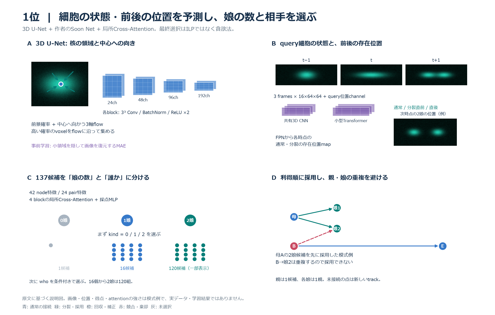
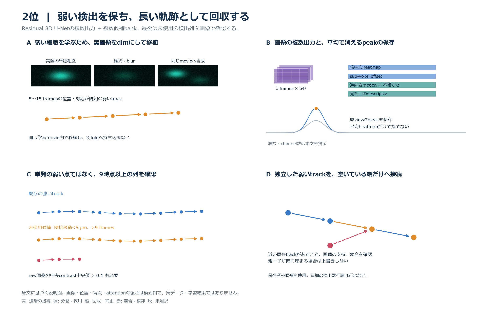
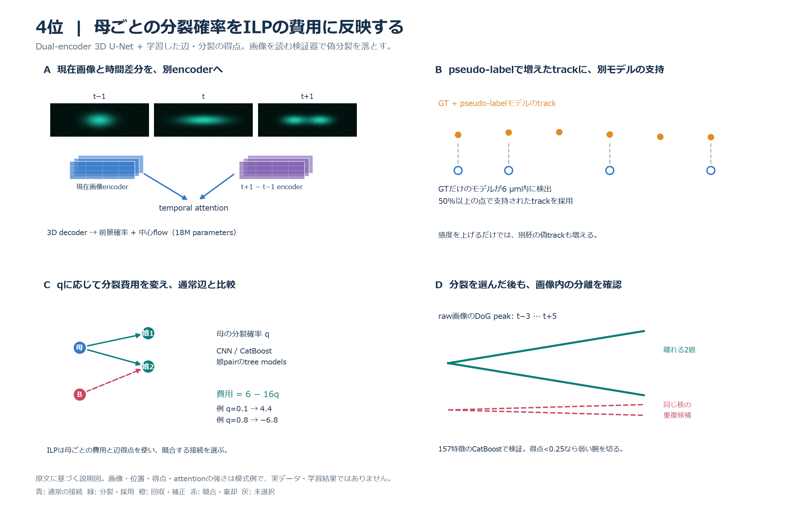
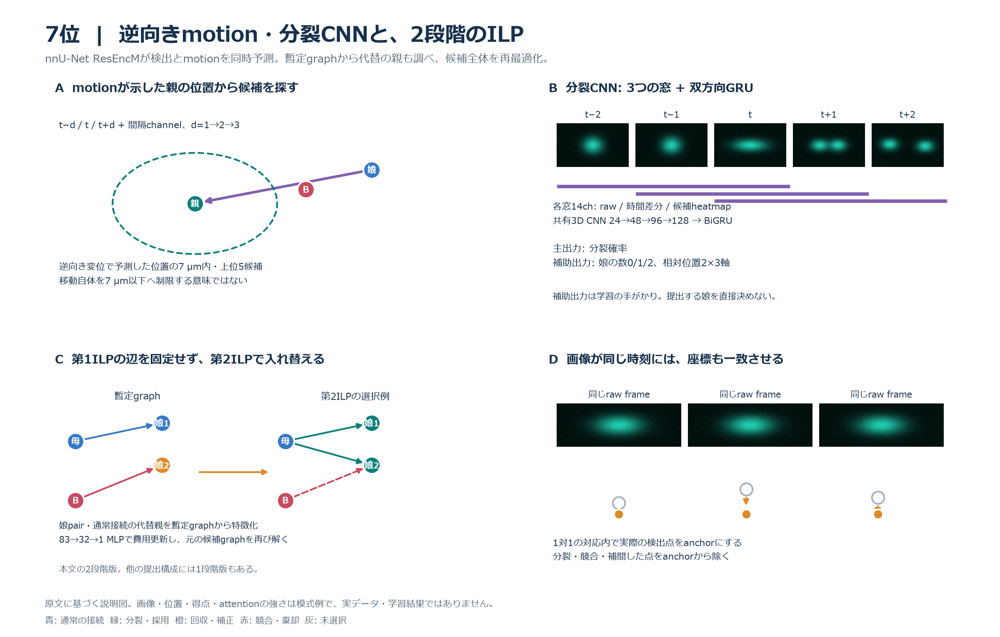
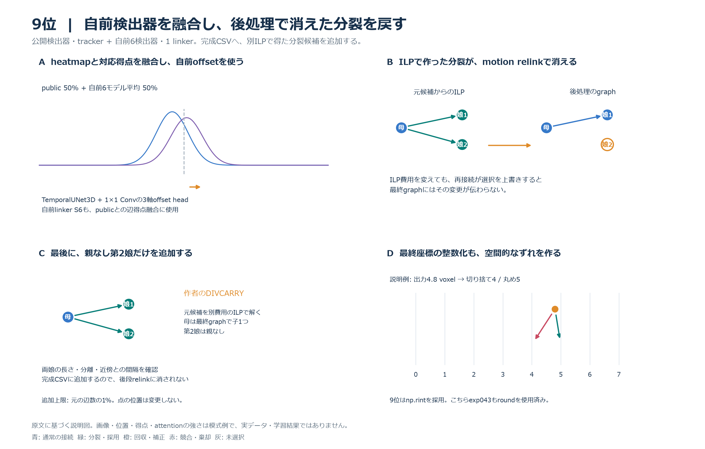
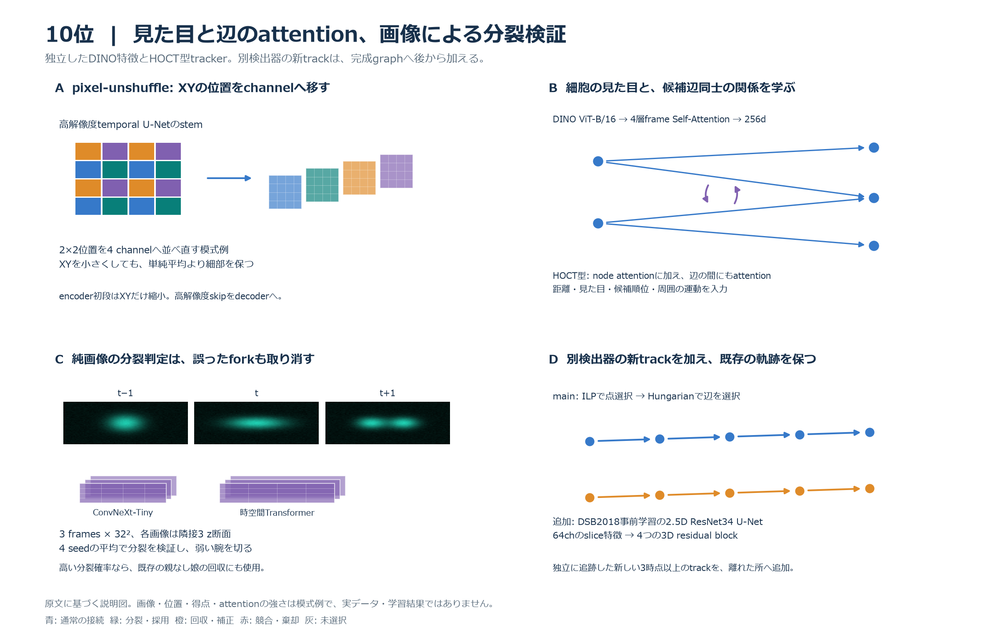
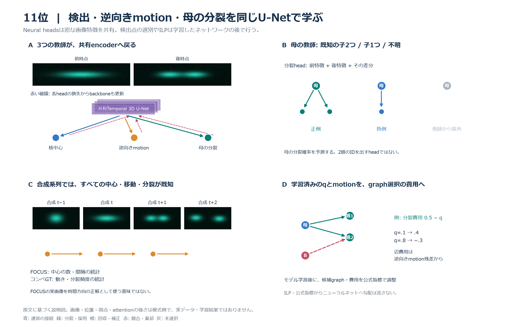
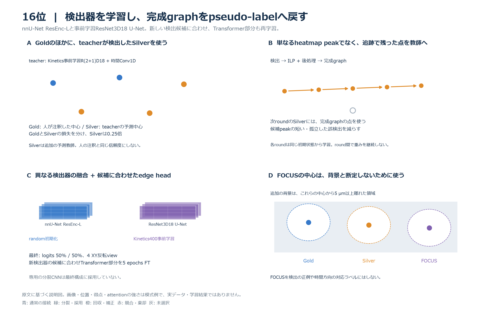
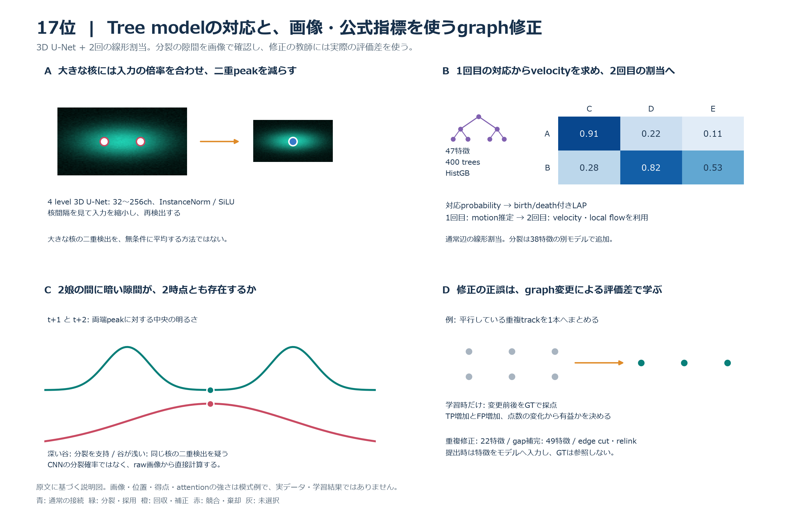

# Biohub 終了後の上位解法と自分の解法の比較

初回確認日: 2026-09-30、19:47 JST。終了後のKaggle DiscussionとAPIの順位・提出スコアを照合した。順位は確認時点の表示であり、主催者による最終監査後の確定順位とは区別する。

追記: 同日21時台の再確認で、新たに公開された6位の解説を取得した。3位・5位の本文と最新コメントも再取得し、評価対象確率の公開範囲を確認した。

**更新: 2026-10-02、20:53 JST。** 新たに確認できた1・2・4・7・9・10・11・16・17位の9解法を本文へ追加し、各解法のモデル構成表・説明図・こちらとの差分を作成した。関連13投稿も保存した。上位順位表はこの更新時のAPIに合わせている。

## 結論

本文で比較するのは、**1・2・3・4・5・6・7・9・10・11・12・14・16・17・18位の15解法**。初回に未確認だった1・2・4位の本文を今回取得できた。8・13・15位などは今回の最近60件のDiscussion取得範囲で解法本文を特定できておらず、未公開とは断定しない。

こちらとの大きな差は次の4点だった。

1. **分裂を座標関係だけで判定せず、前後画像や別の追跡モデルから判断材料を作る。** 1位は分裂状態と前後の存在位置を同時予測する。3・4・7・10・12・18位は画像による分裂判定、5・6・11位は分裂専用出力、14位は娘から母への変位予測を使う。
2. **通常接続と分裂を競合させ、既存接続を変更できる。** 3位は母と2娘をまとめた事象を通常接続と同時選択する。1位も子なし・通常接続・分裂を比較するが、貪欲法で選ぶ。4位は母ごとの分裂費用、7位の2段階版は暫定graphを使う費用更新でILPを解く。18位は分裂採用時に競合する通常接続を外す。こちらのexp053は親なしの第2娘を追加する範囲に限られる。
3. **完成したgraphを評価し直し、弱い検出も軌跡単位で確認する。** 18位は娘軌跡の補完後に分裂を再判定、9位は最終CSVへ分裂を復元、17位はgraph変更の公式評価差を教師にする。2位は未使用の弱い検出を長い軌跡と画像のcontrastで確認する。こちらでも後処理による変更消失を診断したが、最終構成で後処理全体を学習して置き換えるところまでは進んでいない。
4. **Publicの小差で手法を選ぶ限界が、こちらのPrivate結果にも現れた。** exp053はexp043に対してPublic +0.003、Private −0.002。Publicで不採用になったexp050の3構成はPrivate 0.922で、最終リーダーボードの0.919を上回った。これだけでGNNなどの単独寄与を確定できないが、実験の順序はPublicとPrivateで逆転している。

今の学習方針である「公開画像モデルとtrackerを固定し、後段の選択・修復を改善する」に近い参考は**18・12位、9位の最後の分裂復元、17位のgraph変更の教師、2位の未使用track回収**。1位の位置予測や10位の辺attention、各位の新しい検出器を実装するなら、学習対象・GPU予算の方針変更が必要である。この調査では実験の採否やバックログを変更していない。

## 対象と証拠範囲

- 対応する上位仮説: なし
- 今回は終了後の手法比較で、既存の上位仮説の採否を判断しない。
- 収集: Kaggle CLI 2.2.4の最近3ページ、60件のDiscussion一覧。上位5投稿と関連4投稿の本文・全コメントをAPIでも再取得し、リンク、表、図の参照を保存した。
- 追記時の収集: 最新1ページを再確認し、6位の本文を追加取得。保存したDiscussionは計10件。[追記時の取得データ](../../studies/biohub_top_solutions_20260930/calibration_transformer_followup.json)。
- 10月2日の収集: 最近3ページ60件から、主要9件と関連13件の計22件について本文・コメントをAPIで取得した。初回と合わせて保存したDiscussionは32件。[今回の一覧](../../studies/biohub_top_solutions_20261002/archive_inventory.json)、[取得時のDiscussion一覧](../../studies/biohub_top_solutions_20261002/topic_listing.csv)。KaggleページはWebツールでは本文を取得できず、Kaggle APIの原文を使った。
- 順位: `get_leaderboard`の最新表示を先頭600件まで取得し、こちらのTeam ID `16717777`まで確認した。[最終順位の生データ](../../studies/biohub_top_solutions_20260930/final_leaderboard.json)。
- 最新順位: [10月2日の600件](../../studies/biohub_top_solutions_20261002/final_leaderboard.json)はTeam IDの重複なし・score降順を検査した。4位の現在の表示名はBarryで、初回のz7777と同じTeam ID `16494792`。10位の作者はTheo Viel、チーム名はKaggle Agent。17位の作者はby、チーム名はibyyue。
- スコア: こちらの全14提出について`competitions submissions`から取得した。[提出スコアの生データ](../../studies/biohub_top_solutions_20260930/own_submissions.csv)、[比較に使用した数値](../../studies/biohub_top_solutions_20260930/comparison_evidence.json)。
- 注意: `competitions leaderboard --download`で取得したCSVはファイル名が示すとおり**Public leaderboard**だった。APIの最終表示と混同しない。こちらのPublic順位833位をPrivate順位に使わない。
- 解法の実装は作者の説明に基づく。最終source・checkpointを取得して再実行した比較ではない。1位は取得時点でコードを後日公開予定と記載。4位などにはNotebookへのリンクがあるが、今回取得・再実行していない。14位の図内の式や添付PDFまでは解析していない。
- 他参加者のテスト動画数・分割に関する推定は互いに一致しない。3位と89位の投稿にある件数を公式仕様として採用しない。
- 交差検証（CV）、学習に使わない分割への予測（OOF）、反転・回転などの複数入力で推論する方法（TTA）、整数線形計画法（ILP）を以下で使う。正解の注釈をGTと呼び、細胞を点、時間をまたぐ対応を辺として表すgraphを比較する。TPは評価対象で正しい予測、FPは評価対象で誤った予測を指す。

## 取得した上位解法

Privateは最新の最終リーダーボードと照合した。Publicは作者の最終提出の自己申告と、チームの過去最高Public値が混在しないよう、この表には置かない。

| 順位 | チーム | Private | 一次解説 | 手元の保存先 |
| --- | --- | --- | --- | --- |
| 1 | Sergio Alvarez | 0.97759 | [1st Place Solution](https://www.kaggle.com/competitions/biohub-cell-tracking-during-development/discussion/744801) | [保存](../discussions/biohub-cell-tracking-during-development-744801-1st-place-solution.md) |
| 2 | Soheil Ayati | 0.97041 | [2nd Place Solution](https://www.kaggle.com/competitions/biohub-cell-tracking-during-development/discussion/744723) | [保存](../discussions/biohub-cell-tracking-during-development-744723-2nd-place-solution.md) |
| 3 | yu4u | 0.96714 | [3rd Place Solution](https://www.kaggle.com/competitions/biohub-cell-tracking-during-development/discussion/744484) | [保存](../discussions/biohub-cell-tracking-during-development-744484-3rd-place-solution.md) |
| 4 | Barry | 0.96234 | [4th Place Solution](https://www.kaggle.com/competitions/biohub-cell-tracking-during-development/discussion/744673) | [保存](../discussions/biohub-cell-tracking-during-development-744673-4th-place-solution.md) |
| 5 | Tang | 0.95462 | [3D U-Net + Transformer Linker + Multi-stage ILP Tracking](https://www.kaggle.com/competitions/biohub-cell-tracking-during-development/discussion/744549) | [保存](../discussions/biohub-cell-tracking-during-development-744549-5th-place-3d-u-net-transformer-linker-multi-stage-ilp-tracking.md) |
| 6 | Cyrus | 0.95398 | [Six-Model Detect-and-Link Ensemble + Global ILP](https://www.kaggle.com/competitions/biohub-cell-tracking-during-development/discussion/744582) | [保存](../discussions/biohub-cell-tracking-during-development-744582-6th-place-six-model-detect-and-link-ensemble-global-ilp.md) |
| 7 | tatsutaka | 0.95273 | [7th Place Solution](https://www.kaggle.com/competitions/biohub-cell-tracking-during-development/discussion/744937) | [保存](../discussions/biohub-cell-tracking-during-development-744937-7th-place-solution.md) |
| 9 | yuto083 | 0.94981 | [Own Detectors, Public Tracker, Restored Divisions](https://www.kaggle.com/competitions/biohub-cell-tracking-during-development/discussion/744835) | [保存](../discussions/biohub-cell-tracking-during-development-744835-9th-place-solution-own-detectors-public-tracker-restored-divisions.md) |
| 10 | Kaggle Agent | 0.94884 | [Grandmaster-Powered Agentic Approach](https://www.kaggle.com/competitions/biohub-cell-tracking-during-development/discussion/744980) | [保存](../discussions/biohub-cell-tracking-during-development-744980-10th-place-solution-grandmaster-powered-agentic-approach.md) |
| 11 | tanbo | 0.94743 | [11th Place Solution](https://www.kaggle.com/competitions/biohub-cell-tracking-during-development/discussion/745092) | [保存](../discussions/biohub-cell-tracking-during-development-745092-11th-place-solution.md) |
| 12 | Corwin | 0.94664 | [12th Place Solution](https://www.kaggle.com/competitions/biohub-cell-tracking-during-development/discussion/744501) | [保存](../discussions/biohub-cell-tracking-during-development-744501-12th-place-solution.md) |
| 14 | Vibes & Edges Trade-Off | 0.94493 | [14th Place Solution](https://www.kaggle.com/competitions/biohub-cell-tracking-during-development/discussion/744486) | [保存](../discussions/biohub-cell-tracking-during-development-744486-14th-place-solution-from-vibes-edges-trade-off.md) |
| 16 | r3takahashi | 0.94340 | [16th Place Solution](https://www.kaggle.com/competitions/biohub-cell-tracking-during-development/discussion/744671) | [保存](../discussions/biohub-cell-tracking-during-development-744671-16th-place-solution.md) |
| 17 | ibyyue | 0.94235 | [17th Place Solution](https://www.kaggle.com/competitions/biohub-cell-tracking-during-development/discussion/744930) | [保存](../discussions/biohub-cell-tracking-during-development-744930-17th-place-solution.md) |
| 18 | ymg_aq | 0.94188 | [Lineage Graph Refinement Focused on Cell Divisions](https://www.kaggle.com/competitions/biohub-cell-tracking-during-development/discussion/744531) | [保存](../discussions/biohub-cell-tracking-during-development-744531-18th-place-solution-lineage-graph-refinement-focused-on-cell-divisions.md) |

## こちらの解法と最終結果

**こちらは当初、検出モデル・画像特徴を固定してtrackerを学習していた。** [exp016](../../experiments/exp016_frozen_image_encoder/result.md)ではprimary `SimpleNodeTransformer`を再学習し、全199動画の固定graph推論とKaggle上の公式評価まで実施した。その後もself-attentionや複数フレーム入力など、trackerの学習方法・構造を比較している。「こちらは公開trackerを固定していた」という一括した説明はこの経緯を落としていたため訂正する。

以下の提出スコア比較は、終盤の[exp043](../../experiments/exp043_x138_self_trained_head/requirements.md)を基準に、採用済みの[exp052](../../experiments/exp052_x138_relink_candidate_scores/result.md)、[exp053](../../experiments/exp053_x138_postlink_division_score/result.md)を比較対象に加えたもの。この構成で公開trackerを固定したことと、それ以前のtracker学習の経緯を分けて扱う。公開x138をそのまま再現した[exp042](../../experiments/exp042_public_x138_replay/result.md)とも分ける。

処理は、公開の2つのTemporalUNet3Dと対応tracker、DeepCenterによる検出候補の確認、自前の座標補正、ILP、近傍運動による再接続、検出点の再追加、欠落補完・分裂修復・平滑化である。自前の座標補正は、固定画像特徴224次元→全結合層32次元→SiLU活性化→全結合層3次元の7,299パラメータの小型ネットワーク。3軸の移動量を出し、そのノルムを2 µm未満に制限する。20動画で学習し、既知中心との一対一対応にHuber損失を使った。検出器と公開trackerはこの構成では再学習していない。

exp052はILPに選ばれなかった候補辺のtracker得点も再接続へ渡す。exp053は母の直前、母と2娘、娘の直後という4時点から19個の座標・接続特徴を作り、ロジスティック回帰で親なし第2娘を採点する。exp053は画像特徴を分裂採点器に入力せず、既に別の親がある娘の奪い返しや、前後接続の同時変更も行わない。[特徴実装](../../experiments/exp053_x138_postlink_division_score/division_features.py)、[選択実装](../../experiments/exp053_x138_postlink_division_score/scored_division.py)。

| 実験・構成 | submission ref | Public | Private | 比較上の意味 |
| --- | --- | --- | --- | --- |
| exp013 公開構成の再現 | 56199738 | 0.944 | 0.914 | 初期の公開モデル基準 |
| exp042 x138作者head | 56569806 | 0.953 | 0.917 | 公開x138の再現 |
| exp043 自前座標head | 56508119 | 0.950 | 0.918 | 後段改善の基準 |
| exp050 GNN | 56638386 | 0.938 | 0.922 | Publicで不採用、Privateでは手元最高と同点 |
| exp050 Optuna費用 | 56658424 | 0.942 | 0.922 | 同上 |
| exp050 拡張候補＋旧費用 | 56662549 | 0.943 | 0.922 | 同上 |
| exp052 候補得点の再接続への受け渡し | 56675101 | 0.950 | 0.919 | 最終リーダーボードの表示スコアと一致 |
| exp053 4時点の第2娘採点 | 56663354 | 0.953 | 0.916 | Public +0.003、Private −0.002、対照はexp043 |

**最終表示は430位／4,020チーム、0.919。全提出の最高Privateは0.922。** 最新APIはexp053など、既存metricsで未記録だったPrivate値も返した。このレポートの表は取得時点の新しい観測であり、実験statusやユーザーの採否判断を変更するものではない。Private未記録の実験正本への反映は別作業として残る。

上の順位・提出比較は**9月30日の観測**。10月2日のAPIでは同じTeam IDが**409位、0.91963**だった。今回のAPIは小数点以下5桁を返すので、3桁だった初回との末尾の差を新しい実験による改善と扱わない。最新総チーム数は取得していないため、4,020を409位の分母として流用しない。

exp052とexp053を同時適用した構成はこの表にない。両者の改善を加算して最終解法の性能を説明しない。exp050の3構成が同じPrivate値なので、0.922をGNN単独の成功の証拠とも扱わない。

## 図とモデル構成表の読み方

以下の15枚は、原文をもとにこのレポート用に作った説明図である。画像、細胞の位置、候補の得点、attentionの強さ、補正の方向は模式例であり、参加者の実データ・学習済みモデル出力・性能測定ではない。3D画像は2D断面として描き、重ねた矩形は画像特徴を表す。矩形の枚数を実際の層数やchannel数とは扱わない。本文に確認できる寸法・層数だけを構成表へ記載する。

青は通常接続、緑は分裂・採用、橙は回収・補正、赤は競合・棄却、灰は未選択を示す。各図は、処理の箱を順番に並べるだけでなく、モデルが見る画像、比較する細胞、予測する量、接続や座標が変わる具体例を示す。

encoderは画像から特徴を抽出する部分、decoderは特徴から画像上の出力へ戻す部分、headは接続や分裂など特定の予測を出す部分である。Self-Attentionは同じフレーム内の細胞関係を取り込み、Cross-Attentionは異なるフレーム間の細胞を照合する。channelは画像特徴の成分数を指す。GroupNormは特徴をchannelのグループごとに正規化する処理、GELUは非線形の活性化関数である。畳み込み層を用いる画像モデルをCNN、graphの点・辺の特徴を更新するモデルをGNN、画像を小さなpatchに分けて処理するTransformerをViT、時系列の情報を更新する再帰型モデルの一種をGRUと呼ぶ。

MLPは全結合層を重ねたネットワーク、BCEは二値交差エントロピーの損失、FTはfine-tuning（追加学習）。GBMは勾配boosting木モデルを指す。HOCTはHigher-Order Cell Tracking Transformerという追跡モデルの名称で、10位の説明ではnodeだけでなく候補辺をattentionで更新する構成を指す。`Gold/Silver`、`Soon Net`、`DIVCARRY`、`D2/LDM/LGAP/LCUT/KSM`などは各参加者が使う名称であり、このコンペ全体の標準的な工程名ではない。

U-Netは、encoderで画像を縮小しながら広い範囲の特徴を学び、decoderで元の位置の細かさへ戻す構造である。同じ解像度のencoder特徴をdecoderへ直接渡すskip connectionにより、細胞の位置の情報を保つ。3D CNNはz・y・x方向の近傍を一緒に処理する。以下の3位の2.5D U-Netは、隣接z断面を2D encoderのchannelへ入れ、その特徴を3D decoderで統合する構造を指す。

[全15枚の一覧](../images/biohub_top_solutions_20261002/00_contact_sheet.png)。出典と模式例の範囲は[初回6枚](../images/biohub_top_solutions_20260930/manifest.json)と[追加9枚](../images/biohub_top_solutions_20261002/manifest.json)に記録した。個別のSVG版は各節から参照できる。

## 1位: 細胞の状態・前後の位置を画像で予測し、娘の数と相手を選ぶ

[Sergio Alvarezの解説](https://www.kaggle.com/competitions/biohub-cell-tracking-during-development/discussion/744801)は、検出、作者が**Soon Net**と呼ぶ画像モデル、学習したlinker、貪欲な接続選択という構成。**1位は最終選択にILPを使っていない。** 大きな検出器の数を増やすより、分裂の状態と「この細胞が前後の時刻でどこにいるか」を画像から学ぶ点が特徴である。

**図の見方:** Aの矢印は核内のvoxelを中心へ集めるflow。Bはqueryとして指定された細胞について、状態と前後の存在位置を予測する。Cは0娘・1娘・2娘の決定と、具体的な娘の選択を分ける。Dは一つの娘が複数の親へ接続しないように、候補を利得順に採用する例。[SVG版](../images/biohub_top_solutions_20261002/01_occupancy_hierarchical_fork.svg)。

### モデルアーキテクチャ

| 部分 | 入力・構造 | 出力と学習 |
| --- | --- | --- |
| 検出器 | 約3.1Mパラメータの3D U-Net。学習cropは原文表記128×128×64。encoder 24→48→96ch、bottleneck 192ch。各blockは3³ Conv・BatchNorm・ReLUを2回、poolingは(1,2,2)、(1,2,2)、(2,2,2) | 1³ Convの2 headで前景確率と中心への3軸flow。1/2・1/4解像度でも補助学習。確率0.5超のvoxelをflowに沿って集め、3 µm以内で同じ中心へ収束するvoxelを一つの核にする |
| Soon Net | t−1・t・t+1の各16×64×64 cropとquery位置のGaussian channel。共有小型3D CNNでtoken化し、小型TransformerのEVA blockとqueryで読み出す | 通常・分裂直前・分裂直後の3状態。さらにFPN（複数解像度の画像特徴を統合する部分）が各時刻の通常継続用・分裂用の存在位置mapを出す。層数・埋め込み次元・損失の完全な式は本文未提示 |
| linkerのnode処理 | 2時点の各細胞を42特徴からtoken化。体積、前景確率、24次元の位置表現、13形状特徴、3軸の視野境界距離。4つの局所Cross-Attention block | 相手フレームの30 µm以内と16近傍を照合。単一細胞の画像cropを直接tokenとして入れる構成ではなく、検出器の形状特徴を使う |
| pair head | 両端のtokenに24個のpair特徴を追加するMLP。変位、形状・強度の変化、組織の動きを引いた残差、Soon Netの順逆存在位置得点など | 各通常接続の得点。母が予測した次時点mapを娘位置で読み、娘が予測した前時点mapを母位置で読む |
| fork head | pair headの上位16娘から、子なし1通り・1娘16通り・2娘120通り、計137候補を作る | まず作者のいう`kind`で子の数0/1/2を予測し、次に`who`でその条件下の娘を選ぶ。最終確率は両確率の積。分裂を8倍に増やして10 epochs学習、25%はtとt+2の組 |

存在位置mapは全画像の細胞検出と異なり、**queryで指定した細胞とその親・娘がいる位置**を予測する。通常の細胞なら3時点の自分を通常mapへ、母なら次時点の2娘を分裂mapへ、新生娘なら前時点の母を分裂mapへ教師として置く。画像を見て「どちらへ進むか」を学べるため、座標の近さだけで候補を決めずに済む。queryがcropの中心からずれるaugmentationも加え、中央の核を無条件に追う学習を防いでいる。

137候補を一つのsoftmaxで比較した初期版では偽分裂が多かったと作者は述べる。娘の数の判定と娘の組の選択を分け、前者には細胞状態と有力な娘pairの存在、後者には分裂map、pair得点、体積の和、分裂方向などを使う。推論は5 fold平均で、各候補が子なしよりどれだけ良いかを対数確率の差で比べ、正の利得だけを降順採用する。各親は1候補、各娘は1親まで。通常接続と分裂を比較しているが、3位の大域的ILPと同じ最適化ではない。

事前学習はMAE（Masked Autoencoder、画像の一部を隠して復元する学習）で、2×4×4 voxelの小領域を50%隠す。コンペ180動画と外部ultrackの1,500フレームを使用。その後に約1,800個の手描きmaskとGT中心へのstampで学習し、pseudo-labelで追加学習する。Soon Net用には候補を目視して**分裂教師を151件から515件へ増やした**。同じモデルで得たpseudo-labelを検証へ含める点について、作者自身がCVは楽観的になると明記している。元GTでの最終CV 0.9575と追加GTでの0.9856は、採点対象が違うので単なる改善量として差し引かない。

**こちらとの差:** こちらのexp016以降もtrackerを学習したが、入力は固定の検出・画像特徴が中心だった。1位は画像から細胞の状態と前後の相手位置を別に学び、linkerへ渡す。exp053の19個の座標・接続特徴より入力情報が多く、子なし・1娘・2娘を同じ候補集合で比較する。手作業の教師追加も含むため、Transformerのblockだけを変えれば同じ効果が得られるという比較ではない。

## 2位: 弱い検出を保存し、画像に支持された長いtrackを回収する

[Soheil Ayatiの解説](https://www.kaggle.com/competitions/biohub-cell-tracking-during-development/discussion/744723)は、複数の検出候補と運動・見た目の予測を使い、最後に弱い細胞のtrackを回収する。**検出閾値を一律に下げる処理ではなく、使わなかった検出列を画像と時間的連続性で確認する**。

**図の見方:** Aは実細胞のcropを減光して同じmovieへ移植する学習例。Bはheatmap、offset、逆向きmotion、見た目の別出力と、平均で消えた原view peakの保存。Cは単発の弱い点より長い列を採る判断。Dは既存の接続を奪わず、空いているtrack端へ追加する例。[SVG版](../images/biohub_top_solutions_20261002/02_faint_track_recovery.svg)。

### モデルアーキテクチャ

| 部分 | 入力・確認できる構造 | 出力・学習 |
| --- | --- | --- |
| 主検出器 | t−1・t・t+1、XY average pooling 4倍後の等方1.625 µm、3×64³。Residual 3D U-Net | 中心heatmap、sub-voxel offset、逆向きmotionと不確かさ、見た目のdescriptor。各層のchannel数・正確な損失の全式は本文未提示 |
| 補助検出器 | 別recipeの3フレーム・5フレームの候補bank | 独立した候補graphを作り、経路や辺・分裂の一致を確認。全モデルのheatmapを単純平均するだけではない |
| 候補の再順位付け | 画像からの細胞数推定と、弱い候補の特徴 | 学習したcount estimatorと、暗さ・細胞らしさを調べる2つのLightGBM。count estimatorのモデル型は本文未提示。元候補は保持する |
| 通常辺・分裂 | motion、見た目、track文脈、母＋2娘の幾何と競合する説明 | 学習した接続得点・分裂得点を使う。linkerの具体的な層数・Transformerの有無・solverの型は本文だけでは確定できない |
| 最後の回収 | 保存済みの未使用検出、raw画像の中央contrast、画像条件のcluster | 新しい細胞のtrackを採用する規則。推論時にモデルを追加学習したり検出器を再実行したりしない |

疎い注釈では正例と背景を別々に正規化し、正誤不明な領域の損失を0にする。brightness augmentationの前にmaskを作り、減光した未知の細胞を背景へ変えてしまわない。弱い細胞を増やす合成は、実際の孤立した注釈trackを背景除去・減光・depth blurして**同じmovie、同じfold内**の別位置へ貼り、5〜15フレームの位置・接続が既知の新trackを作る。全面的な人工画像だけでなく、実細胞の見た目を使った合成である。これを入れた比較はPublicで改善してもCVで小さく悪化しており、常に有効とは説明していない。

主検出器は5 foldとXY 180度回転viewのheatmap平均を使う一方、offset・motion・descriptorは元viewを使う。平均heatmapから3 µm以上離れた元viewのpeakも別候補として保持する。この段階でtrackにならなくても捨てず、後段の回収に残す。

最終回収は画像の明るさ・contrastから作ったK-meansの群に応じて実施する。作者が`acq_01`と呼ぶ群は画像条件の群で、胚IDそのものではない。既存点から4.5 µm以上離れた未使用候補について、**連続9フレーム以上、隣接移動5 µm以下、中央contrastの中央値0.1超、どこかで既存予測の8 µm内**を要求する。長い候補から競合なく採用し、隣接する空いたtrack端まで5 µm以内なら接続する。接続できなくても採用した独立trackが残る場合がある。

作者のV507→V533比較ではCV +0.001807、辺TP +360・FP +54、分裂は変化なし。20/80動画が改善し、改善量が少数動画に偏ることも記載する。残る見逃し分裂62件のうち30件は第2娘が別の親へ接続済みだったが、その周辺接続の再比較は**今後の案であり実装済みとは書かれていない**。現在の採用Privateは0.97041。

**こちらとの差:** exp052は未選択の辺得点を再接続へ渡すが、2位は未使用の**検出点とその長い経路**を画像で確認する。exp043の小型座標headより新しい検出器の出力も多い。一方、最後のtrack回収という発想は、必要な弱い候補と画像が保存されていれば、検出器・trackerを固定した後段にも転用を検討できる。

## 3位: 疎い注釈、画像からの運動・分裂、通常接続との同時選択

[yu4uの解説](https://www.kaggle.com/competitions/biohub-cell-tracking-during-development/discussion/744484)は、検出器・運動・対応・分裂を別々に学習し、graph最適化で組み合わせる構成。

**図の見方:** Aは元の前後画像と位置合わせした画像を別入力にして、母の分裂得点を出す。Bは細胞間の対応得点と、母＋2娘の分裂確率を分けて作る。CではAの分裂を選ぶために競合するB→Dを外し、B→Eを残す例を描く。Dは通常接続から求めた運動で点を動かし、分裂周辺を固定する例。[SVG版](../images/biohub_top_solutions_20260930/03_joint_division.svg)。

### モデルアーキテクチャ

| 部分 | 入力 | 確認できる構造 | 出力と教師 |
| --- | --- | --- | --- |
| 検出器2種 | z方向の隣接3断面をchannelとして積んだ画像 | EfficientNetV2-LまたはEfficientNet-B7の2D encoder。各段でz方向を統合し、3D decoderで出力する2.5D U-Net | 中心heatmap。注釈中心周辺のGaussianを教師にし、背景と正例の平均二乗誤差（MSE）を別々に平均。未注釈らしい領域は損失から除く |
| 3D検出器 | 3D画像 | MONAI SegResNet。初期32ch、encoder 4段、各段1 residual block、GroupNorm | 同じ中心heatmap。前2種と重み0.3・0.4・0.3で融合 |
| 運動モデル | 連続する2つの3D画像をz/y/x＝1/4/4で縮小 | 小型3D encoder-decoder、32/64/128ch。局所相関から初期変位を出し、残差を予測して更新 | 密な3D変位場。実画像の位置合わせ・順逆の整合・滑らかさと、合成した既知変位で学習 |
| 対応モデル | 独自2.5D U-Netの検出点上の64ch特徴、運動補正した位置 | EfficientNetV2-S encoder。Self/Cross-Attention、フレームの役割を表す埋め込み、見た目のcosine類似度を使う採点head | 対応得点と対応なしの得点。注釈接続による双方向交差エントロピー。分裂では各娘の学習時にもう一方の娘を負例から除く |
| 母の分裂モデル | 元t−1・整列t−1・t・整列t+1・元t+1の5画像 | 共通EfficientNetV2-S encoderで各入力を処理し、対応する段の特徴を結合。GroupNorm付き3D decoder | 各検出点の母の分裂得点。次フレームに2娘を持つ母を正例とする二値交差エントロピー |
| 分裂前後のモデル | 分裂前または分裂後の点を中心とする3時点の元画像 | 母モデルとは独立。本文では個々の層構成を詳述していない | 分裂前の細胞、分裂後の娘を予測 |
| 候補の校正 | 距離・双方向対応・分裂前後の得点など | 通常辺はロジスティック回帰。分裂はLightGBMとXGBoost | 通常辺・母＋2娘の条件付き正解確率。評価対象確率の算出器の詳細は未公開 |

画像からの検出・運動・対応・分裂は別々に学習し、最後にgraph最適化で組み合わせる。対応モデルのattentionの層数・head数を本文だけから推定して補わない。

- 検出はEfficientNetV2-L、EfficientNet-B7の2.5D U-NetとMONAI SegResNetの平均。2.5Dは2D encoderでz方向の隣接断面を処理し、3D decoderで深さを統合する。5分割モデルと2方向のTTAを使う。
- 疎い注釈への対処が明示されている。Difference of Gaussians（DoG、異なる幅のGaussian平滑化の差）で未注釈の細胞らしい候補を探し、その周囲を背景の損失から除外する。未注釈候補を新しい正解にせず、「背景と断定できない場所」を除く。
- 3D変位場を自己教師ありの画像整合と合成変形で学習。対応モデルは運動補正後の位置、画像特徴、対応なしの選択肢を使う。
- 分裂モデルは動きで位置合わせした前後画像と元画像を入力し、分裂する母を予測する。分裂前の細胞と分裂後の娘を予測する別モデルも加える。
- 通常辺と母＋2娘の候補を校正し、点の保持・通常継続・分裂を共同選択する。疎い評価では候補が評価対象になる確率と、評価される場合に正しい確率を分ける。HiGHSの線形計画と混合整数計画で解く。
- 欠落を埋めたあと、通常接続から組織のアフィン運動を求めて座標を補正する。分裂点や欠落の両端は固定する。

**3位のLightGBMの用途は、母1点と娘2点からなる分裂候補の確率校正である。** 画像モデルの分裂得点、双方向の対応得点、距離、候補順位、他候補との差、検出信頼度、分裂前後のモデル得点などを入力し、「評価対象になった場合に、この母と2娘が正しい分裂である確率」を予測する。未注釈候補を一律に誤りとしないため、評価対象になる確率は別に扱う。通常接続の校正はロジスティック回帰であり、LightGBMは検出器や全接続の対応モデルを置き換える用途ではない。

分裂の条件付き確率はLightGBMとXGBoostを学習し、予測確率を等重みで平均する。初期graphの構築にはLightGBMの確率を残し、最適化中の選択肢の評価には平均確率を使う。主な分裂候補と追加の候補には別々の校正モデルを使う。教師では母と両娘の厳密な対応を求め、公式分裂指標の局所的な時刻許容とは同じではない。

画像モデルの分裂得点は、検出された母が次のフレームで2娘へ分裂するかを予測した得点である。主モデルには、元のt−1画像、tへ位置合わせしたt−1画像、t画像、tへ位置合わせしたt+1画像、元のt+1画像の5つの3D画像を入力する。共通encoderと3D decoderで各検出点の母の得点を出す。教師の正例は次フレームに2娘を持つ注釈済みの母、負例は通常継続する細胞や分裂直後の娘などで、GTに対応しない検出点を負例損失へ入れない。分裂前と分裂後の細胞を予測する別モデルもある。画像モデルだけでは、どの2点が娘かまで最終決定しない。

評価対象になる確率は、画像内の細胞が存在する確率ではなく、その候補が疎い注釈のもとでTP・FPとして評価される確率である。例えば注釈済みの接続を誤った候補は誤りと判定できるが、未注釈の細胞同士の接続は正誤を判定できない場合がある。条件付きの正解確率は、評価対象になるという条件の下で候補が正しい確率である。説明用に前者10%、後者80%なら、同条件の100候補について期待されるTP寄与は8、FP寄与は2となる。残る90をFPにしない。保持する点の数に対する補正は別に扱う。

**評価対象になる確率の具体的算出器は未確認である。** 最新本文・コメントには、この確率を出すモデルの種類、教師を作る処理、そのための特徴量、係数は載っていない。通常接続にロジスティック回帰を使うという記述だけから、評価対象確率も同じモデルで出すと断定しない。全体の注釈率2.8%をそのまま使うとも説明されていない。以前の対話で「候補の特徴から学習して算出する」と断定した説明は公開範囲を超えており、実装例としての説明へ訂正する。

一般的な実装例では、学習候補を公式評価器に照らし、TPまたはFPとして評価される候補を1、評価不能な候補を0として、評価対象になるかを予測する分類器を学習できる。評価対象になる候補だけで正誤の分類器を学習すれば、2つの確率を分けられる。ただし、この実装を3位が使ったと確認できたわけではない。分裂候補への評価対象ラベルには分裂用の判定が必要であり、通常辺のルールをそのまま適用すると断定しない。

ロジスティック回帰の役割は、距離や複数モデルの得点を組み合わせて通常接続の正解確率を推定すること。単一の得点を変換するだけの校正ではない。一般的には、比較的少ないパラメータで確率を出せて、複雑なモデルより過学習を抑えやすい選択肢になる。ただし作者は、通常辺にこれを選んだ理由や別モデルとの比較実験を示していない。ロジスティック回帰を使うだけで校正の良さが保証されるわけでもない。[確率校正の一般的な説明](https://scikit-learn.org/stable/modules/calibration.html)。

**数値例:** 距離、順方向の対応得点、逆方向の対応得点を入力し、重み付き和をsigmoid関数で0〜1へ変換する。切片−3、距離の係数−0.5、両方向の得点の係数を各3と仮定すると、次のようになる。係数も数値も説明用で、3位の実測値ではない。

| 距離 | 順方向得点 | 逆方向得点 | 出力確率 | 違い |
| --- | --- | --- | --- | --- |
| 1 µm | 0.95 | 0.93 | 0.895 | 近く、両方向で支持される |
| 4 µm | 0.95 | 0.93 | 0.655 | 得点は同じでも距離が大きい |
| 1 µm | 0.95 | 0.35 | 0.599 | 近いが逆方向の支持が弱い |
| 4 µm | 0.95 | 0.35 | 0.250 | 距離も方向間の不一致も大きい |

実際は、評価可能な学習候補の正誤ラベルから係数を学ぶ。未注釈候補を誤りと扱わず、学習に使わない動画の予測で確率の妥当性を確認する。順方向0.95という1つの得点をそのまま最終確率にせず、他の判断材料も反映できることがこの例の要点である。

同時最適化では、各検出点の保持、各通常辺の採用、各母と2娘の分裂候補の採用を意思決定として扱う。分裂候補を選ぶと両娘の辺がまとめて入り、母の通常辺や娘の他の親からの辺とは排他的になる。目的は公式指標に近い代理目的を高めることであり、校正確率から期待されるTP・FPと点数を求める。そのままでは比率を含むため、現在の解の周りで線形化し、各選択肢の報酬・費用へ変換する。動画ごとに解き、全動画の期待数を集約して係数を更新し、最大3巡まで改善した解を残す。HiGHSでまず線形計画（LP）の緩和、つまり二値の選択を一時的に0〜1の連続値として解き、分数の選択が残れば分裂変数を二値にした混合整数線形計画（MILP）で解く。公開本文には完全な目的関数の式やsolver実装は載っておらず、ここでは原文の処理内容を説明している。

作者の段階比較では、検出＋幾何接続0.890211から、運動0.901919、対応0.901953、分裂と共同選択0.964493、最終0.977801。**大きな改善の段階は分裂モデル・校正・共同選択・候補範囲・点の選択を同時に変更している**ので、+0.062540を共同選択単独の寄与と呼べない。採用Privateは最新APIで0.96714、Division Jaccardは作者報告で0.47。

こちらとの差は、新しい画像モデルと分裂画像判定、疎い教師への対処、事象単位の同時選択。こちらの4時点採点は完成途中の予測接続を特徴に使うが、3位はその接続自体も選択の対象に残す。3位の動画単位5分割にも同じ胚の重複cropによる依存があり、作者は完全に独立した検証とは述べていない。

## 4位: 検出器・辺・分裂を学習し、母ごとの分裂費用でILPを解く

[BarryZhouの解説](https://www.kaggle.com/competitions/biohub-cell-tracking-during-development/discussion/744673)は、自前の検出器、通常辺のLightGBM、画像とgraphを読む分裂モデルを組み合わせる。分裂判定を最後に足すだけでなく、**母ごとに違う分裂確率をILPの費用へ入れる**。

**図の見方:** Aは現在画像と時間差分を別々に読む検出器。Bはpseudo-labelの検出器で得たtrackに、GTだけで学んだ検出器の支持を求める。Cは母の確率で分裂費用が変わり、通常辺と競合する例。Dは選んだ分裂をraw画像の時間変化で検証する。[SVG版](../images/biohub_top_solutions_20261002/04_learned_division_cost.svg)。

### モデルアーキテクチャ

| 部分 | 入力・構造 | 出力・学習 |
| --- | --- | --- |
| 検出器 | 現在画像とt+1−t−1の差分画像を別encoderへ入れ、temporal attentionで融合する18Mパラメータの3D U-Net | 前景確率とvoxelから中心への単位flow。GTのみ、GT＋pseudo-label、XY縮小4倍の別bankを使用。各層のchannel数は本文未提示 |
| 通常辺 | 26幾何特徴など計47特徴のLightGBM | 辺の確率。2.1Mパラメータの公開node Transformer再学習による双方向得点とその調和平均、小型CNNの見た目類似度も入力 |
| 見た目CNN | raw画像の16×32×32 crop、0.24Mパラメータ | 同じGT細胞の連続時点を近く、競合する細胞を遠くするInfoNCE（対照学習の損失）で特徴を学ぶ |
| 母の分裂CNN | 前後5時点の9×33×33 crop、1.4Mパラメータ、3 seedとcopy-pasteの有無で6モデル、4 flip view | 次時点に2娘を持つ母の得点。1娘は負例、正誤不明な細胞は除く |
| graphと娘pair | 53 graph特徴のCatBoost、娘pairのLightGBM・CatBoost。pairには174画像特徴にgraph・embedding・辺特徴を追加 | 母と2娘の整合を採点。母の直前7時点・娘の直後3時点の強度や分離の変化も使用。174は全入力の総数ではない |
| 選択後の分裂検証 | raw画像のt−3〜t+5でDoG peakを再探索し、分離・運動など157特徴のCatBoost | 偽分裂を判定し、0.25未満では明確な軸方向の分離などの例外を除いて弱い腕を切る |

検出は前景への重み付きBCEとflowのL1損失。GT周辺・暗い背景・その他で別々に損失を正規化し、その他にはごく弱い背景重みを置く。前景確率0.97超のvoxelをflowに沿って40回、各0.5 µm動かし、中心でまとめる。pseudo-labelはOOFと外部Zebrahubも使う。感度の高いpseudo-labelモデルが別胚で偽trackを増やしたため、**GT-onlyモデルの6 µm以内の検出がtrackの50%以上の点を支持すること**を求めて採用する。

候補辺は10 µm以内に加え、次時点5近傍・前時点3近傍を残す。母の分裂確率qは娘pairとgraphの得点から作り、ILPの分裂費用を**6−16q、疎い動画では5−16q**へ変える。説明例でq=0.1なら費用4.4、q=0.8なら−6.8になり、分裂らしい母では2娘を採る不利が小さくなる。辺候補の確率閾値も0.3−0.5qへ下げ、第2娘の弱い辺を先に捨てない。SCIPを使って点・辺・分裂を制約付きで選ぶ。

このqは「この母が分裂する確率」で、3位の「注釈の下で評価対象になる確率」とは違う。また3位の母＋2娘の事象を明示した最適化と、4位の母ごとの分裂費用を同じ実装とは扱わない。選択後には画像のpeakが本当に2つへ離れたかを確認するため、qが高かった分裂でも取り消せる。

作者の段階比較では分裂費用などの追加で0.913→0.948という大きな改善があった。最終的に選んだPrivateは0.96234。より緩い支持条件の未選択版0.964を、正式な4位提出のscoreとして置かない。

**こちらとの差:** exp053は幾何の小型分類器で親なし娘を後から追加する。4位は画像分裂CNN・辺の学習・候補の保持・母ごとの費用・最後の画像検証まで扱う。公開trackerも再学習しているので、終盤に固定したこちらと異なる。一方、「強い分裂の支持がある母に対して、第2娘の候補を捨てずに費用へ反映する」は後段設計の参考になる。

## 5位: 外部事前学習、細胞の出現・分裂を予測するtracker

[Tangの解説](https://www.kaggle.com/competitions/biohub-cell-tracking-during-development/discussion/744549)は、公開TemporalUNet3Dを基にしながら、検出器とtrackerを自前学習している。

**図の見方:** Aの線は細胞間の照合を表し、出現・分裂・見た目も予測する。B→Cで閾値を下げると橙の点が回収される一方、赤い偽分裂も生じる。Dではその分裂を取り消して点を残す。Eの橙の白抜き点はILP4で補った欠落位置。Fは同じ細胞の9時点へ直線を当てはめ、位置の揺れを抑える数値例。[SVG版](../images/biohub_top_solutions_20260930/05_multistage_ilp.svg)。

### モデルアーキテクチャ

| 部分 | 入力 | 確認できる構造 | 出力・学習 |
| --- | --- | --- | --- |
| 検出 | 時間方向の3D画像。X/Yはaverage poolingで4分の1へ縮小 | 公開baselineのTemporal 3D U-Net | 核中心と画像特徴。4つの公開ZebraHubデータで事前学習し、コンペデータでfine-tuningする構成 |
| 対応 | 時刻tとt+1の細胞特徴 | フレーム内Self-Attention、フレーム間Cross-Attention | 全候補pairの接続得点 |
| 見た目 | U-Netの細胞特徴 | 16次元の見た目ベクトルを学習 | 同一細胞の前後で似た特徴を持たせ、密集した細胞を区別する |
| 出現 | 次フレームの細胞特徴 | 新規細胞を予測する出力 | 対応する前の細胞がない確率。ILPの開始費用に反映 |
| 分裂 | 母の細胞特徴 | 分裂用の独立head | 分裂確率。希少な正例を重くして学習し、ILPの分裂費用へ反映 |

原文はattentionの層数・head数・hidden dimensionや各損失の完全な式を示していない。5-foldのモデルと8方向のTTAを平均し、ILPへ渡す。ILPは画像を読むモデルではなく、これらの出力に基づいてgraphを選ぶ処理である。

trackerは通常の接続得点に加え、16次元の見た目特徴、次フレームに新しく現れる細胞、母が分裂するかを出力する。分裂には重みを増やした損失を使い、出現・分裂の予測をILPの開始費用・分裂費用へ直接反映する。4つの公開Zebrahubデータで事前学習し、コンペデータでfine-tuning。5分割×8方向TTAで推論する。

**ILPを目的・候補・固定条件を変えながら4段階で実行する。** 同じ問題を4回解くだけではない。

| 段階 | 入力・固定条件 | 選択するもの・狙い |
| --- | --- | --- |
| ILP1 | 検出信頼度0.9以上の点 | 点、接続、軌跡の開始・終了、分裂を選び、信頼度の高い点によるgraphを作る |
| ILP2 | 検出信頼度0.6以上へ候補を増やす | 見逃した点と接続を回収する。ただし偽分裂も増える |
| ILP2後の処理 | ILP1になかった分裂 | 新しく生じた分裂を取り消す。追加の点は独立した軌跡として残す |
| ILP3 | 点と分裂を固定 | 通常接続を再選択する。得点0.2〜0.3の弱い辺も最適化に含め、解いた後で除く |
| ILP4 | 2〜5フレーム離れた軌跡の末端と始端 | 軌跡同士をつなぎ、間の欠落座標を補う |

ILP以外にも、見た目が似ているかで曖昧な接続を修復し、隣接フレームの末端・始端を得点0.1〜0.3の弱い辺でつなぐ。最後に各点の前後4フレームへ直線を当てはめ、その予測位置80%と元の検出位置20%を混ぜて平滑化する。その後、1フレームだけ欠けた点を補う。

平滑化は、同じ軌跡のt−4からt+4まで最大9時点の座標を使い、時間に対する直線を当てはめ、時刻tの座標をその直線から予測する処理である。例えば元のX座標20 µm、直線の予測18 µmなら、混合後は18.4 µmになる。移動の傾向を残して検出位置の揺れを抑える。周囲の別細胞の座標を平均する処理ではない。窓の端や分裂付近の詳細な扱いは本文に記載されていない。

作者が報告するPrivateの増分は、新規細胞・分裂head +0.024、Zebrahub事前学習 +0.016、検出信頼度を点費用に使う変更 +0.020。これらの増分を独立効果として足し合わせない。Private最終値は最新APIで0.95462。

こちらも初期にはtrackerを学習していたため、5位との差をtracker学習の有無とは説明しない。差は、5位が接続、見た目、出現、分裂を別の出力として学習し、外部事前学習と複数段階のILPへ組み込んだことにある。終盤のこちらの構成では公開trackerを固定し、分裂を後段で追加する。異常な重複フレーム・大きな全体移動を除いた学習がPrivate +0.011、Publicでは低下したという例もあり、データ整備とPublic選択の不一致も参考になる。

## 6位: 速度と不確かさを使う疎なgraph attention、検出と追跡の共同学習

[Cyrusの解説](https://www.kaggle.com/competitions/biohub-cell-tracking-during-development/discussion/744582)は、trackerのattentionと入力・出力を工夫した例である。作者の用語は`bidirectional sparse graph attention`であり、通常の密なTransformerと同じ実装だと一括しない。

**図の見方:** Aでは予測変位の場所から近隣フレームの画像特徴を取得する。Bの楕円は予測位置の不確かさを示し、単に近いDより動きに合うCを支持する例。Cは近傍候補上で細胞特徴を更新する。Dはattention途中の仮の対応から速度・不確かさを更新する例で、常に不確かさが縮むと主張するものではない。[SVG版](../images/biohub_top_solutions_20260930/06_motion_attention.svg)。

### モデルアーキテクチャ

| 部分 | 入力・構造 | 出力・学習 |
| --- | --- | --- |
| 共通encoder | native解像度のt−1・t・t+1。Conv3d→GroupNorm→GELUの3D U-Net型。XY方向だけの縮小を2回行って1.625 µmの等方gridへ、その後3D縮小で3.25 µm gridへ | 各フレームの特徴。1フレームを1回encodeして重なる窓で再利用 |
| 時間的な特徴融合 | 粗いgrid上で隣接フレームへの変位を予測し、その位置から特徴を採ってattentionで融合 | 動きに整列した特徴。変位は約6.5 µm以内 |
| 検出decoder | skip connection付きで64×128×128 gridへ戻す | 中心heatmapとsub-voxel offset。中心のfocal loss、offsetのsmooth L1など |
| 細胞特徴 | 中心と局所平均から取得。もう一方の構造では3 µm以内の取得位置を学習 | 候補細胞ごとの見た目特徴 |
| 対応head | 速度と各軸の不確かさを予測し、変位・予測運動からの残差・正規化した残差を候補辺へ入力。近傍候補graph上の双方向attentionを3〜4層 | 候補親＋新規細胞のsoftmax、母の分裂得点、2娘の組の得点、速度 |
| 構造の差 | 作者のIsotropicLineageNetは粗いgridで融合。MultiScaleLineageNetは2解像度で融合し、検出と対応でresidual adapterを分ける | 後者はattention途中の仮の対応から速度・不確かさを更新する |

対応は親候補と新規細胞クラスに対する交差エントロピー、分裂と娘pairは二値交差エントロピー、速度はガウス分布の負の対数尤度で学習する。正しい親を意図的に15%外し、新規細胞の出力も学習させる。注釈の損失と疑似ラベルの損失を分け、疑似ラベル側を0.5倍して合わせる。検出と追跡の画像特徴は共同学習であり、こちらの固定encoder上のtracker学習とは異なる。

3フレームの画像を入力し、各フレームのencoder特徴を再利用する。細胞ごとに速度と各軸の不確かさを予測し、候補接続へ実際の変位と予測速度からの残差、不確かさで正規化した残差を与える。近傍の候補graph上で3〜4層の双方向attentionを行い、両フレームの細胞特徴を更新する。出力は、候補親と新規細胞クラスを含むsoftmax、母の分裂得点、2娘の組の得点、速度である。検出モデルと追跡部分を共同学習する。

2構造を使い、作者が`MultiScaleLineageNet`と呼ぶ方は、複数の解像度での時間的特徴の融合、検出と追跡で分けた残差adapter、細胞中心周辺の学習可能な特徴取得位置を加える。attentionの途中に、候補へのsoft assignmentから速度・不確かさを更新する処理も入る。教師・生徒モデルによる疑似ラベルを複数回作り、注釈と疑似ラベルの損失を分けて学習する。6モデルの検出を共通化し、モデルごとのLightGBM再採点後に接続確率を平均してILPへ渡す。

こちらの[exp025](../../experiments/exp025_frame_self_attention/requirements.md)にもフレーム内Self-AttentionとCross-Attentionの比較があり、[exp034](../../experiments/exp034_frame_self_attention_distance_bias/requirements.md)には物理距離biasがある。6位の差は、近さだけでなく予測した運動と不確かさを接続の入力にし、attention途中でも更新すること、出現・分裂・娘pairも教師にすること、画像特徴と追跡を共同学習したことにある。単にSelf-Attentionを追加した差とは説明しない。

最新APIはPrivate 0.95398、6位。作者は動画単位の学習・検証分割と30動画での比較を用い、最良のsolver設定を選んだ検証値は楽観的だと明記する。この調査では実装・重みを取得して再実行していない。

## 7位: 検出とmotionを同時学習し、分裂候補を再採点してILPを解き直す

[tatsutakaの解説](https://www.kaggle.com/competitions/biohub-cell-tracking-during-development/discussion/744937)は、**単一の3D nnU-Net ResEncM**で位置と逆向きmotionを予測し、別の分裂CNN・娘pairモデル・ILPを使う。大きな検出ensembleを作った解法ではない。

**図の見方:** Aの7 µmは予測した親位置からの残差距離で、細胞の移動量の上限ではない。Bは画像と検出heatmapの変化を3つの時間窓で読む。Cは元の候補graphで2回目のILPを解いて既存の親も変更する例。Dは同じ画像が続く区間の位置の揺れを抑える。[SVG版](../images/biohub_top_solutions_20261002/07_motion_two_stage_ilp.svg)。

### モデルアーキテクチャ

| 部分 | 入力・構造 | 出力・教師 |
| --- | --- | --- |
| 検出・motion | nnU-Net ResEncM。t−d・t・t+dの画像と間隔channel、学習crop 48×128×128（Z/Y/X）。最高解像度decoderを省き、XY半解像度出力を補間 | 中心heatmapと前時点への3軸変位。Gaussian幅2 µmの中心教師、既知対応への重み付きSmooth L1。未知対応をゼロmotionの教師にしない |
| 母の分裂CNN | 前後5時点の12×48×48 cropを、重なる3つの3時点窓へ。各窓はraw・符号付き差分・絶対差分の7chと、候補heatmap由来7chの計14ch | 共有3D CNNの24→48→96→128chで各窓を128次元へ。双方向GRU（BiGRU）の時間特徴を中央特徴へ残差加算し、分裂logitを出す |
| 補助head | 上の時間特徴 | 娘数0/1/2と最大2娘の相対XYZ。数の交差エントロピー・位置Smooth L1を各0.25倍して主BCEへ加える。主headへ補助予測を渡す経路は勾配を止める |
| 娘pair | 73幾何・時間特徴のExtraTrees | 分裂らしい母の周りで、どの2点が娘かを順位付け |
| 分裂候補の統合 | 73特徴＋代替親・通常継続費用など7特徴＋母の信頼度＋CNN logit＋pair得点、計83特徴 | 83→32→SiLU→1のMLP。2娘の辺を同時に選ぶ場合の報酬・罰へ変換 |
| 別の構成 | 73特徴＋娘の明るさ・contrastの18画像特徴、計91特徴のLightGBM | ExtraTreesの代わりの娘pair順位付け。娘の順序に依存しない最小・最大・差を使う。他のモデル・solver設定も異なる比較 |

motion教師は既知の親・祖先と現在点の差を間隔dで割り、8 µmで正規化した量。d=1→2→3と広い間隔を順に学習し、画像が止まった後の大きな移動にも対応させる。候補は現在点をmotionで前時点へ投影し、その位置の7 µm内の上位5点。2娘が同じ母へ戻る対応は教師に残すが、motionだけで分裂の採否は決めない。

分裂CNNでは周囲のmotionで画像を整列してから差分を作る。補助の娘数・座標は表現を学ぶための出力で、**予測座標に新しい娘を置く処理ではない**。娘は検出候補から選ぶ。2娘がそれぞれ別の親の近くにあれば、通常継続2本のほうが自然という情報もMLPへ渡す。

**2段階版はILPを2回行う。** 最初から通常辺と分裂の両方を含めて暫定graphを作る。その分裂と、まだ選ばれていない有効な娘pairもMLPで評価する。得点を2本の娘辺の同時採用の費用へ加え、**元の候補graph全体をもう一度解く**。最初の辺を固定した局所追加ではない。本文には分裂を含む1段階版もあり、別構成0.970/0.952を2段階版の単独比較と扱わない。

検出の8 view TTAは有効だったが、motionの平均は元viewより悪く、採用していない。別々の親を示す複数viewの平均変位が、その間の別細胞を指す場合があるという説明がある。合成事前学習もPublic 0.960→0.966、Private 0.956→0.947の逆転を報告する。総学習量は同じではなく、合成画像全般が有害とは言えない。

欠落補完・短い成分の除去・分裂と境界trackの保護、前後最大4時点への直線当てはめを元40%・推定60%、上限2 µmで適用する構成もある。pixelが完全一致するフレームでは、分裂とその近傍を除いた1対1連鎖を最初の実検出位置へそろえる。現在の採用Privateは0.95273で、過去の未選択版0.959とは区別する。

**こちらとの差:** exp052と同様に未選択候補を残すが、7位はその分裂費用を学習してgraph全体を再最適化する。exp053では他の親に取られた娘や、通常継続2本へ戻る選択肢がない。検出とmotionの共同学習、分裂CNNと補助教師も、終盤の固定画像モデルとは異なる。

## 9位: 自前検出器・offsetを融合し、完成CSVへ分裂を復元する

[yuto083の解説](https://www.kaggle.com/competitions/biohub-cell-tracking-during-development/discussion/744835)は、公開x138系に自前検出器とlinkerを加える。後処理でILPの分裂が消えることを確認し、作者が**DIVCARRY**と呼ぶ処理で最後に復元した。

**図の見方:** Aは自前heatmapとoffset。BはILPのforkが再接続で消える例。Cは最終graphへ親なし第2娘を戻す。Dは整数の切り捨てと丸めで位置が変わる例で、こちらにも同じ不具合があるという図ではない。[SVG版](../images/biohub_top_solutions_20261002/09_division_after_relink.svg)。

### モデルアーキテクチャ

| 部分 | 入力・構造 | 出力・学習 |
| --- | --- | --- |
| 公開上流 | 公開A/BのTemporalUNet3Dとnode Transformer | 全199動画を学習した固定の検出・接続得点 |
| 自前検出器6つ | TemporalUNet3D、XY縮小4倍。作者のW2・W2のZ反転なし・W3の3 recipeを159動画・199動画で学習 | heatmapと1×1 Convの3軸offset。W2/W3の窓長や全損失を名称から補わない |
| 自前linker S6 | 公開と同じアーキテクチャ、自前検出器の特徴を使用 | 159動画で学ぶ辺得点。publicとS6を50/50で融合 |
| 最終分裂候補 | 元のpre-ILP候補をstart 0.3・end 2.5・division 0.7の別ILPで解く | 最終CSVの母→1娘接続と一致し、第2娘が親なしの候補だけ追加 |

検出heatmapは公開50%＋自前6モデル平均50%。整数gridのpeakに自前offsetを足し、公開V1284の小型座標headを置き換える。自前TTAは採用しない。検出・offset・linkerをまとめて足したPrivate改善を、offsetだけの効果とは扱わない。

通常のmotion relinkが**ILPの辺を置き換える**ため、分裂費用を1.2から0.7へ下げても最終forkがほぼ変わらなかった。DIVCARRYは元候補の別ILPから、両娘が2時点以上続く、2時点先の分離が11 µm以上、近傍の他細胞と十分離れるなどの候補を取る。完成graphで母が片方の娘を持ち、他方が親なしなら辺を追加する。上限は元の辺数の1%。点の追加・移動はしない。自己申告差はPublic +0.011・Private +0.013。娘を別の親から奪う後期版も試したが、選んだ版は**親なし娘だけ**で、採用Privateは0.94981。

出力は`np.rint`で丸めて範囲内へclipし、`int16`切り捨ての低い側への偏りを避ける。作者の整数化変更Private +0.013は、分裂復元とは別の段階比較。こちらの[exp043 writer](../../experiments/exp043_x138_self_trained_head/exp043_x138_self_trained_head_inference.py#L3880)は既に`round`を使っており、この不具合をそのままこちらの改善余地とはしない。

**こちらとの差:** exp053と同じ親なし娘追加の範囲だが、9位の候補は19特徴のロジスティック回帰ではなく**別ILPの分裂提案**。exp052の候補得点の受け渡しに加え、修正が最終CSVへ残る段階を明示的に扱う。6検出器とoffsetの学習は、こちらの固定検出器＋小型headとは違う。

## 10位: 独立した画像特徴、候補辺のattention、別trackの後段追加

[Theo Vielの解説](https://www.kaggle.com/competitions/biohub-cell-tracking-during-development/discussion/744980)はチームKaggle Agentの解法。細胞を見つける特徴と、細胞同士を見分ける特徴を別に学び、**nodeだけでなく候補辺同士にもattention**を使う。

**図の見方:** AはXY 2×2をchannelへ並べ替えるpixel-unshuffle。Bは候補辺同士の情報交換。Cはraw画像による分裂検証。Dは別検出器の新trackを完成graphへ足す。[SVG版](../images/biohub_top_solutions_20261002/10_appearance_edge_attention.svg)。

### モデルアーキテクチャ

| 部分 | 入力・構造 | 出力・学習 |
| --- | --- | --- |
| 主3D検出器 | 2時点の高解像度temporal 3D U-Net。初段2つは(1,2,2)縮小、pixel-unshuffle stem、高解像度skipの融合、細かい出力とdeep supervision、各段3 block | 中心Gaussianへのfocal loss。32×128×128 crop、合成→実画像＋合成、3回のpseudo-label。第2の3D検出器は第1から7 µm以上離れた点だけ追加 |
| 見た目モデル | 隣接3 z断面をchannelにした48×48 crop。**DINO ViT-B/16**＋同フレームの全細胞を読む4層Transformer。位置入力なし | L2正規化256次元。同細胞の2 augmentationを対応付け、他細胞を負例にするNT-Xentという対照損失。GTの時間接続は使わない |
| 接続Transformer | HOCT型、node Self-Attentionの後に候補辺のSelf-Attention。5近傍ずつ、20 µm以内 | drift補正位置とRoPE（回転による位置表現）、見た目、検出信頼度、距離・類似度・候補順位から辺確率。層数・head数は本文未提示 |
| 分裂画像モデル | 前後3時点32×32 crop、各時点は隣接3 z断面。事前学習ConvNeXt-Tiny＋小型時空間Transformer、4 seed | 母の分裂確率。GT中心と検出中心cropを半数ずつ、正例40%でBCE。forkの検証・親なし娘の回収 |
| 後段2.5D検出器 | DSB2018事前学習ResNet34 U-Net。**一つのz断面を3chへ複製**する2D trunkの1/4 XY、64ch特徴をz方向へ戻す。各2つの3³ Conv＋GroupNormの4 residual block | 1³ Convのheatmap・3軸offset。重み付きBCE・offset Smooth L1、3Dのpseudo-labelを0.2倍。trunk固定で追加部を学んだ後、10倍低い学習率でFT、BatchNorm統計固定 |

見た目モデルはDINOv2ではない。2.5Dの単一断面の3ch複製は、他の画像モデルの隣接3断面入力とも異なる。初期の位置だけを使う小型trackerは検出器の診断用で、最終辺Transformerではない。

最初のILPは確率0.4超の辺で**残す点を選び、辺は捨てる**。その点にHungarian法で時点ごとの対応を選び、方向が急変する場合のmomentum罰を加える。欠落補完後に再対応、主経路の5時点未満trackを除く。分裂候補は低い分裂費用の第2ILPと幾何規則から作る。純画像モデルで低確率なら弱い腕を切り、短いtrackも再整理する。高い分裂確率で1娘だけなら既存の親なし娘を探す。

後段の2.5D検出器は主linkerへ混ぜず、幾何だけの小型boosting木で独立に追跡する。全辺が高信頼・既存点から離れる**3時点以上の新track**だけを完成graphへ追加し、空いた端への接続でも既存辺を上書きしない。近い点を増やして主linkerの競合を増やすより、trackとして確認後に足す設計。

作者は両方向の胚holdoutのmacro CV 0.903、Public 0.937、採用Private 0.94884を報告する。Public/Privateの胚構成の説明は参加者の推定で、公式確認とは区別する。

**こちらとの差:** exp025などのnode Self-Attentionに加え、10位は**辺をattentionの単位にする**。別の対照学習で見た目を作り、純画像の分裂検証も加える。新規モデルには学習方針変更が必要だが、候補を完成した新trackとして後から足す考え方は固定モデル出力の融合にも参考になる。

## 11位: 検出・motion・母の分裂を密な画像特徴から共同学習する

[tanboの解説](https://www.kaggle.com/competitions/biohub-cell-tracking-during-development/discussion/745092)は、2時点のTemporal 3D U-Netを共有し、中心heatmap・逆向きmotion・母の分裂を同時学習する。**検出点を閾値で切ってから次のneural headへ渡す構成ではない。**

**図の見方:** Aの赤い矢印は3つの損失が共有encoderも更新すること。Bは子が未知の母を負例にしない教師。Cは中心・移動・分裂が既知の合成系列。Dは学習後の出力をgraph費用へ入れる推論。[SVG版](../images/biohub_top_solutions_20261002/11_joint_dense_heads.svg)。

### モデルアーキテクチャ

| 部分 | 入力・構造 | 出力と損失 |
| --- | --- | --- |
| 共有backbone | 2時点のTemporal 3D U-Net。検出事前学習後にmotion・分裂headを加え、backboneも共同学習 | 中心heatmapと逆向きmotion。検出の正例・背景・未知の重みは4・1・0.03 |
| 分裂head | 前時点の密な特徴、後時点の密な特徴、その差の結合 | 母の分裂確率。GT母位置のBCE、正例重み10。既知2娘は正例、1娘は負例、子が不明なら除外 |
| 共同学習 | 検出・motion・分裂の損失、分裂は2倍 | 全headとbackboneを更新し、最後に実画像のみでFT。channel数・kernel列は本文未提示 |
| 推論graph | 学習後にpeak・motionから候補を作る。例は13 µm・上位5親 | motion残差の辺費用、母の確率qから0.5−qの分裂費用。固定modelでcalibration動画の公式指標を使いgraphを調整 |

「密な特徴」は画像上の全位置の特徴。motion・分裂は閾値を通過した少数点だけを入力せず、共有画像特徴を読み、教師のある位置で損失を計算する。**母の分裂確率は2娘のIDを決めず、娘はgraphで選ぶ。**

合成はFOCUS-3Dから中心の数・間隔の統計、コンペGTのtrackから動き・分裂頻度の統計を使う。12フレームを作り、11時点対に密な教師がある。FOCUSの実画像そのものを時間追跡GTにする意味ではない。別のFOCUS画像の既知affine変形も対応教師にするが、分裂教師ではない。

実画像FT後にモデルを固定してILPを調整し、**ILP・公式scoreからneural networkへ勾配を戻してはいない**。自己申告の改善+0.05134は実画像FTとILP調整の両方を含み、単一headの寄与ではない。最終分割は両胚を含む159学習・20 calibration・20 validationだが、過去の選択に使った動画もある。採用Privateは0.94743。

**こちらとの差:** 当初はこちらもtrackerを学習したが検出・画像特徴は固定した。11位は分裂とmotionの損失が検出の共有特徴も更新する。後段の費用調整は比較できるが、密なheadの共同学習には新しい画像学習が必要である。

## 12位: 公開モデルを保ち、画像を使う分裂修復と座標補正を積み重ねる

[Corwinの解説](https://www.kaggle.com/competitions/biohub-cell-tracking-during-development/discussion/744501)は、こちらと近い公開検出・接続モデルを再学習せず、その後の処理を大きく追加した例。

**図の見方:** Aは既存の1娘と親なし候補の周囲を見る。Bは時空間画像のCNN、DINOv2の特徴、画像変形などを合わせて判定する。Cは欠落の補完と誤った分裂腕の修復の模式例。Dは画像と周辺点から中心を補正し、近隣点へ寄りすぎる移動を制限する。[SVG版](../images/biohub_top_solutions_20260930/12_image_repair.svg)。

### モデルアーキテクチャ

| 部分 | 入力 | 確認できる構造 | 出力・教師 |
| --- | --- | --- | --- |
| 公開上流 | 3D時系列画像 | Temporal 3D U-Net＋node Transformer、2 seed | 検出点と候補接続。重みは固定し、閾値や融合を調整 |
| 分裂CNN | 2スケールの時空間crop | 2.8MパラメータのCNN。ZebraHubで初期化しfine-tuning。各層のchannel構成は本文未提示 | 分裂候補の得点。注釈分裂を教師に学習 |
| 別の画像特徴 | t−2からt+2の薄いXY/XZ/YZ断面 | 固定DINOv2 ViT-S/14＋ロジスティックhead | 分裂の見た目の判断材料。画像の明るさの比やTV-L1による変形も併用 |
| 候補の統合 | 画像モデルの出力と、周辺細胞・軌跡の文脈 | LightGBMの候補選択とstacking | 分裂候補を絞り、上位に画像の判定を適用 |
| 接続の再判定 | 幾何、見た目、画像変形、identity-CNN特徴、周辺の細胞配置など | LightGBM | 候補辺の確率。分裂を保護しながら通常接続を修復 |
| 中心補正 | nativeの13×41×41 crop、同じフレームの他の点のmap、視野内maskの3入力 | 3D CNNのchannel数3→24→32→64→96。軸別LightGBMで軌跡・密集度・視野端の文脈を追加 | GTへのoffsetとLaplace scale。3種類の予測graphと合成jitterから学習 |

中心補正は軸ごと2 µm以内、他点の4 µm以内へ入らない、両時間隣接点から同時に0.5 µm超遠ざからないなどの制限を持つ。モデルが予測した位置を無条件に採用する構成ではない。

分裂の作り直し、曖昧な辺の局所再選択、誤分裂の切除を行う。母に1娘と親なし候補がある場合、まず軽いモデルで候補を絞り、上位の候補だけを前後画像の畳み込みニューラルネットワーク（CNN）、画像の変形、DINOv2の特徴で判定する。さらに見逃した分裂、重複点、切れた軌跡を修復する。

座標補正はnative画像crop、周辺の点、視野内maskを使う3D CNNと軸別LightGBM。複数の予測graphと合成jitterから学習し、graph接続を固定した最終段階で中心を移す。近隣点との衝突や両隣の時刻から遠ざかる移動には制限をかける。

Privateは0.946。公開構成を調整した基準の0.933から、分裂判定で0.936、修復群で0.943、最終で0.946という履歴。ただし後半は複数の変更を含み、各機能の単独効果を示す表ではない。公開モデルがtrain全199動画を学習済みで、全工程の学習内評価はPrivateを約0.03過大評価したと明記している。

こちらのexp053と同じ「1娘＋親なし第2娘」の入口でも、候補の順位付けに画像を使い、判定後の修復と最終座標補正まで追加した点が違う。自前headの学習データも、こちらは固定公開特徴20動画に対し、12位は画像cropと複数の予測graphから作る。公開モデルを固定する方針を保って発展できた例だが、追加画像モデルの学習にはこちらの現方針を明示的に変更する必要がある。

## 14位: 中心への変位と娘から母への変位を予測する

[Vibes & Edges Trade-Offの解説](https://www.kaggle.com/competitions/biohub-cell-tracking-during-development/discussion/744486)は、中心heatmapだけとは異なる検出表現を追加した例。

**図の見方:** Aの白矢印は各ボクセルが自分の核中心へ向かう予測で、接した核の境界でも収束先が異なる。Bでは2娘の多数のボクセルが同じ母位置へ投票する。Cは娘の観測距離が小さすぎる過分割や、大きすぎる組を除く例。Dは別graphの点と分裂を補い、接続を決めた後に一定ずれを補正する。[SVG版](../images/biohub_top_solutions_20260930/14_dense_displacement.svg)。

### モデルアーキテクチャ

| 部分 | 入力 | 構造・出力 | 教師・使い方 |
| --- | --- | --- | --- |
| 作者のFlowSeg | 3フレームの対称窓または5フレームの窓と差分画像。本文はdiff encoderへの入力を説明する | 各ボクセルのforeground確率と自分の核中心への変位を予測。encoderの全層構成は本文だけでは確認できない | 変位場を積分して収束先ごとにinstanceを分ける。maskの中心、形状、分裂用変位の集計範囲を作る |
| もう一方の検出・対応 | 時系列画像 | 別のTemporalUNet3D＋Cross-Attentionのnode Transformer、2 seed | 別のgraphを作る。FlowSegの点との照合や最終graph補完に使う |
| 形状を使う対応 | FlowSegの体積・半径・形状の固有値など | 5-fold GNN。層数やmessage passingの詳細は本文未提示 | 形状特徴で候補接続を採点 |
| 作者のdivflow | 異なる2時刻の画像。基準時刻と出力が存在する時刻を別channelへ入れる | 後の画像の各ボクセルから母の位置への3D変位を回帰。encoderの各層は本文未提示 | 娘mask内の変位を教師にする。分裂のない系譜はゼロ変位。母への投票が近く、娘同士が適度に離れる組を候補にする |
| 分裂位置の判定 | 画像から作った分裂位置候補 | ViTで候補を再採点し、別の母判定も使う。ViTの詳細寸法は本文未提示 | 実際の注釈分裂位置にいるかを教師にし、候補を選ぶ |
| 系譜の判定 | 母と2娘の系譜の情報 | 数千パラメータの小型GRU。両娘に共有encoderと対称なpoolingを使う | 娘の順を入れ替えても判定が変わらないようにする。候補を絞るモデルであり、分裂候補の生成には使わない |

FlowSegとdivflowという名前は作者の説明に由来する。分裂を画像1件につき1ラベルだけで学習する代わりに、娘の多数のボクセルで母への変位を学ぶことがこの構成の特徴。元投稿の構成図をこの環境で取得・表示できなかったため、本文で確定できないencoderの層は描き足していない。

ボクセルから自分の細胞中心へ向かう変位場を予測し、それを積分して個々の細胞を分ける。作者が`FlowSeg`と呼ぶモデル。maskは中心座標だけでなく、形状特徴と分裂用変位の集計にも使う。これとTemporalUNet3Dを別々に動かす。

分裂は後の時刻の各ボクセルから元の母への変位を予測する。作者の名称は`divflow`。2つの娘が予測する母の位置が近く、娘同士の観測位置が離れている場合を候補にする。そのあと表形式の分類器や系譜の判定モデルで絞る。希少な分裂を1イベント1ラベルの分類だけで学ぶのではなく、細胞内ボクセル全体の変位で学ぶ処理である。

2つのgraphは確率平均だけで融合せず、片方の欠けた細胞や分裂をもう一方から追加し、検出が崩れた動画では基準graphへ戻す。最後に全体の一定座標ずれを補正する。作者は同じ補正を接続前へ入れると悪化し、graph決定後に入れると改善したと報告している。Privateは0.944。

こちらにはmask由来の形状や、娘から母への密な変位予測がない。座標補正をtracker前へ入れるこちらの構成と、最終段階へ入れる14位の構成も違う。これは「最後に入れれば必ず良い」という一般則ではなく、前段の採点器の学習分布と補正の相互作用を調べる必要があるという証拠。

## 16位: 検出器を学習し、完成graphの点をpseudo-labelへ戻す

[r3takahashiの解説](https://www.kaggle.com/competitions/biohub-cell-tracking-during-development/discussion/744671)は、2つの自前3D検出器と公開の接続Transformer・ILPを組み合わせる。公開detectorを固定した解法ではなく、**検出器が変わるたびにTransformer部分も新候補で再学習する**。

**図の見方:** Aは人の注釈Goldと予測教師Silverの重みを分ける。Bは完成graphに残った点を次の教師へ使う。Cは異種検出器のlogit融合と候補に合わせたedge head再学習。DのFOCUS中心は追加背景を避ける参照点で、正例にはしない。[SVG版](../images/biohub_top_solutions_20261002/16_graph_pseudo_labels.svg)。

### モデルアーキテクチャ

| 部分 | 入力・構造 | 出力・教師 |
| --- | --- | --- |
| 最初のteacher | Kinetics-400事前学習R(2+1)D18 U-Netに、3時点のConv1D temporal mixer。2 seed | GTだけで学んだ中心heatmapから最初のpseudo-labelを作る |
| student 1 | Kinetics-400事前学習ResNet3D18 encoderのU-Net | GoldとSilverの中心Gaussian、幅1.625 µm。Goldの近傍12・背景1・その他0.02の重み付きBCE、Silverは別BCEの0.25倍 |
| student 2 | random初期化nnU-Net ResEnc-L | 同じSilverを使って異なる画像構造を学ぶ。ResEnc-L preset名以上の全channel列は本文未提示 |
| 最終融合 | XY平均縮小2倍、4反転view。ResNet3D18 round 2とResEnc-L round 3のlogitを50/50 | 3 µmの非最大抑制（NMS）、放物線によるsub-voxel位置推定。別の最終提出はResEnc-L単独 |
| 接続モデル | 公開UNet-Transformer edge predictorの**Transformer部分のみ**を新検出器の候補で5 epochs FT | 新候補の辺得点。4つのcalibration動画を学習から除外し、候補数の目標に合わせて閾値を調整 |

pseudo-labelは作者がGold/Silverと呼ぶ教師区分。最初はteacherの検出、その後はstudent自身の**ILPと後処理を通した最終graphの点**をSilverへ戻す。各roundは同じ初期化・recipe・seedで新しく学び直し、前roundの重みをそのまま継続しない。変えるのはSilverである。ResEnc-Lはteacherから直接始めず、ResNet3D18のtracking出力から始めた系譜も明記されている。

FOCUS-3Dの核中心は、Gold・Silver・FOCUSから5 µm以上離れた場所を**追加の背景**に選ぶために使う。FOCUSの誤検出を新しい正例や時間対応のGTにしない。この条件は追加背景maskだけに適用し、元の暗い背景maskにはFOCUS近傍が入る場合もある。

最終構成はmotion relinkを無効化した。近傍細胞への誤接続を増やす診断があり、Private差は+0.001だった。ただし新しい後処理設定の組み合わせはPrivateを悪化させることもあった。分裂head・合成画像・学習した座標headは試したが最終構成には採用していない。採用Privateは0.94340。MAE事前学習ResEnc-Lの未選択0.946や、pseudo-labelの早いroundの良い値と混ぜない。

**こちらとの差:** 当初のこちらも固定画像特徴からtrackerを学習したが、16位は検出器そのものを複数round更新してから候補分布に合わせてTransformerをFTする。座標補正は学習headでなくpeakのsub-voxel推定。relinkが害になる例は参考になるが、こちらのexp052でrelinkを無効化すべきだという同条件の証拠ではない。

## 17位: Tree modelの対応と、画像・公式指標で学ぶgraph修正

[byの解説](https://www.kaggle.com/competitions/biohub-cell-tracking-during-development/discussion/744930)はチームibyyueの解法。コンペデータだけで3D検出器を一から学び、通常辺・分裂・後処理に小型tree modelを使う。**最終trackerはTransformerやILPでなく、通常辺の線形割当と別の分裂選択**である。

**図の見方:** Aは大きな核の二重peakを入力倍率で抑える。Bは初回対応からmotionを計算して再採点する。Cは2娘の間の谷と、一つの核の二重検出の違い。Dはgraphを修正したときの評価差を学習教師にする例。[SVG版](../images/biohub_top_solutions_20261002/17_assignment_metric_edits.svg)。

### モデルアーキテクチャ

| 部分 | 入力・構造 | 出力・学習 |
| --- | --- | --- |
| 検出器2つ | 4 level、32〜256ch、InstanceNorm・SiLUの3D U-Net。XY平均縮小4倍の64³等方画像 | 幅2.2 µmの中心heatmap。CenterNet型focal loss、GT近傍を強く・暗い背景を弱く・未知を除外。4 flip view、3³ peakと二次曲線位置補正 |
| 通常接続 | 47特徴、400 treeのHistGradientBoosting。13 µm以内の候補 | motion残差、z/XY変位、検出信頼度、候補の競合・順位、密度、patch類似度、distance bootstrapの一致から辺確率 |
| 分裂 | 母＋2娘の38個のscaleに依存しにくい特徴のHistGradientBoosting | 作者の`D2`得点。母あたり上位5娘から列挙し、娘は別trackから取る場合もある。時間・空間の抑制付き貪欲選択 |
| 重複track修正 | 作者の`LDM`、22特徴の小型GBM | 平行なtrack対の距離、同方向運動、間の画像の谷、検出得点などから、統合の有益さを予測 |
| 欠落補完 | 作者の`LGAP`、49特徴の4 GBM | track端の直接接続、またはtからt+3への間に2点を補間する変更を採点 |
| edge cut・relink | 作者の`LCUT`、小型GBM。特徴数は本文未提示 | FP辺の確率0.6以上で切り、0.1以下の1フレーム候補を再接続 |
| 最終平滑化 | 作者の`KSM`、前後3フレームのkernel、zとXYは別係数 | design動画のGT位置に最小二乗で係数を当てはめる。CNNではない |

大きな核に複数peakが出る問題には、フレーム内の第2近傍の距離の中央値から入力の倍率を選ぶ。核間隔が大きければ最小0.6倍まで画像を縮小して検出し直す。単に検出器を高解像度にしたり、複数倍率の平均を取ったりする方法はこの構成では改善しなかった。

通常接続はJaqamanのbirth/death付きLAP（Linear Assignment Problem、線形割当問題）。辺費用を負の対数確率、出生・消失の費用を固定値として、各側上位5候補を疎な最小費用マッチングで選ぶ。初回の学習した対応からvelocityと近傍motionを求め、再採点して短い成分を除き、最終割当へ進む。完全一致フレームには実際の時間間隔を反映し、大きな全体移動には画像全域のshiftを引く。

分裂の追加・取り消しには、**娘間の線上の最小強度を両端peakの強度に対する比で読む**。t+1とt+2の両方で比が0.8未満なら、閾値の0.1倍以上の弱い分裂候補でも両娘が親なしなら昇格させる。逆に両時点で比0.95以上の浅い谷なら、採用forkの弱い腕を切る。CNNで母の分裂を分類する処理ではなく、raw画像から直接計算する。2つの点が同じ明るい核を指す場合の偽分裂を調べる情報になる。

**後処理の教師は、graphを変えた際に公式評価で数えるTP・FPの増減と個数項から作る効用。** 学習時にGTを使い、TP増分からFP増分の0.87倍を引く近似的な効用を計算する。公式combined scoreそのものの差を教師にしたと確認できたわけではない。重複の意味的な正誤を教師にした版はAUC 0.78〜0.82でも適用で悪化し、この効用を教師にすると有益になったという比較がある。提出時にはGTを使わず、距離・画像・予測graphの特徴だけでモデルを実行する。

検証は両方向の胚holdoutを使い、後期変更を89動画で設計してcode・modelのhashと合格条件を固定し、110動画で一度確認した。designで良かった19変更の7つを棄却した。平滑化kernelだけは両胚のdesign側で係数を学び、厳密な胚holdout版も別に診断している。分裂CNNも試したが確認側で悪化し、最終には使わない。

採用Privateは0.94235。CV改善の約23%がPrivateへ移り、重複統合は確認側+0.0099でもPrivate −0.001だった。評価差を教師にする方法が、未知胚の改善を自動的に保証するわけではない。

**こちらとの差:** exp053は既知の母と2娘の正誤を19座標・接続特徴で学び、親なし娘だけを追加する。17位は直接の画像強度も使い、既存の親の変更、重複track統合、欠落補完、辺の切断まで対象にして**変更後graphの評価への効果**を教師にする。小型tree modelの名称より、候補の範囲・教師・適用順序が主要な差である。

## 18位: 固定公開モデルの出力を再採点し、完成graphで分裂を再判定する

[ymg_aqの解説](https://www.kaggle.com/competitions/biohub-cell-tracking-during-development/discussion/744531)は、こちらの後段改善方針に最も近い。

**図の見方:** Aは4時点のcropを読む小型CNNと、順逆再生を学ぶ別のCatBoostを示す。Bは分裂採用のために外す通常辺も比較する。Cの橙の辺で娘軌跡をつなぐと、長さや運動の特徴が変わる。Dはその完成graphから相対運動を読み直して分裂を戻す判断を示す。曲線は説明用で、この形だけを判定規則として使うという意味ではない。[SVG版](../images/biohub_top_solutions_20260930/18_completed_graph.svg)。

### モデルアーキテクチャ

| 部分 | 入力・構造 | 出力・学習 |
| --- | --- | --- |
| 固定上流 | 公開TemporalUNet3D・DeepCenter・候補生成 | 検出点と候補接続。上流の画像モデルは固定 |
| 通常接続 | HOCT・Trackastra・核形状・強度・運動など238特徴に、OrganoidTracker CNNの103特徴を加えた341特徴 | LightGBMで通常辺の確率を再予測。公式に評価可能な辺を教師にする |
| OrganoidTracker CNN | 公開CNNを利用し、下の2 blockを固定、上側をfine-tuning | 分裂・接続用の103個の特徴 |
| 娘pair | 母と2娘の303特徴 | CatBoostで分裂の基準確率を出す |
| 作者のDivisionCubeNet | 母の時刻に対して−1、0、+1、+3の4時点、各8×8×8 crop。娘間の軸に合わせる。3つの3D畳み込み層とGroupNorm、60,449パラメータ | 分裂画像の確率。合成画像→Linajea→コンペで学習。元と反転の2 viewを平均。各層のchannel数は本文未提示 |
| 時間方向モデル | 138特徴のCatBoost | Linajeaの順再生・逆再生で1→2と2→1を区別。コンペの教師ラベルは使わない |
| 分裂の統合 | 画像・時間・CELLECTなどの個別の予測と特徴をまとめた309特徴 | 公開の事前学習済みTabPFN 3.5に学習例をcontextとして渡す。115正例を含む1,139行を使用。重みを通常の勾配法でfine-tuningする処理とは区別する |
| 点補正 | 86特徴、軸別のLightGBM | Huber回帰による補正。予測量の0.5倍を適用、上限3 µm |
| 修復後の分裂判定 | 完成graphの42特徴と組織運動を引いた51特徴をTabPFNへ、別の86特徴を幾何判定へ | 両判定を合わせ、最終確率0.3未満の分裂は弱い腕を通常辺へ戻す。点は削除しない |

大きな画像モデルを一つ再学習する構成ではなく、固定公開モデル、小型CNN、表形式の分類器、contextを使う事前学習済みモデルを組み合わせる。追加の分裂候補を拾う別のTabPFNもあるが、図では主要な判定と修復の関係に絞っている。

公開TemporalUNet3D・DeepCenterで検出と候補生成を保ち、接続得点をLightGBMで置き換える。元trackerの出力は1特徴として使い、公開追跡モデルHOCT・Trackastra、Cellpose由来の形状、画像強度、前後運動、別CNNの中間特徴を加える。通常辺は隣接フレーム間の容量付き二部マッチングで選ぶ。

分裂候補は「母＋2娘」の組で列挙し、CatBoost、小型3D CNN、複数の予測を統合するTabPFNで採点する。**CNNと時間方向の分類モデルには外部データによる学習がある。** 原文での学習経路は次のように異なる。

- 作者が`DivisionCubeNet`と呼ぶ小型3D CNN: 合成した1→2分裂画像で事前学習し、Linajeaのゼブラフィッシュの実分裂70件と合成画像で追加学習し、最後にコンペデータでfine-tuningする。母の時刻に対して−1、0、+1、+3の4時点の小さな3D画像を入力する。
- 時間方向のCatBoost: Linajeaの分裂を順再生・逆再生して、1→2と2→1の違いを学ぶ。コンペの教師ラベルは使わない。外部データで学習したモデルとして分裂判定に使う。

ここで合成画像とは、分裂の場面を人工的に作った学習用画像である。作者は自作の1→2分裂画像と説明している。概念例は、3D画像内の核に相当する明るい領域を1つから2つへ変え、2つが離れる時間系列を作ること。ただし、この描画方法が作者の実装だと確認できたわけではなく、形状・ノイズ・背景・負例の生成方法の詳細は本文に載っていない。実際の撮影データであるLinajeaと合成画像を併用する点を区別する。

したがって「CNNと時間分類モデルを事前学習した」という参加者の説明と整合する。以前の説明で外部学習を省略したり、双方をコンペデータだけで学習したと読める説明をした場合は不十分だった。X投稿そのものは今回の検索では特定できておらず、上記はKaggle Discussionの本文・モデル一覧で確認した内容である。

分裂を採用するときは、母や娘に付いている通常辺を外し、その辺の得点と分裂の得点を比較する。娘の短い切れた軌跡を補完した**あと**、実際に提出するgraphから42個の接続・軌跡の特徴と51個の周囲の組織運動を差し引いた相対運動の特徴を計算する。相対運動は1、3、7、15フレーム先を使う。TabPFNの判定と86特徴の幾何的な判定を混ぜ、最終確率0.3未満の分裂では弱い片腕を切り、通常辺へ戻す。短いtrackや点を一律には削除しない。

追加モデルの主評価は、片方の胚で学び他方で評価する両方向を全199動画について公式評価器で集約する。ただし公開上流モデルは全train学習済みなので、追加部分に対する条件付きOOFである。最終Privateは0.941、Publicで選ばなかった基準はPrivate 0.942。こちらと同様、Publicで0.001上がった設定がPrivateでは下がっている。

こちらとの直接差は、19個の座標・接続特徴にとどまらない情報源、別の親へ接続済みの娘を含めた通常辺との競合解消、修復後graphでの再判定、全199動画の集約。複雑な統合モデルの名前だけをコピーしても、この入力・候補・教師・評価の差は解消しない。

## trackerのTransformerと、接続・分裂の選択方法の比較

「Transformerを工夫した解法」は複数ある。ただしTransformerを追加したという共通点より、**何をtokenにし、何を入力・教師・出力へ加えたか**が異なる。

| 解法 | attentionの対象と工夫 | こちらとの主な差 |
| --- | --- | --- |
| 1位 | 42特徴の細胞tokenに4層の近傍Cross-Attention。別の画像Transformerが状態と前後位置を予測し、pair/fork headへ渡す | 画像で相手位置を学ぶ追加教師、0/1/2娘と相手を分ける出力 |
| 3位 | 運動で位置を補正した細胞にSelf/Cross-Attention、見た目、時点の役割、対応なしの出力 | 組織の運動と独自画像特徴、分裂モデルによる別情報 |
| 5位 | 時点内・時点間の照合に接続、見た目、出現、分裂の出力を追加 | trackerの学習の有無より複数の教師・出力が違う |
| 6位 | 近傍graphの双方向attentionにmotion残差・不確かさを渡し、途中の対応から運動を更新 | 単なる距離biasより多い運動情報、画像と追跡の共同学習 |
| 9位 | 公開アーキテクチャを使い、自前検出特徴でS6を学ぶ。公開得点も融合 | 特徴・候補の変更に合わせた学習と、後段へ伝わるかの診断 |
| 10位 | nodeのあとに**候補辺のSelf-Attention**。独立した対照学習の256次元見た目を使用 | 細胞だけでなく辺同士の競合をモデル化。検出教師と見た目の教師を分ける |
| 16位 | 検出器が変わるたび、公開Transformer部分を新候補で5 epochs FT | 検出候補の分布に合わせ直す。新しいattention方式を発明した説明ではない |
| 18位 | 上流trackerを固定し、HOCT・Trackastraなどの予測もLightGBMの特徴へ | Transformer自体の再学習より、複数出力の後段での利用 |

7位はmotion CNNと分裂CNN＋BiGRU、11位は密な3D U-Net head、17位はtree modelと線形割当が中心であり、trackerのTransformer改良の例として一括しない。2位のlinker詳細は未提示。

| 解法 | 通常接続と分裂を選ぶ単位 | 複数回の最適化・後段変更 |
| --- | --- | --- |
| 1位 | 各母の子なし・1娘・2娘候補、娘の親1つの制約 | 利得順の貪欲採用。ILPなし |
| 3位 | 点・通常辺・母＋2娘の事象 | LP/MILPと目的係数の更新、最大3巡 |
| 4位 | 辺と母ごとの分裂費用 | 学習したqをILPへ。採用後に画像でfork検証 |
| 5位 | 高信頼点、弱い点、通常辺、track端 | 4段階のILPで候補・固定対象を変更 |
| 7位の2段階版 | 通常辺と2娘の同時採用 | 暫定graphで費用を再予測し、**元候補graphを再最適化**。1段階の別版もある |
| 9位 | 公開ILP・relinkの後、親なし娘の分裂 | 別ILPの提案を**最後のCSV**へ復元 |
| 10位 | ILPで点選択→Hungarianで通常辺→画像で分裂 | 第2ILPをfork提案へ使用。別検出器の新trackを最後に追加 |
| 11位 | 密なmotion・qから作る辺と分裂費用 | モデル学習後にILP設定を調整。ILPを通した勾配学習ではない |
| 17位 | 通常辺はLAP、分裂は母＋2娘の貪欲採用 | motionで再採点、画像の谷、学習したgraph編集 |
| 18位 | 通常辺のmatchingと分裂候補の貪欲比較 | 競合する通常辺を外し、娘補完後に再判定 |
| こちらのexp053 | 既存の1娘＋親なし第2娘 | 既存親の変更なし、元候補graph全体の再最適化なし |

## 補足: 座標補正・分裂の競合・修復後の再判定

### 座標の何を正として補正するか

対象は各フレームの検出された核中心である。接続先の細胞IDを変える処理とは分ける。評価の基準は正解の注釈中心（GT）であり、明るさの最大位置や、平滑化した位置を無条件に正解とするわけではない。

- **GTを使った学習:** こちらのexp043は検出点と対応するGT点の差を教師にし、固定画像特徴から3軸の移動量を学ぶ。18位もGTとの対応を用いた点補正を学習し、LightGBMの軸別Huber回帰を使う。適用量は予測の0.5倍、上限3 µm。原文には残差教師を生成する詳細な式や実装は載っていない。
- **軌跡からの推定:** 3位は通常接続からフレーム間のアフィン運動を推定し、推定された動きへの整合と元の検出位置からの移動量を両方考えて補正する。分裂周辺などは固定する。5位は前後4フレームの直線当てはめを使う。推論時の正解座標は不要だが、誤接続や急な動きがあれば補正自体も誤り得る。

例えば元の検出点がGTから2 µmずれているとき、画像特徴からそのずれを推定して戻すのが学習した補正である。軌跡の中で1点だけ周囲の運動から飛び出しているとき、それを抑えるのが運動による補正である。最終的に良い補正かは、学習に使わない注釈での座標対応と公式graph指標で確認する。テストのGTはどちらの方法も参照しない。

### 通常接続と分裂を競合させる意味

時刻tの細胞A、Bと、時刻t+1の細胞C、Dを考える。通常接続を先にA→C、B→Dと確定すると、A→(C,D)という分裂を追加するにはB→Dを外す必要がある。娘Dは親を2つ持てないためである。

「通常接続と分裂を競合させる」とは、**A→CとB→Dを残す選択肢**と、**A→C、A→Dという分裂へ変更する選択肢**を比較し、外す通常辺の信頼度も考慮すること。高い分裂得点だけで採用せず、既に有力だった接続を壊す損失も考える。

3位は点・通常辺・母と2娘の分裂事象を制約付きで同時選択する。18位は分裂の利得と外す通常辺の確率を比較して、貪欲に採用する。18位が3位と同じ大域的な同時最適化をしているとは説明しない。こちらのexp053は親なしの第2娘だけを追加するため、既にBへ接続されたDをこの比較で取り戻すことはできない。

### 修復した後のgraphで再判定する意味

最初の母と2娘の位置関係だけで分裂と判断しても、娘の欠落を補った後に、片方の軌跡が別細胞へ飛ぶ、信頼度の低い辺だけで伸びる、周囲の組織の動きと比べて不自然になるなどの情報が得られる。補完前に作った特徴のまま判定すると、この変更を見落とす。

18位は、娘軌跡を補完した後のgraphから特徴を作り直し、完成した分裂を学習済みモデルで判定する。そこで弱い分裂腕を通常接続へ戻す。**テストの正解graphを見て採否を決める処理ではなく、完成した予測graphを入力する推論である。** 学習・検証では注釈を使えるが、提出時の判定にはGTを使わない。

原文の順序は、通常辺選択→分裂採用→娘軌跡補完→分裂再判定→近接する分裂の系譜制約である。「全ての処理が済んだCSVを無限に再判定する」という意味ではなく、特に娘の補完によって変わったgraphを判定へ反映する変更を指す。

## こちらの方針のまま次に学べること

以下は調査からの転用仮説であり、実験化・学習・提出は行っていない。

| 比較の順序 | 具体的な変更 | 根拠と難度 | 成功を確認する方法 |
| --- | --- | --- | --- |
| 1 | 分裂候補を入れた最終graphを公式評価器で再生し、改善・悪化・評価不能を教師にする | 89位の採点器教師。画像モデルを増やさず着手できるが、疎い注釈と時刻許容の処理が必要 | 追加部分を学ばない胚の全動画で、分裂の正解・誤り・見逃しと接続の悪化を集約 |
| 2 | 通常接続と母＋2娘の候補を競合させ、既存辺の変更を許す | 3位の共同選択、18位の競合解消。候補数と費用の設計が必要 | 候補内の正解と最終選択を分け、親なし候補だけのexp053と同じ候補・得点で比較 |
| 3 | 娘軌跡の補完後のgraphで分裂を再判定する | 18位。固定graphの特徴を作るCPU処理と小型モデルが中心 | 最終CSVの公式スコアを評価し、既に正しかった分裂の破壊も数える |
| 4 | 接続を固定した最終座標補正と、tracker前の補正を分けて比較する | 3・12・14位。一定補正や運動平滑化なら新画像学習は不要 | 点の対応、接続、分裂を別々に診断し、点の補正だけから得点を判断しない |
| 5 | 保存済みの弱い検出候補を連続trackとして確認し、空いている端へだけ接続する | 2位のcontrastと長さによる回収、10位の独立した新track追加。画像と未使用候補の保存が必要 | 回収した点・辺の正解と誤り、点数項、既存の正しいtrackへの悪化を全動画で確認 |
| 6 | 修正を後段へ入れたとき、最終CSVに何が残るかを段階ごとに確認する | 9位のfork復元、16位・92位のrelink診断。exp052の候補保持と関連 | 同じ候補・得点でILP直後、relink後、最終CSVを比較し、修正消失と誤り増加を区別 |

固定公開モデルがtrain学習済みである限り、全199動画を使っても画像モデルまで独立したCVにはならない。それでも12・18位の説明とこちらの実験結果は、少数動画や単体指標だけでは最終graphの順位を判断しにくいことを示す。独立した比較基準の作成には別の学習条件・計算予算を要する。

## 関連投稿と未解決事項

- [89位の分裂再選択](https://www.kaggle.com/competitions/biohub-cell-tracking-during-development/discussion/744490)／[保存](../discussions/biohub-cell-tracking-during-development-744490-89th-place-division-reselection-transferred-to-private-our-public-picked-chass.md): こちらに近い公開構成と小型座標head。18特徴のロジスティック回帰で分裂候補を選び、教師を公式分裂評価器による追加前後の差から作る。Private +0.008の比較を報告。こちらのexp053がPrivate改善しなかったため、モデル種類より教師・候補・完成graphの差を調べる材料になる。
- [自前ConvNeXt検出器、Private 0.939](https://www.kaggle.com/competitions/biohub-cell-tracking-during-development/discussion/744485)／[保存](../discussions/biohub-cell-tracking-during-development-744485-from-scratch-2-5d-convnext-detector-ilp-tracker-private-0-939.md): 0.939の構成は最終提出に選ばれていない。作者は最終2提出が0.917と明記。0.939を正式な最終順位の根拠にしない。公開[inference Notebook](https://www.kaggle.com/code/hjyact/biohub-model-inference)のV47を指すが、この調査ではsourceを取得・実行していない。
- [V1284の自前学習](https://www.kaggle.com/competitions/biohub-cell-tracking-during-development/discussion/744498)／[保存](../discussions/biohub-cell-tracking-during-development-744498-the-0-953-stack-s-private-v1284-head-was-reproducible-from-the-notebook-itself.md): 40動画のheadがPublic 0.954、199動画では0.951。座標残差の改善順とLBが一致しないという報告。今回の自前head比較に直接関連するが、スコアは作者の自己申告。
- [Paired-Orphan Division Rescue](https://www.kaggle.com/competitions/biohub-cell-tracking-during-development/discussion/744491)／[保存](../discussions/biohub-cell-tracking-during-development-744491-paired-orphan-division-rescue-for-3d-embryonic-cell-tracking.md): 本文は短い参加記録で、添付論文の中身は今回取得していない。タイトルだけから候補生成や実装方法を補完しない。

### 今回追加保存した関連投稿

以下は本文の15解法とは別に保存した関連資料。順位・増分は作者の投稿時の自己申告であり、最新順位表や同条件の再実行とは区別する。公開modelの学習範囲、テスト動画数などの参加者の推定を公式仕様にしない。

| 投稿 | 確認できたモデル・処理 | こちらとの比較・読む理由 |
| --- | --- | --- |
| [41位](https://www.kaggle.com/competitions/biohub-cell-tracking-during-development/discussion/744630)／[保存](../discussions/biohub-cell-tracking-during-development-744630-41st-place-post-processing-a-fine-tuned-detector-and-a-flipped-public-lb.md) | 3時点のz最大投影cropを読む3 blockの小型3D CNNとConvNeXt-nanoの平均で母を分類。完成CSVの1娘の母へ親なし娘だけを追加。別途detector FTとweight soup | exp053と同じ親なし追加に**画像**を使う。分裂段階はPrivate +0.014との報告。娘の奪い返しは辺を悪化させた例も記載 |
| [66位](https://www.kaggle.com/competitions/biohub-cell-tracking-during-development/discussion/744601)／[保存](../discussions/biohub-cell-tracking-during-development-744601-66th-place-solution.md) | 6時点11×41×41 crop、3D CNN 32/64/128/192ch、mean＋max pooling、384→128→1 head、2.6M parameters。固定公開graphへfork追加・veto | 点を追加・移動しない分裂画像モデル。exp053より広い画像範囲。公開0.947基準とのPrivate +0.015は、最終0.953基準の増分と混ぜない |
| [79位](https://www.kaggle.com/competitions/biohub-cell-tracking-during-development/discussion/744785)／[保存](../discussions/biohub-cell-tracking-during-development-744785-79th-place-solution.md) | 3時点16×48×48 cropの小型3D CNN、3 seed。固定公開graphへ親なし娘追加。全体jumpを補正するrelink・smoothing、同一frameの位置consensus | exp053と候補範囲が近いが画像の母得点も使う。全体移動と完全一致画像を別に扱う。個々の最終提出のPrivateは作者も未照合 |
| [92位](https://www.kaggle.com/competitions/biohub-cell-tracking-during-development/discussion/744799)／[保存](../discussions/biohub-cell-tracking-during-development-744799-92nd-place-solution.md) | 2娘間の画像強度の谷でfork veto。固定224画像特徴からGT残差をridge回帰、1.99 µm上限。広い候補と弱い辺の罰、relink無効化を組み合わせる | exp043と**同じ224次元の固定特徴**で、MLPより胚をまたぐridgeが良かった報告。relink無効化単独はPrivateを悪化させ、他設定と組で改善 |
| [95位](https://www.kaggle.com/competitions/biohub-cell-tracking-during-development/discussion/744912)／[保存](../discussions/biohub-cell-tracking-during-development-744912-from-12th-public-to-95th-private-our-biohub-cell-tracking-solution.md) | 時間U-Net・edge headを自前学習。未注釈らしい予測の近傍を背景損失から除く。公開2＋自前4 checkpoints、専門edge head、9個の座標モデル、同一frame位置consensus | 予測点を正例にするのでなく**背景から除く**教師。固定画像のこちらとは違う。Public 0.971でもPrivate 0.928という選択の限界 |
| [98位](https://www.kaggle.com/competitions/biohub-cell-tracking-during-development/discussion/744817)／[保存](../discussions/biohub-cell-tracking-during-development-744817-98th-place-cell-tracking-with-a-lightgbm-division-classifier.md) | 224→32→SiLU→3の座標headを別headと平均。親なし娘候補の**19特徴LightGBM**、評価可能な母だけで分裂教師を作る | exp053の19特徴LRと比較しやすいが、特徴は幾何だけでなくveto network得点も含み同一ではない。Public 0.957／Private 0.929、段階差Private +0.008の報告 |
| [181位](https://www.kaggle.com/competitions/biohub-cell-tracking-during-development/discussion/744762)／[保存](../discussions/biohub-cell-tracking-during-development-744762-181st-place-solution-retraining-the-coordinate-refinement-head.md) | 公開224→32→3 headを199動画・111,129対応点で再学習。Hungarianで3 µm内の対応、動画4 fold、Smooth L1 | exp043と同じ構造で**学習動画・教師座標の基準**が違う。採用Private 0.924、未選択の接続設定追加0.929は分ける |
| [224位](https://www.kaggle.com/competitions/biohub-cell-tracking-during-development/discussion/745086)／[保存](../discussions/biohub-cell-tracking-during-development-745086-224th-place-out-of-sample-validation-and-what-did-not-transfer.md) | 公開x138の小型座標head再学習、弱い端点のtrim、破棄点の再追加。追加部を胚をまたいで評価 | head単独Private 0.92312が、Publicで選んだtrim付き0.92247より良かった。胚ごとのz残差を学ぶ問題がこちらのhead比較にも関連 |
| [301位](https://www.kaggle.com/competitions/biohub-cell-tracking-during-development/discussion/744899)／[保存](../discussions/biohub-cell-tracking-during-development-744899-301st-place-solution-a-bounded-native-link-guard-0-957-public.md) | motion relinkが外した元の1対1辺を、p≥0.60・距離≤5.5 µm・readmit前の点という条件で少数だけ復元。分裂を除外 | exp052と同じ再接続段階の問題だが、こちらは候補得点を渡し、301位は外れた元辺を戻す。[同作者の関連投稿](../discussions/biohub-cell-tracking-during-development-744895-301st-place-bounded-native-links-for-3d-cell-tracking.md)も保存。Privateは作者未照合 |
| [Kirderfのbronze解説](https://www.kaggle.com/competitions/biohub-cell-tracking-during-development/discussion/744842)／[保存](../discussions/biohub-cell-tracking-during-development-744842-biohub-cell-lineage-story-bronze-medal-solution.md) | 公開U-Net・Transformer・ILPを使う複数後処理構成。GTの3D系譜を可視化 | Private最高0.922は最終2選択とは別と明記。こちらのPublic/Private逆転と関連。短い解説から各改良の全実装は補わない |
| [Jordi Corbillaの実験記録](https://www.kaggle.com/competitions/biohub-cell-tracking-during-development/discussion/744670)／[保存](../discussions/biohub-cell-tracking-during-development-744670-biohub-solution-controlled-experiments-for-detection-and-lineage-reconstruction.md) | 公開構成の検出閾値・readmit・保守的修復。修復対象が実際に生じたか、graph差・hashを記録 | Public同点0.955でもPrivate 0.918/0.920。処理が有効に働いたことと汎化を分ける材料 |
| [検証のpostmortem](https://www.kaggle.com/competitions/biohub-cell-tracking-during-development/discussion/744647)／[保存](../discussions/biohub-cell-tracking-during-development-744647-0-957-public-0-916-private-a-postmortem-of-three-validation-traps.md) | 公開構成の分裂費用・readmit調整、5つのV1284 headなどを比較 | 選んだPrivate 0.916/0.917と未選択0.923の逆転。local再現性と未見胚への効果を混同したという作者の分析 |

初回に未確認だった1・2・4位は追記済み。残る未解決事項は、上位モデルの再実行、こちらのPrivateの成分別誤差、exp053の失敗原因の特定、取得範囲外の解法本文。将来の監視は設定していない。

## 関連ファイルと検証

- [6枚のPNG・SVGと出典manifest](../images/biohub_top_solutions_20260930/)、[図の生成コード](../../studies/biohub_top_solutions_20260930/make_solution_figures.py)。再生成はリポジトリルートで`PYTHONDONTWRITEBYTECODE=1 UV_CACHE_DIR=/tmp/uv-cache uv run --with matplotlib python studies/biohub_top_solutions_20260930/make_solution_figures.py`。Matplotlibのcacheは`/tmp/biohub-solutions-matplotlib`へ置く。日本語フォントは`BIOHUB_FIGURE_FONT`で指定できる。
- [追加9枚のPNG・SVGと出典manifest](../images/biohub_top_solutions_20261002/)、[全15枚一覧](../images/biohub_top_solutions_20261002/00_contact_sheet.png)、[追加図の生成コード](../../studies/biohub_top_solutions_20261002/make_additional_figures.py)。同じ環境で`PYTHONDONTWRITEBYTECODE=1 UV_CACHE_DIR=/tmp/uv-cache uv run --with matplotlib python studies/biohub_top_solutions_20261002/make_additional_figures.py`により再生成できる。
- [元の学習方針](../../backlog/KAGGLE_DIRECTION.md#今後の学習方針)、[これまでの提出履歴](../../SUBMISSIONS.md)、[実験サマリー](../../experiment_summary.md)。
- [調査コードと生データ](../../studies/biohub_top_solutions_20260930/): `collect.py`、`enrich.py`、`render_archives.py`、`final_leaderboard.py`、`check_sources.py`、topic HTMLを含むJSON、最新提出スコアと順位のsnapshot。
- [保存物の一覧](../../studies/biohub_top_solutions_20260930/archive_inventory.json)、[数値の照合](../../studies/biohub_top_solutions_20260930/comparison_evidence.json)。
- [10月2日の追加資料・取得コード](../../studies/biohub_top_solutions_20261002/)、[22投稿の保存一覧](../../studies/biohub_top_solutions_20261002/archive_inventory.json)、[最新順位](../../studies/biohub_top_solutions_20261002/final_leaderboard.json)。
- 初回6枚と追加9枚はPNGを目視確認し、文字が図の外へ出ないことも生成時に検査した。調査索引の整合、保存した32投稿・レポート・索引の34文書のローカルリンク、レポートの数式記法検査を通過した。[今回の検証結果](../../studies/biohub_top_solutions_20261002/validation_result.json)。Markdownには数式0件で、GitHub変換やCodex上の文書の実表示は検証していない。
- 原文に含まれる数式は取得資料の表現を保持した。この日本語レポートでは数式を新規作成していない。外部画像は公開URLへの参照を保持し、外部画像本体のローカル保存や元投稿の全図の表示確認は行っていない。
