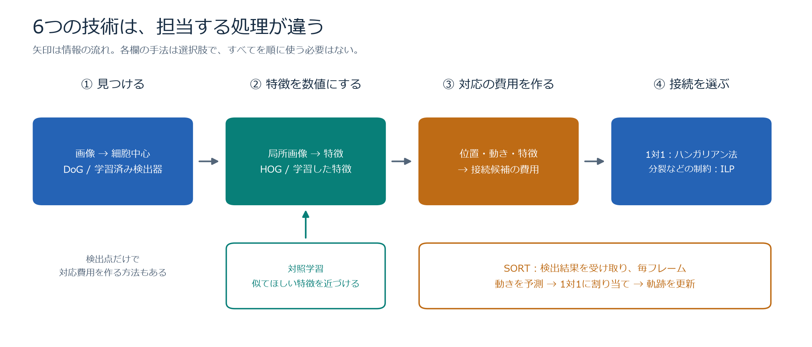
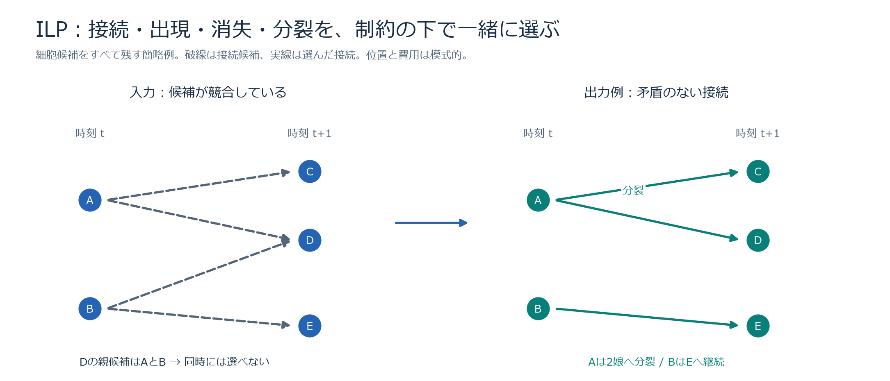
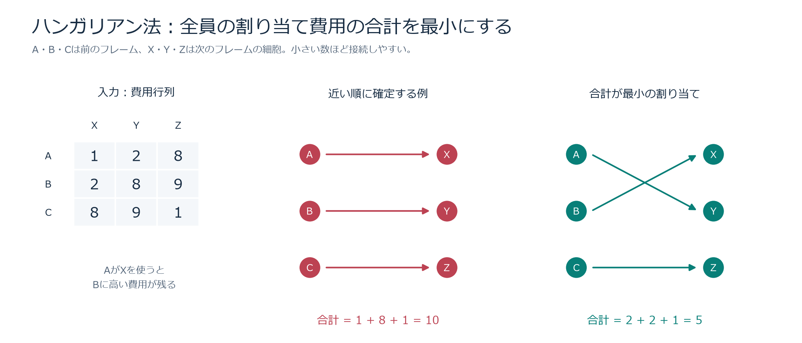
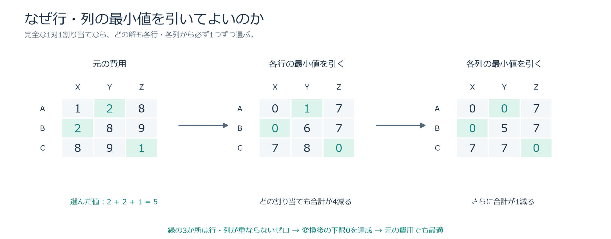
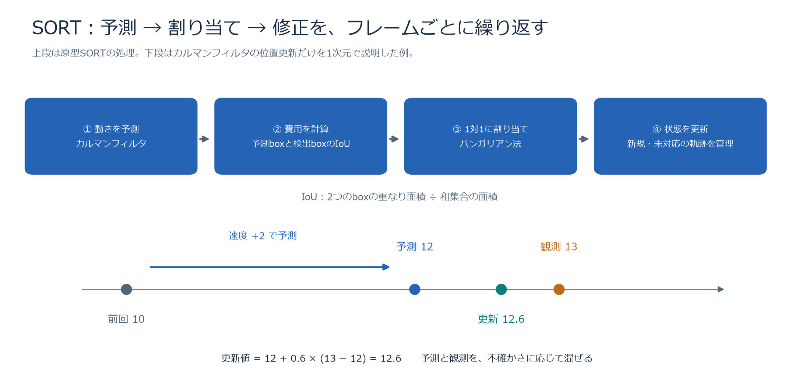
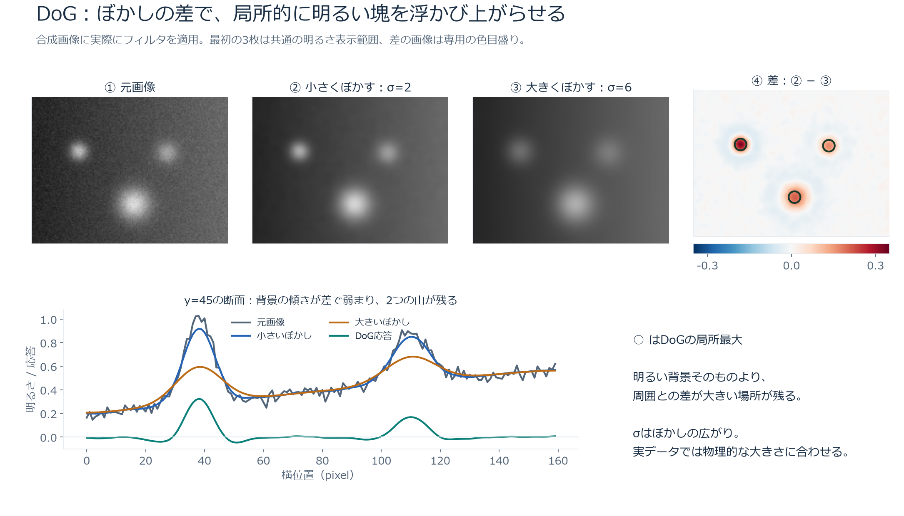
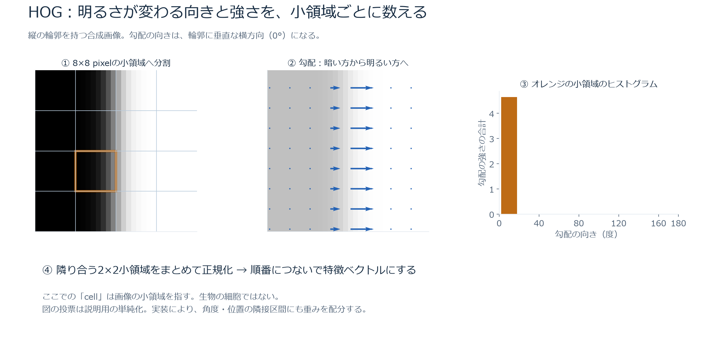
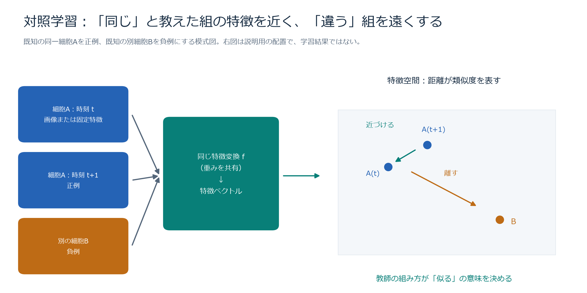

# Biohub・トラッキングの6技術を図で理解する

**6つの技術は、それぞれ違う処理を担当します。** DoGは明るい塊を見つけ、HOGは画像の形を数値にします。対照学習は「何を似ているとみなすか」を学習します。ハンガリアン法とILPは候補の対応を選び、SORTは予測・対応付け・更新を繰り返して追跡します。

本コンペでは、3次元の経時画像から細胞の中心を見つけ、時刻をまたぐ接続と分裂を推定します。**位置を見つけるだけでなく、「どの細胞がどの細胞へ続くか」までが予測対象**です。[主催者リポジトリ](https://github.com/royerlab/kaggle-cell-tracking-competition)、[コンペ概要のローカル整理](../01_competition.md)

作成・外部資料確認日：2026-09-15。図はすべて本書のために作成しました。DoG・HOGの画像は合成データへの計算結果、それ以外は仕組みを説明する模式図です。コンペの実画像、精度測定、学習結果を表すものではありません。

## 読み方

- 全体の位置づけを知る：[0. 6技術の関係](#overview)
- 接続を決める仕組みを知る：[1. ILP](#ilp) → [2. ハンガリアンアルゴリズム](#hungarian) → [3. SORT](#sort)
- 画像から情報を取り出す仕組みを知る：[4. DoG](#dog) → [5. HOG](#hog) → [6. 対照学習](#contrastive)
- 違いを整理する：[7. 比較とよくある疑問](#comparison)
- コード・論文へ進む：[8. 出典と再現方法](#references)

各節は「直感 → 図 → 入出力と手順 → 数式 → このコンペとの関係」の順です。数式を飛ばしても読めます。**費用（cost）は小さいほど望ましい接続、類似度や確率は大きいほど望ましい接続**として説明します。

<a id="overview"></a>

## 0. 6技術の関係



**図の読み方：** 上段は追跡で必要になる処理の例です。DoGで得た中心付近から画像を切り出してHOGを計算することもできますし、位置と移動量だけで対応を決めることもできます。6技術すべてを使う必要はありません。

| 技術・正式名 | ひとことで | 受け取るもの → 返すもの |
| --- | --- | --- |
| **ILP**：Integer Linear Programming、整数線形計画法 | 制約を守る組合せの中から、合計費用が最小のものを選ぶ | 候補の点・接続・費用・制約 → 選択した点や接続、出現・消失・分裂 |
| **ハンガリアンアルゴリズム**：Hungarian algorithm | 2つの集合を、合計費用が最小になるよう1対1に対応付ける | 費用行列 → 対応する行と列の組 |
| **SORT**：Simple Online and Realtime Tracking | 動きを予測し、検出結果を対応付け、同じ識別番号（ID）を引き継ぐ | 各フレームの検出矩形 → ID付きの矩形・軌跡 |
| **DoG**：Difference of Gaussians、ガウス差分 | ぼかしの差で、ある大きさの明るい塊を強調する | 画像 → 応答画像。局所最大を取れば中心候補 |
| **HOG**：Histograms of Oriented Gradients、勾配方向ヒストグラム | 画像内の明るさの変化を、場所と向きごとに数える | 局所画像 → 形・輪郭を表す特徴ベクトル |
| **対照学習**：Contrastive learning | 正例の特徴を近づけ、負例と区別できる特徴を学ぶ | 正例・負例の組 → 学習済みの特徴変換 |

### このコンペで実際に確認できた範囲

| 技術 | 確認した位置づけ |
| --- | --- |
| ILP | 採用した公開Notebookの推論構成にあり、候補の接続から追跡グラフを選ぶ。[保存済み解説](biohub-cell-tracking-0946-notebook-explanation_20260913.md#7-ilpによるgraph選択) |
| ハンガリアン法と同じ割り当て問題 | 公開Notebookの軌跡修復で、SciPyの `linear_sum_assignment` を使用。実装名の注意は2節に記載。[保存済みNotebook](../../experiments/exp013_public_notebook_replay/assets/reference_notebook/biohub-cell-tracking-0-947-lb.ipynb) |
| DoG | Pilkwangの公開ベースラインの保存版に、複数の大きさのDoG応答から3D中心を求める `detect_blobs` がある。[公開Notebook](https://www.kaggle.com/code/pilkwang/biohub-cell-tracking-data-model-eda-baseline)、[保存版](../notebooks/biohub-cell-tracking-during-development/pilkwang__biohub-cell-tracking-data-model-eda-baseline/biohub-cell-tracking-data-model-eda-baseline.ipynb) |
| SORT | 一般的な物体追跡の基礎として解説。採用した公開構成をSORTそのものとは扱わない。 |
| HOG | 一般的な画像特徴として解説。採用した公開構成で使う画像特徴は学習済みモデルの出力で、HOGではない。 |
| 対照学習 | 特徴の学習方法として解説。採用した公開トラッカーの接続学習を、根拠なく対照学習とは呼ばない。 |

後ろ3件はコンペ全体での不使用を断定したものではありません。確認対象は保存済み公開資料と採用構成です。公開Notebookのタイトルに含まれるスコアは版を識別する名称として使い、本書では性能比較を行いません。

<a id="ilp"></a>

## 1. ILP：接続と分裂を、制約の下で一緒に選ぶ

### 直感：接続ごとの「良さ」だけでは決められない

次のフレームに細胞Dがあり、その親候補としてAとBが挙がったとします。A→DもB→Dも高得点だからといって両方を選ぶと、Dに2つの親が付いてしまいます。一方で、Aが分裂したなら、A→CとA→Dの2本は必要です。

**ILPでは、「この線を選ぶ／選ばない」を0か1で表し、守るべき条件を書いてから、全体の合計費用を最小にします。**



**図の読み方：** 左の破線は可能性を列挙したものです。右は「Dの親は1つ」「Aは2娘へ分裂」という条件を満たす出力例です。実際にこの解が選ばれるかは、各接続と分裂に与えた費用で変わります。

### 入力・出力と処理単位

- **入力：** 各時刻の細胞候補点、時間方向の接続候補、接続の費用、出現・消失・分裂などの費用と制約。
- **出力：** 選んだ接続からなる追跡グラフ。定式化によっては候補点自体の採否も選びます。
- **処理単位：** 複数フレームを含む候補グラフなど、ひとまとめにして解く範囲。全動画を必ず一括処理する、という意味ではありません。
- **学習：** ILP自体は通常、与えられた費用を使って最適化します。費用を作るモデルの学習とは別の処理です。

`tracksdata` のILP実装には、点・接続・出現・消失・分裂の変数があります。一般のILPは「整数変数を使う線形の目的関数・制約を解く問題の形式」であり、細胞追跡だけの固有アルゴリズム名ではありません。[tracksdataの実装](https://github.com/royerlab/tracksdata/blob/main/src/tracksdata/solvers/_ilp_solver.py)、[SciPyの整数最適化の説明](https://docs.scipy.org/doc/scipy/reference/generated/scipy.optimize.milp.html)

### 最小限の数式：0か1の選択にする

以下は**理解のための独立した簡略モデル**です。すべての候補点を残すと仮定し、接続は隣接フレームの間だけに用意します。公開Notebookのsolverをそのまま再現した式ではありません。

- $x_{ij}=1$ ：点 $i$ から点 $j$ への接続を選ぶ。
- $a_i=1$ ：点 $i$ から軌跡が始まる。
- $d_i=1$ ：点 $i$ で軌跡が終わる。
- $q_i=1$ ：点 $i$ が2つの娘へ分裂する。

```math
\min_{x,a,d,q}
\sum_{(i,j)\in E} c_{ij}x_{ij}
+ \lambda_{\mathrm{start}}\sum_i a_i
+ \lambda_{\mathrm{end}}\sum_i d_i
+ \lambda_{\mathrm{div}}\sum_i q_i
```

ここで $E$ は候補接続の集合、 $c_{ij}$ は接続の費用、3つの $\lambda$ は開始・終了・分裂の費用です。制約を次のように置きます。

```math
\begin{aligned}
\sum_{j:(j,i)\in E} x_{ji} + a_i &= 1 \\[4pt]
\sum_{j:(i,j)\in E} x_{ij} + d_i &= 1+q_i \\[4pt]
q_i+d_i &\le 1 \\[4pt]
x_{ij},\ a_i,\ d_i,\ q_i &\in \{0,1\}
\end{aligned}
```

1行目は「親から1本来る、またはここから始まる」です。2行目と3行目により、出ていく接続数は次の3通りになります。

| 状態 | 分裂 $q_i$ | 終了 $d_i$ | 出ていく接続 |
| --- | ---: | ---: | ---: |
| 通常の継続 | 0 | 0 | 1本 |
| 分裂 | 1 | 0 | 2本 |
| 終了 | 0 | 1 | 0本 |

図のDでは、A→Dを選ぶとB→Dは選べません。Aでは分裂変数を1にすれば、A→CとA→Dを同時に選べます。

「整数」は接続が0.4本などにならないためです。「線形」は変数の重み付き和で書くという意味で、**細胞が直線運動するという意味ではありません**。費用を作る前段はニューラルネットワークでも構いません。

### solverはどうやって組合せを探すのか

代表的な考え方が**分枝限定法（branch and bound）**です。まず整数の条件を一時的に緩め、0.4なども許す計算で「これより安くはならない」という下限を求めます。0か1に決まらない変数があれば、「この接続を選ぶ場合」と「選ばない場合」に分けます。既に見つけた整数解より良くならない枝は、それ以上調べません。

例えば、ある枝の費用の下限が7で、既に費用5の実行可能な整数解が見つかっていれば、その枝から改善は得られません。こうして探索を減らします。実際のsolverは追加の制約なども組み合わせるため、この説明は基本的な考え方に限ります。[整数条件を緩めた解と停止条件の説明](https://docs.scipy.org/doc/scipy/reference/generated/scipy.optimize.milp.html)

### 何が得意で、どこに限界があるか

**得意：** 出現、消失、分裂、点の競合などを明示し、その条件を満たす接続をまとめて選べることです。単純な1対1対応を超える条件を表しやすくなります。

**限界：** ILPが最適にするのは、与えた候補・費用・制約です。候補にない真の接続は選べず、間違った費用を「生物学的に正しい」と見抜くわけでもありません。一般のILPは計算が難しく、候補が多いほど時間やメモリが問題になります。時間制限や最適性の許容差で停止した解を、無条件に厳密な最適解と扱うこともできません。[SciPy `milp`](https://docs.scipy.org/doc/scipy/reference/generated/scipy.optimize.milp.html)

### このコンペとの関係

採用した公開構成は、画像モデルが作った候補と、候補点の特徴から接続得点を出すNode Transformerの出力を `tracksdata` のILPへ渡します。さらに**ILPの後にも、移動に基づく再接続、欠落フレームや分裂の修復があります**。したがって、最終提出の接続がすべてILPだけで決まるわけではありません。[公開Notebookの保存済み解説：7・8節](biohub-cell-tracking-0946-notebook-explanation_20260913.md#7-ilpによるgraph選択)

<a id="hungarian"></a>

## 2. ハンガリアンアルゴリズム：1対1の対応を全体で決める

### 直感：「各細胞から最も近い点へ」で困る例

前のフレームにA・B・C、次にX・Y・Zがあるとします。接続費用を次の表にしました。これは説明用の数値で、距離そのものとは限りません。

| 費用 | X | Y | Z |
| --- | ---: | ---: | ---: |
| A | 1 | 2 | 8 |
| B | 2 | 8 | 9 |
| C | 8 | 9 | 1 |

Aを先に処理して最も安いXへ割り当てると、BはXを使えず、高い費用が残ります。



**図の読み方：** 中央はA→X、B→Y、C→Zで合計10。右はA→Y、B→X、C→Zで合計5です。Aがわずかに高い費用を受け入れることで、Bの大きな損を避けられます。

**ハンガリアン法は、このような全体の合計を最小にする1対1割り当てを解くアルゴリズムです。** 「Aにとっての最適」と「全員にとっての最適」は一致しない場合があります。[Kuhn, 1955](https://doi.org/10.1002/nav.3800020109)

### 入力・出力と処理単位

- **入力：** 行が元の物体、列が対応先を表す費用行列。費用は距離、見た目の違い、接続確率などから作ります。
- **出力：** 同じ行・列を重複させない対応の組。
- **処理単位：** 1つの費用行列。追跡ではフレーム間や、途切れた軌跡の終端・始端の間など。
- **学習：** 不要です。費用の作り方は別途決めます。

全員を割り当てる正方行列では、最適化したいものは次の式です。

```math
\begin{aligned}
\min_x\quad &\sum_{i,j} c_{ij}x_{ij} \\[4pt]
\text{subject to}\quad &\sum_j x_{ij}=1\quad \text{for every }i \\[4pt]
&\sum_i x_{ij}=1\quad \text{for every }j \\[4pt]
&x_{ij}\in\{0,1\}
\end{aligned}
```

「各行1つ」「各列1つ」の条件です。ILPとしても書けますが、この特別な形には効率のよい専用アルゴリズムがあります。一般のILPと同じ探索をする必要はありません。[SciPyの割り当て問題の説明](https://docs.scipy.org/doc/scipy/reference/generated/scipy.optimize.linear_sum_assignment.html)

### アルゴリズムの中身：なぜ最小値を引くのか

代表的な行列による説明では、まず各行の最小値、次に各列の最小値を引きます。



**理由：** どの完全な割り当ても各行から必ず1つずつ選ぶため、行の全要素から同じ数を引くと、すべての割り当ての合計が同じだけ減ります。列についても同じです。**どの割り当てが一番安いか、という順位は変わりません。**

この例では、最後にA→Y、B→X、C→Zがすべてゼロになります。変換後の費用はすべて非負なので、合計ゼロは達成できる最小値です。したがって元の行列でも最適だと分かります。

一般の行列では、行・列の最小値を引くだけでは完了しません。ゼロをすべて覆う最小本数の行・列を求め、独立したゼロが足りなければ、覆われていない最小値を使って行列を調整します。ゼロの割り当てを組み替えながら、全行を対応付けられるまで進めます。**各行のゼロを先着順に選ぶだけの処理ではありません。** これは行列を使う説明で、実装は別の表現で同じ最適化を行うこともあります。[Kuhnの原論文](https://doi.org/10.1002/nav.3800020109)

### 追跡に使う際の3つの注意

1. **「対応なし」を設計する。** 細胞が消えたり検出を逃したりするので、全員の強制割り当ては不適切です。ダミーの対応先へ未対応の費用を置く方法などがあります。行列を長方形にするだけでは、少ない側の全員を割り当てる性質は残ります。
2. **あり得ない接続を排除する。** 移動距離の上限などで候補を制限する処理をgatingと呼びます。無理な組を選んでから落とすだけの方法は、未対応を含めた最適化と同じ結果になるとは限りません。
3. **素の1対1対応では分裂を表せない。** A→Cを選ぶとA→Dは選べません。分裂を扱うには別処理、変数や候補の拡張、ILPなどが必要です。

### このコンペとの関係と実装名の注意

公開Notebookの軌跡修復では、動きから予測した位置と検出位置のずれなどを費用にして、SciPyの `linear_sum_assignment` を呼んでいます。ただし、**現在のSciPy公式資料は、この関数をmodified Jonker–Volgenant algorithmの実装と説明しています**。同じ線形割り当て問題を解きますが、関数名だけから「内部でハンガリアン法を実行する」と断定するのは正確ではありません。[SciPy公式資料](https://docs.scipy.org/doc/scipy/reference/generated/scipy.optimize.linear_sum_assignment.html)、[保存済みNotebook](../../experiments/exp013_public_notebook_replay/assets/reference_notebook/biohub-cell-tracking-0-947-lb.ipynb)

また、主催者の評価では、**同じ時刻の予測点と正解点**を対応付けてから接続の正しさを測ります。これは**前後の時刻の予測点同士**を結ぶ追跡とは、対応付ける2集合が違います。[主催者の評価仕様](https://github.com/royerlab/kaggle-cell-tracking-competition/blob/main/metrics.md)

<a id="sort"></a>

## 3. SORT：動きを予測し、検出へ割り当てて、IDを更新する

### 直感：「今どこか」だけでなく「次はどこか」を使う

ある物体が毎フレーム右へ2 pixelずつ動いているなら、次の位置も右へ2 pixel進んだ辺りだと予測できます。その予測位置に近い検出へ、同じIDを引き継ぎます。

**SORTは、この予測・対応付け・更新を軽量に繰り返す追跡手法です。** 原型は2Dの検出矩形を扱い、カルマンフィルタで状態を予測し、矩形の重なりで費用を作り、ハンガリアン法で対応付けます。[Bewley et al., 2016](https://arxiv.org/abs/1602.00763)



**図の読み方：** 上段のループに新しいフレームの検出結果が入ります。下段では予測位置12に対し観測位置13が得られ、両方を混ぜて12.6へ更新しています。

### 入力・出力と1フレームの手順

- **入力：** 外部の検出器が出した各フレームのbounding box（物体を囲む矩形）と検出得点。
- **出力：** 追跡IDを付けた矩形。時刻順につなぐと軌跡になります。
- **処理単位：** 新しいフレーム1つと、既に保持している各軌跡の状態。未来のフレームを待たずに処理する、という意味でonlineです。
- **学習：** SORT本体はニューラルネットワークを学習しません。前段の検出器は別です。

1. **予測：** 前回の位置・速度などから現在の矩形を予測する。
2. **費用計算：** 予測矩形と今回の検出矩形の重なりを測る。
3. **対応付け：** 全体として重なりが大きくなる1対1対応を選ぶ。重なりが小さすぎる組は認めない。
4. **更新：** 対応が付いた軌跡を観測値で修正する。
5. **管理：** 未対応の検出から新しい軌跡を作り、見つからない状態が所定期間続いた軌跡を終了する。十分な観測が蓄積するまで出力を保留する管理も行う。

実装では保持期間や確認回数に設定値があり、1フレーム見失えばどの設定でも必ず復帰できる、とは限りません。[著者のSORT実装](https://github.com/abewley/sort/blob/master/sort.py)

### IoUとカルマンフィルタを分けて理解する

**IoU（Intersection over Union）は矩形の重なりの指標**です。

```math
\operatorname{IoU}(A,B)=\frac{|A\cap B|}{|A\cup B|}
```

 $|A\cap B|$ は重なる面積、 $|A\cup B|$ は両方を合わせた面積です。完全に重なると1、全く重ならないと0です。例えば費用を $1-\operatorname{IoU}$ にすれば、よく重なる組ほど安くなります。最大化と最小化を取り違えないための変換です。

**カルマンフィルタは、予測と観測の不確かさを使って、位置や速度を更新する方法**です。予測を強く信じられるときは予測寄り、観測を強く信じられるときは観測寄りに修正します。

図の1次元の位置更新を、観測位置を $y$ 、予測位置を $\hat{x}$ 、カルマンゲインを $K$ として書くと、次のようになります。

```math
x_{\mathrm{updated}}=\hat{x}+K(y-\hat{x})
=12+0.6(13-12)=12.6
```

0.6は説明用に置いた値です。実際の $K$ は予測誤差と観測誤差の共分散から計算します。原型SORTは、位置だけでなく矩形の中心、面積、縦横比、速度を含む状態を扱います。この1次元式はその一部を直感的に示したものです。[SORT原論文：3節](https://arxiv.org/html/1602.00763v2)

### このコンペへそのまま持ち込めない点

Biohubでは3Dの細胞中心と分裂を扱います。原型SORTの2D矩形IoUと1対1対応をそのまま使うだけでは、必要な出力を十分に表せません。3D位置・物理距離を使う動きのモデルや、分裂を扱う処理が必要です。これは本コンペの出力仕様と原型SORTの設計を比べた解釈です。

原型SORTは追跡の対応付けで見た目の特徴を使わないため、よく似た動きで交差する物体や長い見失いが難しくなります。**Deep SORT**は、学習した外観特徴による対応付けを加えた別手法です。名前が似ていますが、HOGや対照学習を原型SORTが標準で含むわけではありません。[Wojke et al., 2017](https://arxiv.org/abs/1703.07402)

<a id="dog"></a>

## 4. DoG：ぼかしの差で、細胞らしい明るい塊を見つける

### 直感：背景の明るさより「周囲に比べて明るいか」

蛍光画像では、背景が明るい領域の弱い細胞と、暗い領域の強い細胞が同居します。画像全体に同じ明るさの閾値を置くだけでは、弱い細胞を逃したり背景を拾ったりします。

DoGでは同じ画像を2通りにぼかします。**小さなぼかしには残る明るい塊が、大きなぼかしでは周囲へ広がる。その差を取ると、塊の中心が目立つ**という考え方です。



**図の読み方：** 最初の3枚は同じ明るさの目盛りです。4枚目は小さいぼかしから大きいぼかしを引き、正の応答を赤く表示しています。丸印が局所最大です。下の断面では、右へ向かって明るくなる背景成分が差で弱まり、塊の位置に山が残ります。

### 入力・出力と手順

- **入力：** グレースケールの2D画像または3D画像。
- **出力：** DoGそのものは応答画像。さらに閾値と局所最大検出を組み合わせると、中心座標の候補が得られます。
- **処理単位：** 1枚の画像または1時刻の3D体積。
- **学習：** 不要です。ぼかしの大きさや閾値は設定します。

1. 必要なら明るさの範囲をそろえる。
2. 小さいガウスぼかしを作る。
3. 大きいガウスぼかしを作る。
4. 差を取り、近傍より強く、閾値を超える場所を選ぶ。
5. 大きさが異なる塊を拾うには、複数のぼかしの組を使い、近すぎる重複候補を整理する。

標準的な `blob_dog` は画像位置とぼかしの大きさを探索し、中心座標と検出スケールを返します。保存済み公開ベースラインは、複数のDoG応答の最大を取ってから空間的な局所最大を選ぶ実装で、標準関数をそのまま呼ぶ形ではありません。[scikit-image `blob_dog`](https://scikit-image.org/docs/stable/api/skimage.feature.html#skimage.feature.blob_dog)、[公開ベースライン保存版](../notebooks/biohub-cell-tracking-during-development/pilkwang__biohub-cell-tracking-data-model-eda-baseline/biohub-cell-tracking-data-model-eda-baseline.ipynb)

### 数式：ぼかしを2つ作って引くだけ

本書では明るい塊の中心が正になりやすい符号を使います。

```math
D(\mathbf{r})=(G_{\sigma_s}*I)(\mathbf{r})-(G_{\sigma_l}*I)(\mathbf{r}),
\qquad \sigma_s\lt\sigma_l
```

 $I$ は画像、 $\mathbf{r}$ は位置、 $G_\sigma$ は標準偏差 $\sigma$ のガウスぼかし、 $*$ は畳み込みです。畳み込みは、ここでは「周囲の画素を距離に応じた重みで平均する」と考えれば十分です。

DoGは**時間の前後フレームの差ではありません**。同じ画像にかける、ぼかしの大きさの差です。文献や実装によって引き算の順序が逆になるため、明るい塊を正の山として探すのか、負の谷として探すのかを確認します。Loweの論文はDoGを画像の位置・スケールの特徴検出に使った代表的な一次資料です。[Lowe, 2004](https://www.cs.ubc.ca/~lowe/papers/ijcv04.pdf)

### このコンペで大事な「pixelとµmの違い」

3D画像では、z方向の1 voxel（3Dの画素）が、x・y方向の1 voxelと同じ物理的長さとは限りません。全軸へ同じpixel数のぼかしをかけると、物理空間では縦に伸びたフィルタになることがあります。

各軸の間隔を $s_z,s_y,s_x$ 、ぼかしたい物理長を $\sigma_{\mu m}$ とすると、画素単位へ変換します。

```math
(\sigma_z,\sigma_y,\sigma_x)
=\left(\frac{\sigma_{\mu m}}{s_z},\frac{\sigma_{\mu m}}{s_y},\frac{\sigma_{\mu m}}{s_x}\right)
```

これは単位換算です。例えば間引いた軸は1画素分の実効的な長さが増えるので、その長さを使います。公開ベースラインの `detect_blobs` でも、間引き後の軸間隔でぼかしと近傍の大きさを換算しています。[保存済み実装](../notebooks/biohub-cell-tracking-during-development/pilkwang__biohub-cell-tracking-data-model-eda-baseline/biohub-cell-tracking-data-model-eda-baseline.ipynb)

### 限界

DoGは、対象の大きさが合わない場合や、隣接する細胞が重なる場合に見逃し・重複を生じます。明るい塊が生物学的に細胞かどうか、同じ細胞が次にどこへ行ったかはDoGだけでは分かりません。採用した公開構成の主検出は学習済みモデルのheatmap（細胞中心らしさの分布）であり、DoGを使う公開ベースラインとは区別します。

<a id="hog"></a>

## 5. HOG：輪郭の向きを数えて、見た目を数値にする

### 直感：「どこに、どちら向きの明るさの変化が多いか」

同じ平均輝度でも、縦長の物体と横長の物体では、輪郭の向きが違います。HOGはその違いを数値にします。

**小領域ごとに画像の明るさが変わる向きを数え、変化が強い画素ほど大きな票を入れます。** 全画素をそのまま並べるより細かな位置の揺れを吸収しつつ、局所的な形を残す考え方です。[Dalal & Triggs, 2005](https://lear.inrialpes.fr/people/triggs/pubs/Dalal-cvpr05.pdf)



**図の読み方：** 縦の境界では、明るさは左右へ変化します。したがって勾配の矢印は横向きで、0°付近の棒が高くなります。**輪郭が伸びる方向と、勾配の方向は直交します。**

### 入力・出力と手順

- **入力：** 物体付近の画像の切り出しなど。
- **出力：** 各領域の方向ヒストグラムをつないだ、固定長の特徴ベクトル。
- **処理単位：** 設定した画像領域。通常のHOGは2D画像の特徴です。
- **学習：** 特徴計算自体は不要です。その後の分類器や対応付けのモデルは学習できます。

1. **勾配を計算する。** x方向・y方向に明るさがどれだけ変わるかを調べる。
2. **小領域へ分ける。** 例えば8×8 pixelずつに区切る。
3. **方向別に投票する。** 例えば0〜180°を9区間に分け、勾配の強さを重みにする。
4. **近傍の領域をまとめて正規化する。** 例えば2×2小領域を1つのblockとして、明るさやコントラストの変化の影響を抑える。
5. **順番を保って連結する。** 画像内の場所ごとの特徴が残るよう、ヒストグラムを並べる。

この分野でいう **cellはヒストグラムを数える画像の小領域**、blockは正規化に使う小領域のまとまりです。生物学的な細胞を1個ずつ取り出して集計する、という意味ではありません。原論文は局所ヒストグラムと、重なりを持つblockでの正規化の重要性を示しています。[HOG原論文](https://lear.inrialpes.fr/people/triggs/pubs/Dalal-cvpr05.pdf)

### 数式と次元数の具体例

横方向・縦方向の勾配を $g_x,g_y$ とすると、強さ $m$ と向き $\theta$ を計算します。

```math
m=\sqrt{g_x^2+g_y^2},\qquad
\theta=\operatorname{atan2}(g_y,g_x)\bmod \pi
```

これは0〜180°の向きを使う例です。区間への投票では強さ $m$ を加算し、実装によっては隣接する方向や位置の区間へ票を分配します。

図の32×32 pixelの画像について、8×8 pixelを1小領域、2×2小領域を1block、blockを1小領域ずつずらし、9方向を使うとします。

| 計算 | 結果 |
| --- | --- |
| 小領域の配置 | 4×4個 |
| 重なりを持つblockの配置 | 3×3個 |
| 1blockの数値 | 2×2×9 = 36個 |
| 特徴ベクトル全体 | 3×3×36 = **324次元** |

これらは説明用の設定です。画像サイズ、blockの移動幅、方向数などが変われば次元数も変わります。

### トラッキングではどう使うか

前後フレームの物体の周囲を切り出し、それぞれからHOGを計算して、特徴が近い組ほど対応費用を下げる、という使い方が考えられます。これは**特徴を追跡に使う方法の説明**で、このコンペでの精度改善を確認した主張ではありません。

HOG単体はIDも接続も返しません。物体検出なら後段に分類器、追跡なら後段に類似度計算と割り当てが必要です。また、任意の回転や大きな変形に不変ではありません。よく似た丸い細胞同士を、HOGだけで区別できるとも限りません。3D画像で使う場合は、2D断面・投影で何を残すか、または3Dの特徴へ拡張するかが別の設計になります。

<a id="contrastive"></a>

## 6. 対照学習：追跡に役立つ「似ている」を学習する

### 直感：「同じに見えてほしい組」を例で教える

同じ細胞でも、時刻によって明るさや形が変わります。逆に、別の細胞なのに見た目がそっくりなこともあります。

対照学習では、画像や特徴をベクトルに変換し、**正例として与えた組は近く、負例として与えた組は相対的に遠くなるように変換を学習します**。正例・負例の作り方によって、何を保存し何を無視する特徴にするかが変わります。



**図の読み方：** Aの2つの観測に同じ特徴変換を使い、対応が既知なら正例として近づけます。Bは既知の別細胞として区別します。右側の配置は説明用で、実際の学習で得られた散布図ではありません。

### 入力・出力と学習の手順

- **入力：** 画像や固定された画像特徴と、「近づけたい組」「区別したい組」の定義。
- **学習後に得るもの：** 特徴ベクトルへの変換を行うモデル。接続グラフそのものが直接得られるわけではありません。
- **処理単位：** 学習では複数の正例・負例を含むbatchなど。推論では物体ごとの特徴を計算して対応付けへ渡します。
- **学習：** 必要です。固定フィルタや割り当てアルゴリズムとは異なります。

1. 基準にする観測anchorを選ぶ。
2. 正例positiveと負例negativeを用意する。
3. 重みを共有するモデルで各観測をベクトルへ変換する。
4. 正例の類似度が負例より高くなる損失を計算する。
5. その損失が小さくなるようにモデルを更新する。

代表例の **SimCLR** は、同じ画像に異なるdata augmentation（切り出しなどの変形）を施した2つを正例にします。encoderが特徴を抽出し、その後のprojection headという変換で対照学習の損失を計算します。これは代表的な一方式で、対照学習のすべてが同じ構成ではありません。[Chen et al., 2020](https://proceedings.mlr.press/v119/chen20j.html)

### 数式：正例を、比較相手の中から当てる

特徴を長さ1に正規化したベクトルを $z_i$ 、その正例を $z_p$ とします。比較集合 $\mathcal{K}_i$ に正例と負例を含め、anchor自身を除く、正例を比較相手から選ぶ対照損失の一例です。

```math
\mathcal{L}_i
=-\log
\frac{\exp(\operatorname{sim}(z_i,z_p)/\tau)}
{\sum_{k\in\mathcal{K}_i}\exp(\operatorname{sim}(z_i,z_k)/\tau)}
```

- $\operatorname{sim}$ ：類似度。長さ1のベクトル同士なら内積はcosine similarity（ベクトルの向きの近さ）になります。
- $\tau$ ：temperature。小さいほど類似度の差が比較結果へ強く反映されます。
- 分数：比較相手の中で正例を選ぶ確率のように読めます。

**直感は「正例だけが他より目立つようにする」です。** 正例と負例の特徴が全部同じなら、この確率は高くなりません。正例を近づけるだけで全入力を同じ特徴にしてしまう問題を、負例との比較で抑えます。SimCLRのNT-Xent（normalized temperature-scaled cross entropy）損失もこの形に対応するもので、2つのviewの両方向について計算します。[SimCLR論文](https://proceedings.mlr.press/v119/chen20j/chen20j.pdf)

例えば正例と2つの負例を比べ、temperatureを1とします。類似度がすべて同じなら正例を選ぶ確率は1/3です。正例の類似度が1、負例がともに0なら、その確率は約0.576へ上がります。この値は式を説明する計算例で、追跡精度ではありません。

### 何を正例にするかで、学習内容が変わる

| 正例の作り方 | 近くなるように教えるもの | それだけでは保証できないもの |
| --- | --- | --- |
| 同じ画像の2種類の変形 | その変形を受けても同じ画像由来だと分かる特徴 | 異なる時刻でも同一細胞だと分かること |
| 既知の同一細胞の前後時刻 | 時間変化をまたぐ同一性 | 注釈のない部分での対応の正しさ |
| 同じ細胞種に属する別の細胞 | 細胞種としての共通性 | 個体IDの識別。むしろ別IDを近づけることもある |

この表は、正例の定義から学習で求める類似性が変わることを示した解釈です。**対照学習＝必ずラベル不要、ではありません。** 同じ画像の変形なら自己教師ありにできますが、既知の細胞IDや接続を正例にするなら、その教師情報を使います。同じクラスの観測を正例にする代表的な一次資料として、教師あり対照学習の論文があります。[Khosla et al., 2020](https://proceedings.neurips.cc/paper/2020/hash/d89a66c7c80a29b1bdbab0f2a1a94af8-Abstract.html)

### このコンペで気を付けること

**疎い注釈を負例と誤認しない。** 正解グラフに接続が書かれていないからといって、必ず別細胞とは限りません。「本当は同じなのに負例として引き離す組」はfalse negative pairです。本コンペでは未注釈部分があるため、既知の正例・負例と未知の組を分ける必要があります。[主催者の疎注釈に対応した評価仕様](https://github.com/royerlab/kaggle-cell-tracking-competition/blob/main/metrics.md)

**分裂は、通常の同一IDの継続と分けて考える。** 母細胞と娘細胞には系譜上の接続がありますが、母・2娘をすべて同じ個体として近づけると、娘同士の区別を弱める可能性があります。何を近づけるかと、1対2の接続をどう出すかは別に定義する必要があります。

**特徴の類似度だけで接続を確定しない。** 推論時は、学習した特徴の類似度に、移動距離や時刻などを組み合わせて接続費用を作り、割り当てやILPへ渡すことが考えられます。学習で使った大きな負例集合が、そのまま推論時にも必要なわけではありません。

**現在の学習方針との関係。** このリポジトリでは公開検出器と画像特徴抽出器を固定し、下流のトラッカーを学習する方針です。対照学習を検討する場合も、固定画像特徴を受け取る下流の変換を学習する話と、画像encoder自体を学習し直す話を区別します。本書は方式の解説であり、実験の実施や方針変更を決めるものではありません。[現在の学習方針](../../backlog/KAGGLE_DIRECTION.md#今後の学習方針)

<a id="comparison"></a>

## 7. 比較とよくある疑問

### どの手法が、何を自動で解決するのか

| 技術 | 画像の形・明るさを見る | 時間の対応を決める | 分裂を直接表せる | 手法自体の学習 |
| --- | --- | --- | --- | --- |
| ILP | 費用を通じて間接的に使える | 候補グラフから選ぶ | 分裂を含む定式化なら可能 | 不要 |
| ハンガリアン法 | 費用を通じて間接的に使える | 2集合の1対1対応を選ぶ | 素の1対1問題では不可 | 不要 |
| 原型SORT | 追跡では矩形の位置・大きさを使う | 予測と1対1対応を繰り返す | 標準の処理には含まない | 不要。検出器は別 |
| DoG | 明るさの局所変化を見る | しない | しない | 不要 |
| HOG | 勾配の分布を見る | しない | しない | 不要 |
| 対照学習 | 入力・学習対象による | 対応に使う特徴を学べる | 損失だけでは接続構造を出さない | 必要 |

### ILPとハンガリアン法は、どちらが「全体を見ている」？

どちらも、与えられた問題の合計費用を最適化できます。違いは**表せる制約と、一度に渡す範囲**です。ハンガリアン法は1つの2集合の1対1割り当てを解き、ILPは分裂を含む広い条件を記述できます。ハンガリアン法をフレームごとに解いても、未来の全フレームを通した最適性まで自動的に得られるわけではありません。

### SORTとハンガリアン法の違いは？

SORTは動きの予測・割り当て・軌跡管理を含む追跡手法で、ハンガリアン法はその中の割り当てを担当します。費用行列を作って解くだけでは、予測速度の更新やIDの生存管理は行われません。

### DoGとHOGはどちらもフィルタ？

DoGは2つのぼかしを引いた**応答画像**を作ります。HOGは勾配を集計した**特徴ベクトル**を作ります。DoGの明るい山から中心を取り、その周りの画像からHOGを計算する、という組合せも考えられます。

### HOGと対照学習は置き換えの関係？

HOGは特徴を計算する規則、対照学習は特徴変換を学習する方法です。学習済みの特徴をHOGの代わりに使う構成もありますが、比較している概念の階層は異なります。固定された特徴の後ろへ学習する変換を置くこともできます。

### 特徴が良ければ、接続の選択は不要？

必要です。ある細胞が2つの候補と似ていたり、複数の親候補が同じ娘を取り合ったりします。**候補を評価することと、競合を解いて整合する接続を選ぶことは、別の処理**です。

### 6つを一文ずつで覚える

- **ILP：** ルールを数式にして、接続と分裂の組合せを選ぶ。
- **ハンガリアン法：** 行・列を重複させず、合計費用が最小の対応を選ぶ。
- **SORT：** 動きを予測し、検出に割り当て、状態とIDを更新する。
- **DoG：** ぼかしの差で、狙った大きさの明るい塊を強調する。
- **HOG：** 場所ごとに勾配の向きを数え、画像の形を数値にする。
- **対照学習：** 正例と負例を定義して、必要な類似性を学ぶ。

<a id="references"></a>

## 8. 出典と再現方法

### 一次資料・実装

| 対象 | 一次資料 | 本書での用途 |
| --- | --- | --- |
| コンペ | [Royer Lab：コンペ参照実装](https://github.com/royerlab/kaggle-cell-tracking-competition)、[評価仕様](https://github.com/royerlab/kaggle-cell-tracking-competition/blob/main/metrics.md)（2026） | 3D追跡、点・接続・分裂、疎注釈と評価の対応付け |
| ILP | [tracksdata：ILPSolver](https://github.com/royerlab/tracksdata/blob/main/src/tracksdata/solvers/_ilp_solver.py)、[SciPy：milp](https://docs.scipy.org/doc/scipy/reference/generated/scipy.optimize.milp.html)（参照日2026-09-15） | 変数、費用、制約、停止状態。Web上の現行実装と保存版Notebookの環境は区別 |
| ハンガリアン法 | [Kuhn：The Hungarian method for the assignment problem](https://doi.org/10.1002/nav.3800020109)（1955） | 原典の名称と線形割り当て問題。出版社の書誌情報を確認 |
| 線形割り当て | [SciPy：linear_sum_assignment](https://docs.scipy.org/doc/scipy/reference/generated/scipy.optimize.linear_sum_assignment.html)（参照日2026-09-15） | 正方・長方行列の意味、現行アルゴリズム名 |
| SORT | [Bewley et al.：Simple Online and Realtime Tracking](https://arxiv.org/abs/1602.00763)（2016）、[著者実装](https://github.com/abewley/sort) | 動き予測、IoU、割り当て、軌跡管理 |
| Deep SORT | [Wojke et al.：Simple Online and Realtime Tracking with a Deep Association Metric](https://arxiv.org/abs/1703.07402)（2017） | 原型SORTと学習した外観特徴の違い |
| DoG | [Lowe：Distinctive Image Features from Scale-Invariant Keypoints](https://www.cs.ubc.ca/~lowe/papers/ijcv04.pdf)（2004）、[scikit-image：blob_dog](https://scikit-image.org/docs/stable/api/skimage.feature.html#skimage.feature.blob_dog) | スケール、DoGによる塊の検出、座標とスケールの出力 |
| HOG | [Dalal & Triggs：Histograms of Oriented Gradients for Human Detection](https://lear.inrialpes.fr/people/triggs/pubs/Dalal-cvpr05.pdf)（2005） | 小領域ごとの方向ヒストグラム、block正規化、特徴と検出器の区別 |
| 対照学習 | [Chen et al.：A Simple Framework for Contrastive Learning of Visual Representations](https://proceedings.mlr.press/v119/chen20j.html)（2020） | 正例・負例、画像変形、encoderとprojection head、損失の例 |
| 教師あり対照学習 | [Khosla et al.：Supervised Contrastive Learning](https://proceedings.neurips.cc/paper/2020/hash/d89a66c7c80a29b1bdbab0f2a1a94af8-Abstract.html)（2020） | クラスラベルを使う正例の定義と、自己教師あり方式との違い |

一般手法の説明は上記を参照しました。模式図、費用行列、1次元の更新例、HOGの次元数、コンペへ適用する際の解釈は本書独自の説明です。原論文の実験結果や図を転載したものではありません。

### ローカルのコードと説明へ進む

- [採用した公開Notebookの詳しい解説](biohub-cell-tracking-0946-notebook-explanation_20260913.md)：画像モデルからILP・軌跡修復まで。
- [公開Notebookの再実行に使う保存版](../../experiments/exp013_public_notebook_replay/assets/reference_notebook/biohub-cell-tracking-0-947-lb.ipynb)：`linear_sum_assignment` の呼び出しを検索。
- [DoGを含む公開ベースラインの保存版](../notebooks/biohub-cell-tracking-during-development/pilkwang__biohub-cell-tracking-data-model-eda-baseline/biohub-cell-tracking-data-model-eda-baseline.ipynb)：`detect_blobs` と `dog_scales` を検索。
- [固定する画像モデル・トラッカーの契約](../../experiments/exp011_public_detector_selection/assets/public_detector_selection.json)：入力特徴や既存学習損失の確認先。
- [図の生成コード](../../studies/biohub_tracking_techniques_20260915/make_figures.py)：費用行列の最適解、DoG・HOGの数値計算と全8図。

Kaggleの公開ページだけでは本文を取得できない箇所は、保存版のNotebookを読みました。「採用構成で未確認」と「コンペの誰も使っていない」は区別しています。

### 図を作り直す

リポジトリルートで実行します。日本語フォントは環境のメイリオまたはNoto Sans CJKを使い、見つからない場合は `BIOHUB_FIGURE_FONT` にフォントファイルのパスを指定します。フォントファイルそのものはリポジトリへ複製しません。

```bash
PYTHONDONTWRITEBYTECODE=1 UV_CACHE_DIR=/tmp/uv-cache uv run --with matplotlib python studies/biohub_tracking_techniques_20260915/make_figures.py
```

PNGは `docs/images/biohub_tracking_techniques/` に生成します。コンペデータも学習済み重みも不要です。DoGの例は単一のぼかしの組、HOGの図は投票の一部を単純化しており、公開Notebookや原論文の検出器を再実装するコードではありません。

### 確認範囲

本書が示すのは各手法の入出力・原理・適用箇所です。どの手法がBiohubで高精度になるかは、この解説からは判断できません。画像モデルの精度、費用設計、分裂や未対応の扱い、評価条件をそろえた実験が別途必要です。

文書の検証では、数式46件のローカル検査とGitHub Markdown変換APIでのTeX本文の保持、ローカルリンク、図8枚の目視確認を実施しました。GitHubのブラウザ画面での実表示確認は行っていません。

索引用の管理情報です。「上位仮説」は、複数の実験で検証する問いを指す、このリポジトリ内の管理用語です。本書は特定の実験仮説の検証を目的としません。

- 対応する上位仮説: なし
