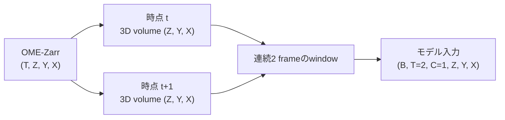
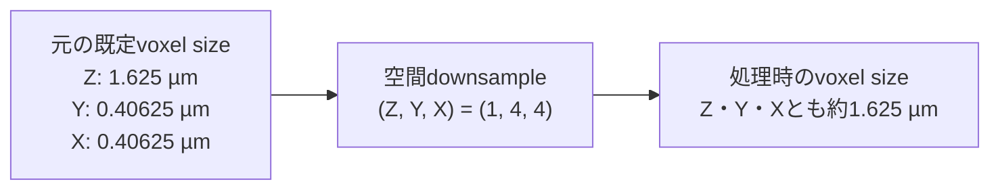
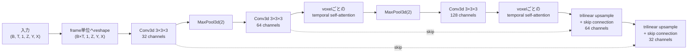
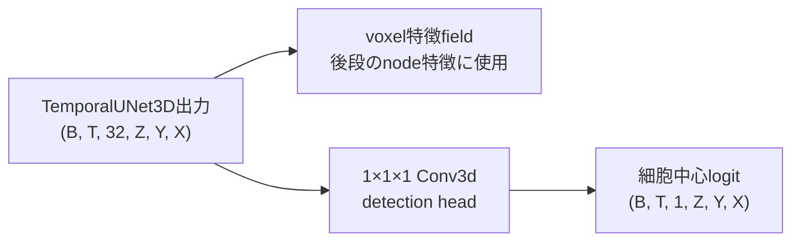
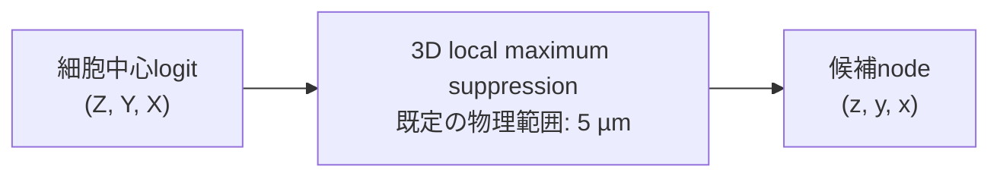
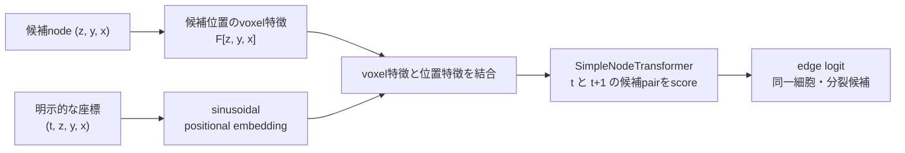
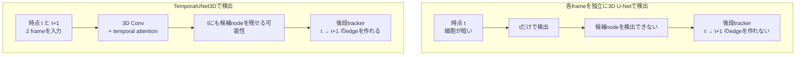

# TemporalUNet3D の3D画像処理と時間情報

この文書は、Biohub – Cell Tracking During Development の公式 baseline で使われている `TemporalUNet3D` について、3D画像の入力から細胞中心の検出、後段のtrackingまでを図解します。

参照した公式実装:

- [`TemporalUNet3D`](https://github.com/royerlab/kaggle-cell-tracking-competition/blob/main/src/tracking_cellmot/models/temporal_unet.py)
- [学習処理](https://github.com/royerlab/kaggle-cell-tracking-competition/blob/main/scripts/train_unet_transformer.py)
- [画像とvoxel sizeの読み込み](https://github.com/royerlab/kaggle-cell-tracking-competition/blob/main/src/tracking_cellmot/io.py)

## 1. 入力と3D座標

元画像は時間を含む `(T, Z, Y, X)` の配列です。各時点に、Z枚の `Y × X` 断面画像からなる3D volumeがあります。

- `B`: batch
- `T`: 時間。公式学習処理の既定window sizeは2
- `C`: 画像channel。既定は輝度1 channel
- `Z`: 奥行き
- `Y`: 高さ
- `X`: 幅

`x`、`y`、`z` は3本の入力channelではありません。1個の輝度値を持つvoxelを並べる3本の空間軸です。

公式baselineの既定voxel sizeとdownsampleは次の関係です。

Z方向は維持し、Y・X方向を4分の1にします。これにより、既定scaleでは3軸の物理的なvoxel sizeがほぼ等しくなります。

## 2. TemporalUNet3D 内部の処理

時間軸をZ軸へ結合して4次元畳み込みを行う構成ではありません。`Conv3d` は各frameの `(Z, Y, X)` を処理し、encoderの一部で時間方向のself-attentionを適用します。

既定設定では、計算量が大きいfull-resolutionの最初のencoder stageではtemporal self-attentionを省略します。downsample後の64 channelsと128 channelsのstageで、同じ空間位置に対応する複数frameの特徴を時間方向に統合します。

decoderからは、各frame・各voxelに32 channelsの特徴を持つfieldが得られます。そこから二つの用途へ分岐します。

学習時は、正解の細胞中心に対応するvoxelをpositive、それ以外をnegativeとして、重み付きBinary Cross Entropyでdetection headを学習します。

## 3. 細胞中心の検出からtrackingまで

3D U-Netが直接予測するのはtracking edgeではありません。最初に3Dの細胞中心mapから候補nodeを抽出します。

候補位置では、TemporalUNet3Dのvoxel特徴を取得します。それとは別に、明示的な `(t, z, y, x)` 座標からsinusoidal positional embeddingを作ります。

したがって各座標の役割は次のように分かれます。

- 3D U-Net内: `Z`、`Y`、`X` を画像の空間軸として処理
- detection loss: 正解中心のvoxel位置として使用
- 3D局所最大値抽出: 細胞中心候補 `(z, y, x)` を生成
- node特徴: 候補位置のvoxel特徴を取得
- tracking: `(t, z, y, x)` のpositional embeddingをnode transformerへ入力

## 4. 物体検出時から時間方向を使う理由

各frameを独立に検出してからtrackingする構成も可能です。TemporalUNet3Dを使う主な理由は、後段のtrackerが、検出段階で存在しない候補nodeを原則として接続できないためです。

時間情報には、次の効果が期待されます。

- あるframeだけ暗い、またはぼけた細胞を隣接frameの特徴で補う
- 1 frameだけ現れるノイズによる輝点を抑える
- 密集した細胞の中心を時間的な変化から区別しやすくする
- 分裂付近の1個から2個への変化をvoxel特徴へ反映する
- node transformerへ渡す特徴を、隣接frameとの対応付けに使いやすくする

これは必ず独立検出より優れることを意味しません。単frameで十分なnode recallが得られる場合や、frame間の移動が大きい場合は、独立した3D U-Netの方が単純で計算量も少なくなります。効果を判断するには、検出閾値、3D local maximum suppression、node transformer、学習・validation splitを固定し、node recall、edge Jaccard、division Jaccardと実行時間を比較する必要があります。
